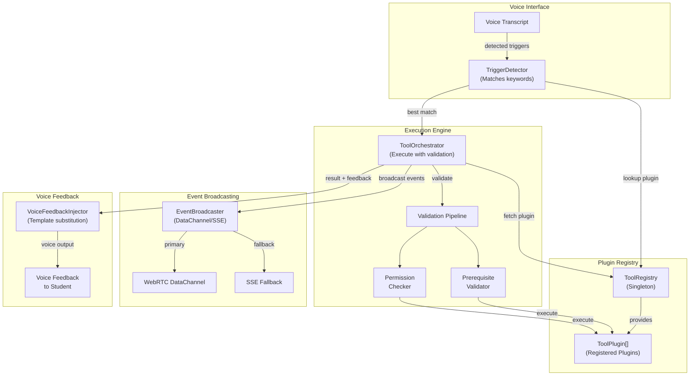

# Tool Plugin System Architecture

## System Architecture Diagram

The tool plugin system integrates voice input with tool discovery, validation, execution, and feedback:



## Component Flow

1. **Voice Input**: Student speaks trigger keywords
2. **TriggerDetector**: Detects tool triggers in transcript using keyword matching
3. **ToolRegistry**: Provides lookup of plugin definitions
4. **ToolOrchestrator**: Orchestrates full execution pipeline:
   - Plugin discovery from registry
   - Input validation against Zod schema
   - Prerequisite checking
   - Permission verification
   - Handler execution
5. **EventBroadcaster**: Broadcasts tool events via WebRTC DataChannel (primary) or SSE (fallback)
6. **VoiceFeedbackInjector**: Generates voice response with template variable substitution
7. **Voice Output**: Student receives confirmation via text-to-speech

## Key Design Patterns

### Singleton Registry
```typescript
const registry = ToolRegistry.getInstance();
// Same instance across application
```

### Plugin Validation Pipeline
```
Discovery → Schema Validation → Prerequisites → Permissions → Execution
```

### Dual-Path Broadcasting
- Primary: WebRTC DataChannel for real-time tool events
- Fallback: Server-Sent Events (SSE) for fallback sessions

### Template-Based Voice Feedback
```typescript
template: "Foglio su {topic} creato con {itemCount} elementi"
// Variables substituted from tool result data
```

## Integration Points

| Component | Purpose |
|-----------|---------|
| **ToolRegistry** | Plugin registration and discovery |
| **ToolOrchestrator** | Execution engine with validation |
| **TriggerDetector** | Voice keyword matching |
| **VoiceFeedbackInjector** | Dynamic voice prompts |
| **EventBroadcaster** | Real-time event distribution |
| **DataChannel Protocol** | Message serialization/deserialization |
| **Maestro System** | Voice proposal and feedback |

## Files Reference

- `src/lib/tools/plugin/types.ts` - Plugin interfaces and schemas
- `src/lib/tools/plugin/registry.ts` - Plugin registry implementation
- `src/lib/tools/plugin/orchestrator.ts` - Execution engine
- `src/lib/tools/plugin/trigger-detector.ts` - Voice trigger detection
- `src/lib/tools/plugin/voice-feedback.ts` - Voice feedback injection
- `src/lib/tools/plugin/data-channel-protocol.ts` - WebRTC message protocol
- `src/lib/tools/plugin/data-channel-sender.ts` - DataChannel sender
- `src/lib/tools/plugin/event-broadcaster.ts` - Event broadcasting
- `src/lib/tools/plugin/voice-flow.ts` - Voice-triggered tool flow
