# MirrorBuddy Architecture Diagrams

> Complete visual documentation of the MirrorBuddy platform architecture.
> All diagrams are in Mermaid format for easy maintenance and version control.

---

## Table of Contents

1. [System Overview](#1-system-overview)
2. [Tech Stack Layers](#2-tech-stack-layers)
3. [Database Schema](#3-database-schema)
4. [Authentication Flow](#4-authentication-flow)
5. [Chat Pipeline](#5-chat-pipeline)
6. [Voice System](#6-voice-system)
7. [Character System](#7-character-system)
8. [Tool Execution](#8-tool-execution)
9. [RAG System](#9-rag-system)
10. [Tier & Subscription](#10-tier--subscription)
11. [Trial Mode](#11-trial-mode)
12. [Invite System](#12-invite-system)
13. [CI/CD Pipeline](#13-cicd-pipeline)
14. [Git Hooks](#14-git-hooks)
15. [Cron Jobs](#15-cron-jobs)
16. [API Routes](#16-api-routes)
17. [Accessibility System](#17-accessibility-system)
18. [Compliance & Safety](#18-compliance--safety)
19. [Observability](#19-observability)
20. [External Integrations](#20-external-integrations)
21. [Component Structure](#21-component-structure)
22. [State Management](#22-state-management)
23. [Deployment Flow](#23-deployment-flow)
24. [ADR Index](#24-adr-index)

---

## 1. System Overview

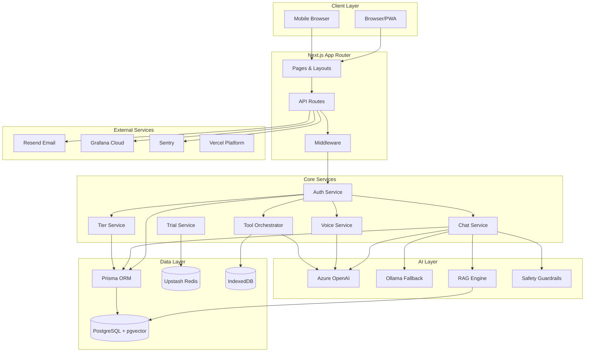
```mermaid
graph TB
    subgraph "Client Layer"
        Browser[Browser/PWA]
        Mobile[Mobile Browser]
    end

    subgraph "Next.js App Router"
        Pages[Pages & Layouts]
        API[API Routes]
        Middleware[Middleware]
    end

    subgraph "Core Services"
        Auth[Auth Service]
        Chat[Chat Service]
        Voice[Voice Service]
        Tools[Tool Orchestrator]
        Tier[Tier Service]
        Trial[Trial Service]
    end

    subgraph "AI Layer"
        Azure[Azure OpenAI]
        Ollama[Ollama Fallback]
        RAG[RAG Engine]
        Safety[Safety Guardrails]
    end

    subgraph "Data Layer"
        Prisma[Prisma ORM]
        PG[(PostgreSQL + pgvector)]
        Redis[(Upstash Redis)]
        IndexedDB[(IndexedDB)]
    end

    subgraph "External Services"
        Resend[Resend Email]
        Grafana[Grafana Cloud]
        Sentry[Sentry]
        Vercel[Vercel Platform]
    end

    Browser --> Pages
    Mobile --> Pages
    Pages --> API
    API --> Middleware
    Middleware --> Auth

    Auth --> Chat
    Auth --> Voice
    Auth --> Tools
    Auth --> Tier

    Chat --> Azure
    Chat --> Ollama
    Chat --> RAG
    Chat --> Safety

    Voice --> Azure

    Tools --> Azure
    Tools --> IndexedDB

    RAG --> PG

    Auth --> Prisma
    Chat --> Prisma
    Tier --> Prisma
    Trial --> Redis

    Prisma --> PG

    API --> Resend
    API --> Grafana
    API --> Sentry
```

---

## 2. Tech Stack Layers

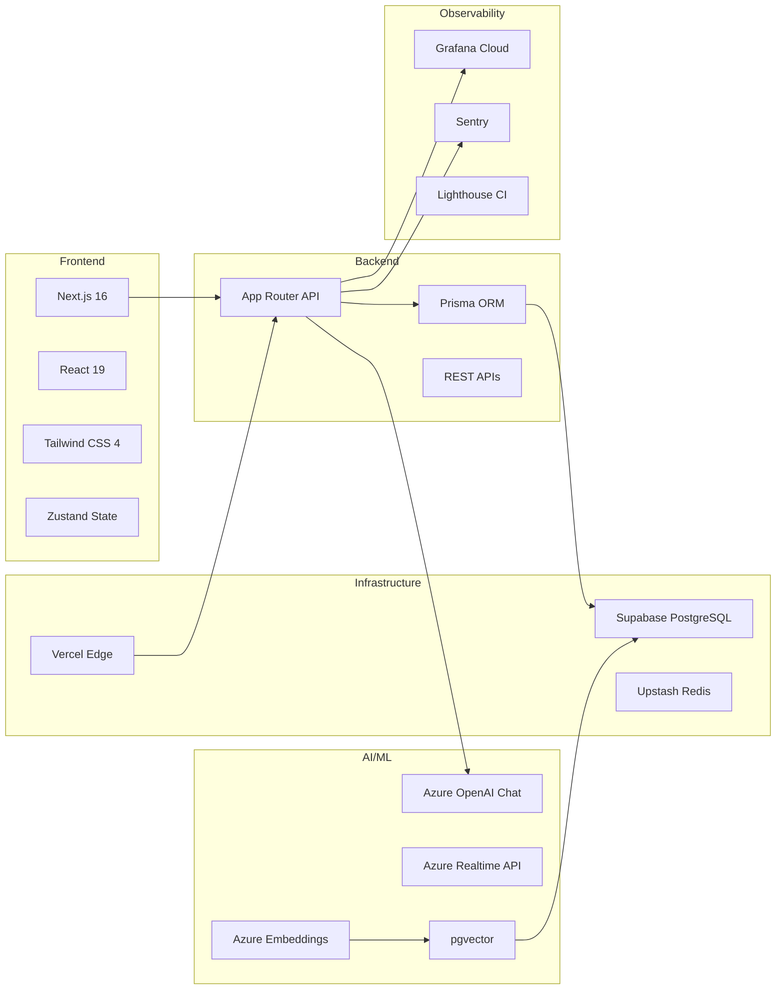
```mermaid
graph LR
    subgraph "Frontend"
        Next[Next.js 16]
        React[React 19]
        Tailwind[Tailwind CSS 4]
        Zustand[Zustand State]
    end

    subgraph "Backend"
        AppRouter[App Router API]
        Prisma[Prisma ORM]
        tRPC[REST APIs]
    end

    subgraph "AI/ML"
        AzureChat[Azure OpenAI Chat]
        AzureVoice[Azure Realtime API]
        AzureEmbed[Azure Embeddings]
        pgvector[pgvector]
    end

    subgraph "Infrastructure"
        Vercel[Vercel Edge]
        Supabase[Supabase PostgreSQL]
        Upstash[Upstash Redis]
    end

    subgraph "Observability"
        Grafana[Grafana Cloud]
        Sentry[Sentry]
        Lighthouse[Lighthouse CI]
    end

    Next --> AppRouter
    AppRouter --> Prisma
    Prisma --> Supabase
    AppRouter --> AzureChat
    AzureEmbed --> pgvector
    pgvector --> Supabase
    Vercel --> AppRouter
    AppRouter --> Grafana
    AppRouter --> Sentry
```

---

## 3. Database Schema

### 3.1 Entity Relationship Diagram

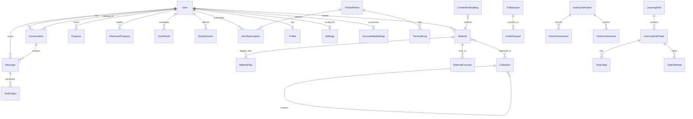
```mermaid
erDiagram
    User ||--o{ Conversation : has
    User ||--o{ Message : sends
    User ||--o{ Material : creates
    User ||--o{ Progress : tracks
    User ||--o{ FlashcardProgress : studies
    User ||--o{ QuizResult : completes
    User ||--o{ StudySession : attends
    User ||--o{ UserSubscription : subscribes
    User ||--o| Profile : has
    User ||--o| Settings : configures
    User ||--o| AccessibilitySettings : customizes

    Conversation ||--o{ Message : contains
    Conversation }|--|| User : belongs_to

    Message ||--o{ ToolOutput : generates

    Material ||--o{ MaterialTag : tagged_with
    Material ||--o{ MaterialConcept : links_to
    Material }o--o{ Collection : organized_in

    Collection ||--o{ Collection : contains

    TierDefinition ||--o{ UserSubscription : defines
    TierDefinition ||--o{ TierAuditLog : logs

    LearningPath ||--o{ LearningPathTopic : contains
    LearningPathTopic ||--o{ TopicStep : has
    LearningPathTopic ||--o{ TopicAttempt : tracks

    TrialSession ||--o| InviteRequest : converts_to

    ContentEmbedding }|--|| Material : embeds

    UserGamification ||--o{ PointsTransaction : records
    UserGamification ||--o{ UserAchievement : unlocks
```

### 3.2 Schema File Organization

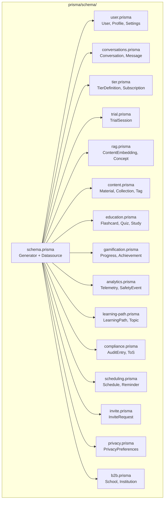
```mermaid
graph TB
    subgraph "prisma/schema/"
        schema[schema.prisma<br/>Generator + Datasource]
        user[user.prisma<br/>User, Profile, Settings]
        conv[conversations.prisma<br/>Conversation, Message]
        tier[tier.prisma<br/>TierDefinition, Subscription]
        trial[trial.prisma<br/>TrialSession]
        rag[rag.prisma<br/>ContentEmbedding, Concept]
        content[content.prisma<br/>Material, Collection, Tag]
        edu[education.prisma<br/>Flashcard, Quiz, Study]
        gami[gamification.prisma<br/>Progress, Achievement]
        analytics[analytics.prisma<br/>Telemetry, SafetyEvent]
        lpath[learning-path.prisma<br/>LearningPath, Topic]
        compliance[compliance.prisma<br/>AuditEntry, ToS]
        schedule[scheduling.prisma<br/>Schedule, Reminder]
        invite[invite.prisma<br/>InviteRequest]
        privacy[privacy.prisma<br/>PrivacyPreferences]
        b2b[b2b.prisma<br/>School, Institution]
    end

    schema --> user
    schema --> conv
    schema --> tier
    schema --> trial
    schema --> rag
    schema --> content
    schema --> edu
    schema --> gami
    schema --> analytics
    schema --> lpath
    schema --> compliance
    schema --> schedule
    schema --> invite
    schema --> privacy
    schema --> b2b
```

---

## 4. Authentication Flow

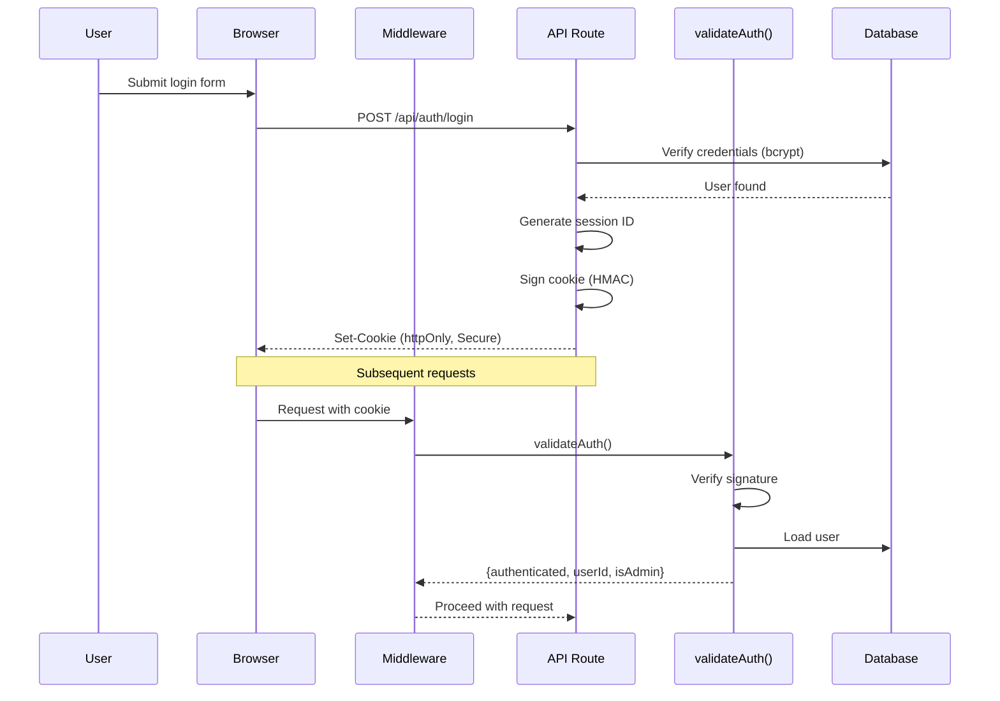
```mermaid
sequenceDiagram
    participant U as User
    participant B as Browser
    participant M as Middleware
    participant API as API Route
    participant Auth as validateAuth()
    participant DB as Database

    U->>B: Submit login form
    B->>API: POST /api/auth/login
    API->>DB: Verify credentials (bcrypt)
    DB-->>API: User found
    API->>API: Generate session ID
    API->>API: Sign cookie (HMAC)
    API-->>B: Set-Cookie (httpOnly, Secure)

    Note over B,API: Subsequent requests

    B->>M: Request with cookie
    M->>Auth: validateAuth()
    Auth->>Auth: Verify signature
    Auth->>DB: Load user
    Auth-->>M: {authenticated, userId, isAdmin}
    M-->>API: Proceed with request
```

### 4.1 Cookie Architecture

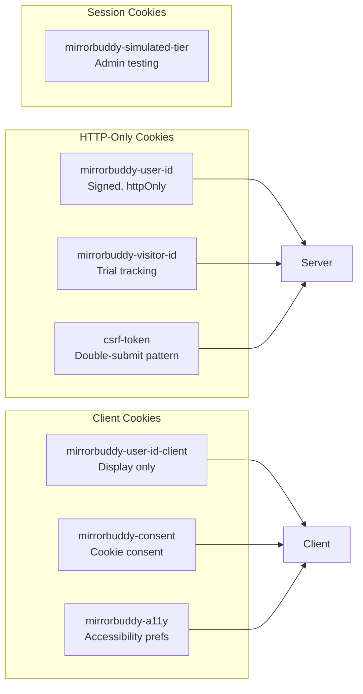
```mermaid
graph LR
    subgraph "HTTP-Only Cookies"
        AuthCookie[mirrorbuddy-user-id<br/>Signed, httpOnly]
        VisitorCookie[mirrorbuddy-visitor-id<br/>Trial tracking]
        CSRFCookie[csrf-token<br/>Double-submit pattern]
    end

    subgraph "Client Cookies"
        ClientAuth[mirrorbuddy-user-id-client<br/>Display only]
        Consent[mirrorbuddy-consent<br/>Cookie consent]
        A11y[mirrorbuddy-a11y<br/>Accessibility prefs]
    end

    subgraph "Session Cookies"
        SimTier[mirrorbuddy-simulated-tier<br/>Admin testing]
    end

    AuthCookie --> Server
    VisitorCookie --> Server
    CSRFCookie --> Server
    ClientAuth --> Client
    Consent --> Client
    A11y --> Client
```

---

## 5. Chat Pipeline

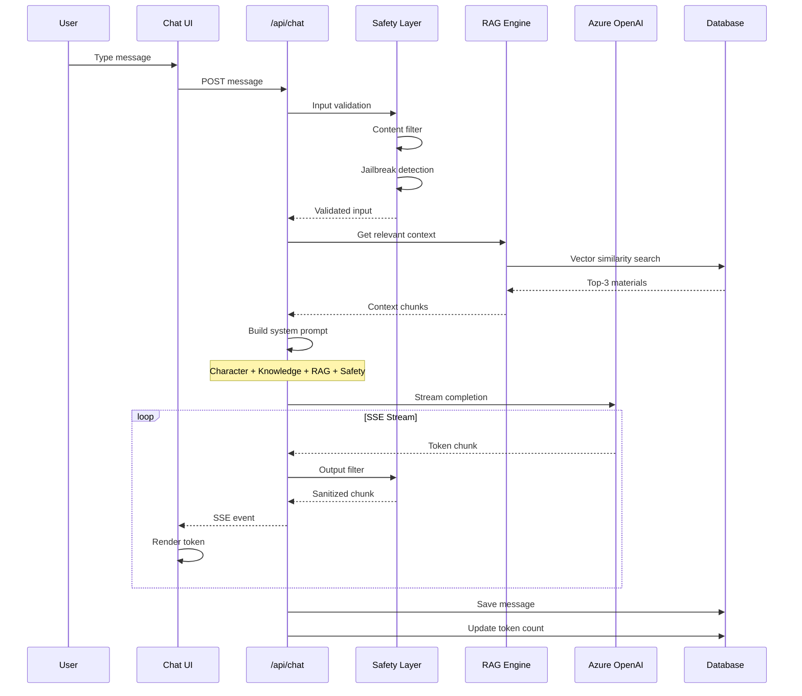
```mermaid
sequenceDiagram
    participant U as User
    participant UI as Chat UI
    participant API as /api/chat
    participant Safety as Safety Layer
    participant RAG as RAG Engine
    participant AI as Azure OpenAI
    participant DB as Database

    U->>UI: Type message
    UI->>API: POST message

    API->>Safety: Input validation
    Safety->>Safety: Content filter
    Safety->>Safety: Jailbreak detection
    Safety-->>API: Validated input

    API->>RAG: Get relevant context
    RAG->>DB: Vector similarity search
    DB-->>RAG: Top-3 materials
    RAG-->>API: Context chunks

    API->>API: Build system prompt
    Note over API: Character + Knowledge + RAG + Safety

    API->>AI: Stream completion

    loop SSE Stream
        AI-->>API: Token chunk
        API->>Safety: Output filter
        Safety-->>API: Sanitized chunk
        API-->>UI: SSE event
        UI->>UI: Render token
    end

    API->>DB: Save message
    API->>DB: Update token count
```

### 5.1 System Prompt Construction

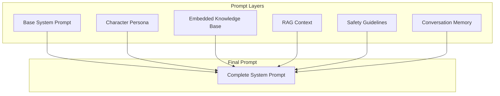
```mermaid
graph TB
    subgraph "Prompt Layers"
        Base[Base System Prompt]
        Character[Character Persona]
        Knowledge[Embedded Knowledge Base]
        RAG[RAG Context]
        Safety[Safety Guidelines]
        Memory[Conversation Memory]
    end

    subgraph "Final Prompt"
        Final[Complete System Prompt]
    end

    Base --> Final
    Character --> Final
    Knowledge --> Final
    RAG --> Final
    Safety --> Final
    Memory --> Final
```

---

## 6. Voice System

### 6.1 WebRTC Architecture (ADR 0038)

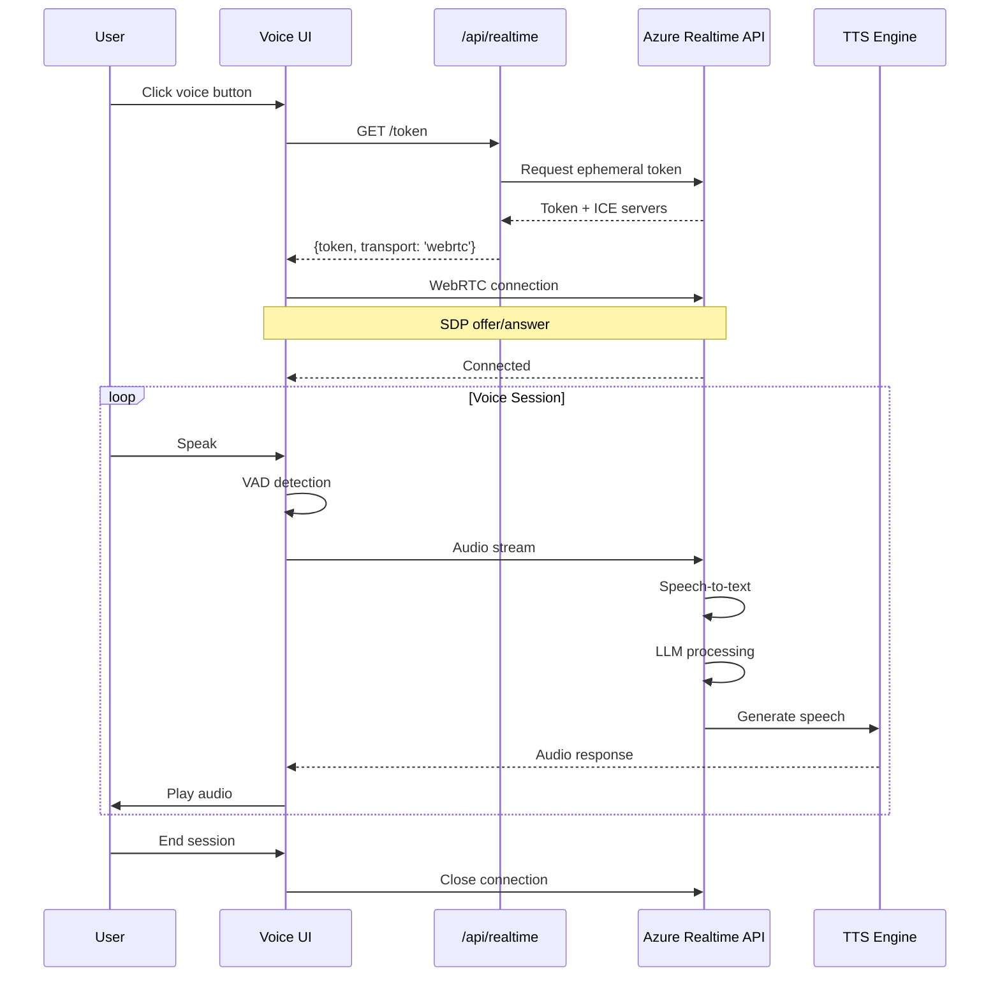
```mermaid
sequenceDiagram
    participant U as User
    participant UI as Voice UI
    participant API as /api/realtime
    participant Azure as Azure Realtime API
    participant TTS as TTS Engine

    U->>UI: Click voice button
    UI->>API: GET /token
    API->>Azure: Request ephemeral token
    Azure-->>API: Token + ICE servers
    API-->>UI: {token, transport: 'webrtc'}

    UI->>Azure: WebRTC connection
    Note over UI,Azure: SDP offer/answer
    Azure-->>UI: Connected

    loop Voice Session
        U->>UI: Speak
        UI->>UI: VAD detection
        UI->>Azure: Audio stream
        Azure->>Azure: Speech-to-text
        Azure->>Azure: LLM processing
        Azure->>TTS: Generate speech
        TTS-->>UI: Audio response
        UI->>U: Play audio
    end

    U->>UI: End session
    UI->>Azure: Close connection
```

### 6.2 Adaptive VAD (ADR 0069)

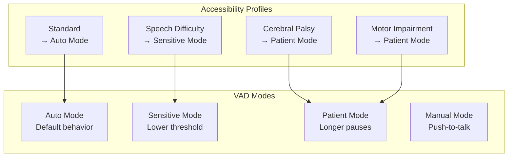
```mermaid
graph TB
    subgraph "VAD Modes"
        Auto[Auto Mode<br/>Default behavior]
        Sensitive[Sensitive Mode<br/>Lower threshold]
        Patient[Patient Mode<br/>Longer pauses]
        Manual[Manual Mode<br/>Push-to-talk]
    end

    subgraph "Accessibility Profiles"
        CP[Cerebral Palsy<br/>→ Patient Mode]
        Motor[Motor Impairment<br/>→ Patient Mode]
        Speech[Speech Difficulty<br/>→ Sensitive Mode]
        Standard[Standard<br/>→ Auto Mode]
    end

    CP --> Patient
    Motor --> Patient
    Speech --> Sensitive
    Standard --> Auto
```

---

## 7. Character System

### 7.1 Support Triangle

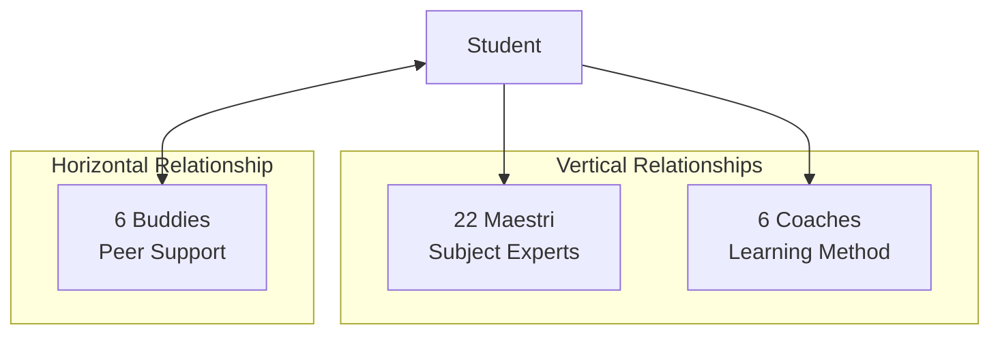
```mermaid
graph TB
    Student[Student]

    subgraph "Vertical Relationships"
        Maestri[22 Maestri<br/>Subject Experts]
        Coaches[6 Coaches<br/>Learning Method]
    end

    subgraph "Horizontal Relationship"
        Buddies[6 Buddies<br/>Peer Support]
    end

    Student --> Maestri
    Student --> Coaches
    Student <--> Buddies
```

### 7.2 Maestri Overview

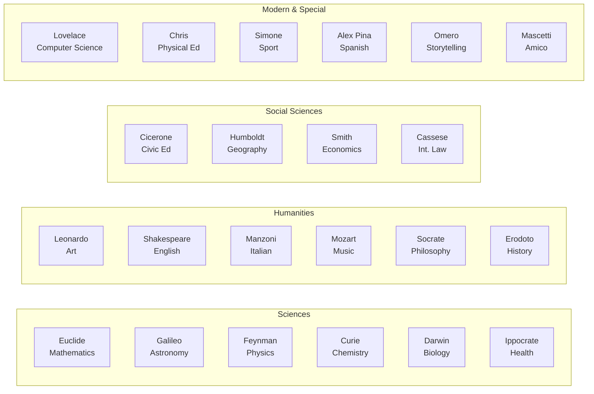
```mermaid
graph LR
    subgraph "Sciences"
        Euclide[Euclide<br/>Mathematics]
        Galileo[Galileo<br/>Astronomy]
        Feynman[Feynman<br/>Physics]
        Curie[Curie<br/>Chemistry]
        Darwin[Darwin<br/>Biology]
        Ippocrate[Ippocrate<br/>Health]
    end

    subgraph "Humanities"
        Leonardo[Leonardo<br/>Art]
        Shakespeare[Shakespeare<br/>English]
        Manzoni[Manzoni<br/>Italian]
        Mozart[Mozart<br/>Music]
        Socrate[Socrate<br/>Philosophy]
        Erodoto[Erodoto<br/>History]
    end

    subgraph "Social Sciences"
        Cicerone[Cicerone<br/>Civic Ed]
        Humboldt[Humboldt<br/>Geography]
        Smith[Smith<br/>Economics]
        Cassese[Cassese<br/>Int. Law]
    end

    subgraph "Modern & Special"
        Lovelace[Lovelace<br/>Computer Science]
        Chris[Chris<br/>Physical Ed]
        Simone[Simone<br/>Sport]
        AlexPina[Alex Pina<br/>Spanish]
        Omero[Omero<br/>Storytelling]
        Mascetti[Mascetti<br/>Amico]
    end
```

### 7.3 Character Intensity Dial (ADR 0031)

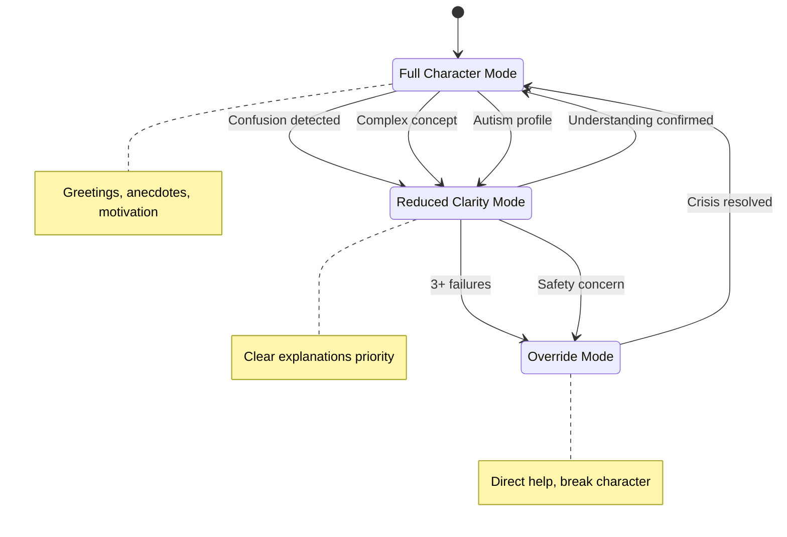
```mermaid
stateDiagram-v2
    [*] --> FullCharacter

    FullCharacter: Full Character Mode
    note right of FullCharacter: Greetings, anecdotes, motivation

    FullCharacter --> Reduced: Confusion detected
    FullCharacter --> Reduced: Complex concept
    FullCharacter --> Reduced: Autism profile

    Reduced: Reduced Clarity Mode
    note right of Reduced: Clear explanations priority

    Reduced --> FullCharacter: Understanding confirmed
    Reduced --> Override: 3+ failures
    Reduced --> Override: Safety concern

    Override: Override Mode
    note right of Override: Direct help, break character

    Override --> FullCharacter: Crisis resolved
```

### 7.4 Formal vs Informal Address (ADR 0064)

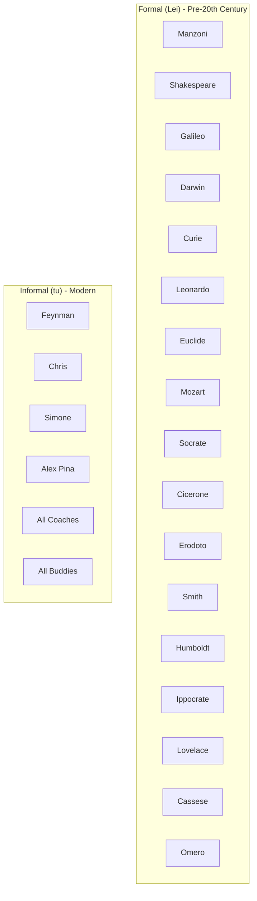
```mermaid
graph TB
    subgraph "Formal (Lei) - Pre-20th Century"
        F1[Manzoni]
        F2[Shakespeare]
        F3[Galileo]
        F4[Darwin]
        F5[Curie]
        F6[Leonardo]
        F7[Euclide]
        F8[Mozart]
        F9[Socrate]
        F10[Cicerone]
        F11[Erodoto]
        F12[Smith]
        F13[Humboldt]
        F14[Ippocrate]
        F15[Lovelace]
        F16[Cassese]
        F17[Omero]
    end

    subgraph "Informal (tu) - Modern"
        I1[Feynman]
        I2[Chris]
        I3[Simone]
        I4[Alex Pina]
        I5[All Coaches]
        I6[All Buddies]
    end
```

---

## 8. Tool Execution

### 8.1 Tool Plugin Architecture (ADR 0037)

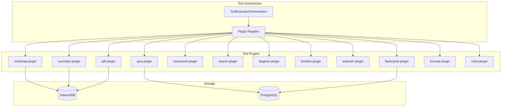
```mermaid
graph TB
    subgraph "Tool Orchestrator"
        Orch[ToolExecutorOrchestration]
        Registry[Plugin Registry]
    end

    subgraph "Tool Plugins"
        Mindmap[mindmap-plugin]
        Quiz[quiz-plugin]
        Flash[flashcards-plugin]
        Summary[summary-plugin]
        Homework[homework-plugin]
        Search[search-plugin]
        Diagram[diagram-plugin]
        Timeline[timeline-plugin]
        Webcam[webcam-plugin]
        PDF[pdf-plugin]
        Formula[formula-plugin]
        Chart[chart-plugin]
    end

    subgraph "Storage"
        IDB[(IndexedDB)]
        Prisma[(PostgreSQL)]
    end

    Orch --> Registry
    Registry --> Mindmap
    Registry --> Quiz
    Registry --> Flash
    Registry --> Summary
    Registry --> Homework
    Registry --> Search
    Registry --> Diagram
    Registry --> Timeline
    Registry --> Webcam
    Registry --> PDF
    Registry --> Formula
    Registry --> Chart

    Mindmap --> IDB
    Quiz --> Prisma
    Flash --> Prisma
    Summary --> IDB
    PDF --> IDB
```

### 8.2 Tool Execution Flow

```mermaid
sequenceDiagram
    participant M as Maestro AI
    participant O as Orchestrator
    participant P as Plugin
    participant S as SSE Stream
    participant DB as Storage
    participant UI as Tool Canvas

    M->>O: Tool call detected
    O->>O: Validate tool access
    O->>P: Execute plugin

    P->>S: tool_started event
    S-->>UI: Show loading

    loop Progress
        P->>S: tool_progress event
        S-->>UI: Update progress
    end

    P->>DB: Save material
    P->>S: tool_completed event
    S-->>UI: Render tool output

    UI->>UI: 80% canvas, 20% PiP
```

---

## 9. RAG System

### 9.1 RAG Architecture (ADR 0033)

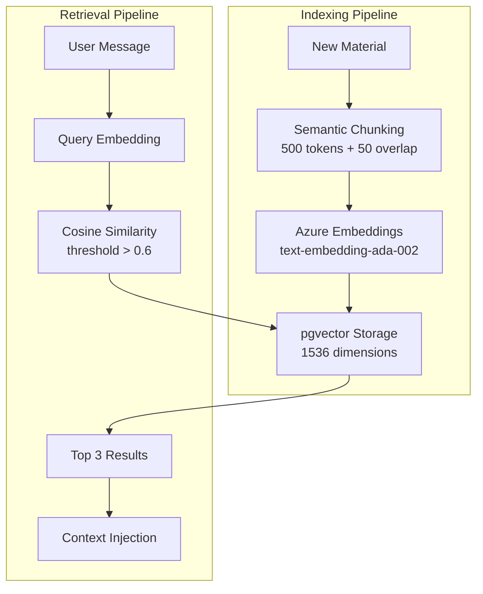
```mermaid
graph TB
    subgraph "Indexing Pipeline"
        Doc[New Material]
        Chunk[Semantic Chunking<br/>500 tokens + 50 overlap]
        Embed[Azure Embeddings<br/>text-embedding-ada-002]
        Store[pgvector Storage<br/>1536 dimensions]
    end

    subgraph "Retrieval Pipeline"
        Query[User Message]
        QEmbed[Query Embedding]
        Search[Cosine Similarity<br/>threshold > 0.6]
        Top3[Top 3 Results]
        Inject[Context Injection]
    end

    Doc --> Chunk
    Chunk --> Embed
    Embed --> Store

    Query --> QEmbed
    QEmbed --> Search
    Search --> Store
    Store --> Top3
    Top3 --> Inject
```

### 9.2 Content Embedding Model

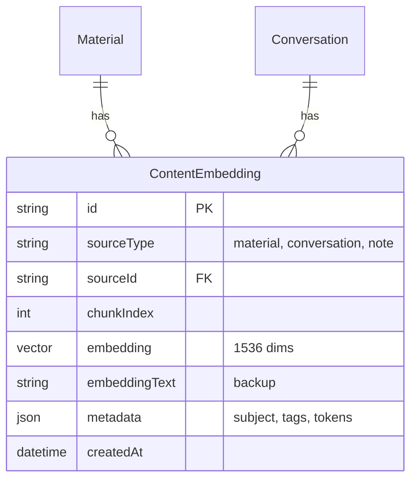
```mermaid
erDiagram
    ContentEmbedding {
        string id PK
        string sourceType "material, conversation, note"
        string sourceId FK
        int chunkIndex
        vector embedding "1536 dims"
        string embeddingText "backup"
        json metadata "subject, tags, tokens"
        datetime createdAt
    }

    Material ||--o{ ContentEmbedding : has
    Conversation ||--o{ ContentEmbedding : has
```

---

## 10. Tier & Subscription

### 10.1 Tier Hierarchy (ADR 0071)

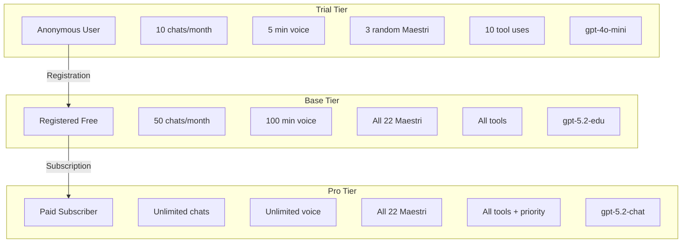
```mermaid
graph TB
    subgraph "Trial Tier"
        T1[Anonymous User]
        T2[10 chats/month]
        T3[5 min voice]
        T4[3 random Maestri]
        T5[10 tool uses]
        T6[gpt-4o-mini]
    end

    subgraph "Base Tier"
        B1[Registered Free]
        B2[50 chats/month]
        B3[100 min voice]
        B4[All 22 Maestri]
        B5[All tools]
        B6[gpt-5.2-edu]
    end

    subgraph "Pro Tier"
        P1[Paid Subscriber]
        P2[Unlimited chats]
        P3[Unlimited voice]
        P4[All 22 Maestri]
        P5[All tools + priority]
        P6[gpt-5.2-chat]
    end

    T1 --> |Registration| B1
    B1 --> |Subscription| P1
```

### 10.2 TierService Flow

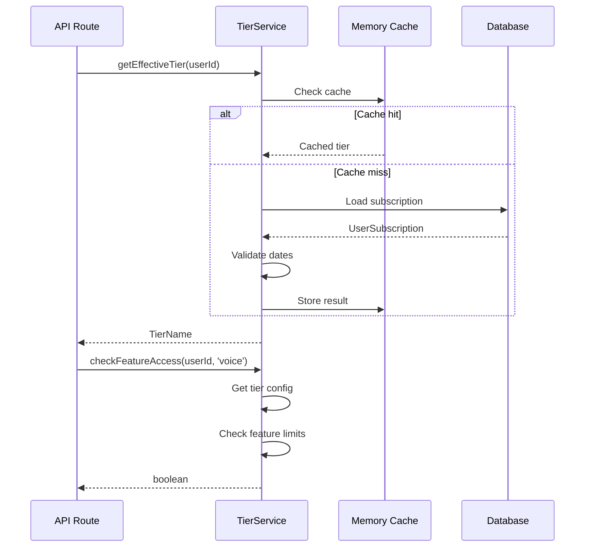
```mermaid
sequenceDiagram
    participant API as API Route
    participant TS as TierService
    participant Cache as Memory Cache
    participant DB as Database

    API->>TS: getEffectiveTier(userId)
    TS->>Cache: Check cache

    alt Cache hit
        Cache-->>TS: Cached tier
    else Cache miss
        TS->>DB: Load subscription
        DB-->>TS: UserSubscription
        TS->>TS: Validate dates
        TS->>Cache: Store result
    end

    TS-->>API: TierName

    API->>TS: checkFeatureAccess(userId, 'voice')
    TS->>TS: Get tier config
    TS->>TS: Check feature limits
    TS-->>API: boolean
```

### 10.3 Per-Feature Model Selection (ADR 0073)

```mermaid
graph LR
    subgraph "Feature Types"
        Chat[chat]
        Realtime[realtime]
        PDF[pdf]
        Mindmap[mindmap]
        Quiz[quiz]
        Flash[flashcards]
        Summary[summary]
        Formula[formula]
    end

    subgraph "Trial Models"
        TM[gpt-4o-mini]
    end

    subgraph "Base Models"
        BM1[gpt-5.2-edu<br/>chat, quiz, homework]
        BM2[gpt-5-mini<br/>pdf, mindmap, summary]
        BM3[gpt-realtime<br/>voice]
    end

    subgraph "Pro Models"
        PM[gpt-5.2-chat<br/>All features]
    end

    Chat --> TM
    Chat --> BM1
    Chat --> PM
```

---

## 11. Trial Mode

### 11.1 Trial Session Flow (ADR 0056)

```mermaid
stateDiagram-v2
    [*] --> Anonymous: Visit site

    Anonymous: Anonymous User
    note right of Anonymous: Generate visitor ID

    Anonymous --> TrialSession: First interaction

    TrialSession: Active Trial
    note right of TrialSession: Track: IP hash, limits, Maestri

    TrialSession --> LimitReached: Exceed limits
    TrialSession --> Blocked: Abuse detected
    TrialSession --> InviteRequest: Request invite

    LimitReached: Limits Exhausted
    note right of LimitReached: Show upgrade prompt

    Blocked: 24-hour Block
    note right of Blocked: Anti-abuse score >= 15

    InviteRequest: Pending Approval

    InviteRequest --> Registered: Approved
    InviteRequest --> Rejected: Denied

    Registered: Full User
    note right of Registered: Migrate preferences
```

### 11.2 Anti-Abuse Scoring

```mermaid
graph TB
    subgraph "Abuse Signals"
        IP[IP Changes<br/>+5 points]
        Rapid[Rapid Requests<br/>+3 points]
        Doc[Document Abuse<br/>+2 points]
        Reset[Cookie Reset<br/>+3 points]
    end

    subgraph "Score Evaluation"
        Score[Abuse Score]
        Threshold{Score >= 15?}
    end

    subgraph "Actions"
        Allow[Allow Request]
        Block[24-hour Block]
    end

    IP --> Score
    Rapid --> Score
    Doc --> Score
    Reset --> Score

    Score --> Threshold
    Threshold -->|Yes| Block
    Threshold -->|No| Allow
```

---

## 12. Invite System

### 12.1 Invite Flow (ADR 0057)

```mermaid
sequenceDiagram
    participant U as Trial User
    participant UI as Invite Form
    participant API as /api/invites
    participant Admin as Admin
    participant Email as Resend
    participant Auth as Auth System

    U->>UI: Click "Request Invite"
    UI->>API: POST /request
    API->>API: Create InviteRequest (PENDING)
    API->>Email: Notify admin
    API-->>UI: Success

    Admin->>API: GET /admin/invites
    API-->>Admin: Pending requests

    Admin->>API: POST /approve
    API->>API: Update status (APPROVED)
    API->>API: Generate temp password
    API->>Email: Send approval + credentials

    U->>Auth: First login
    Auth->>Auth: Force password change
    Auth->>API: Migrate trial data
    API-->>U: Welcome to Base tier
```

### 12.2 Invite Request States

```mermaid
stateDiagram-v2
    [*] --> PENDING: Submit request

    PENDING: Pending Review

    PENDING --> APPROVED: Admin approves
    PENDING --> REJECTED: Admin rejects

    APPROVED: Approved
    note right of APPROVED: Email with credentials sent

    REJECTED: Rejected
    note right of REJECTED: Optional reason provided

    APPROVED --> MIGRATED: First login

    MIGRATED: Data Migrated
    note right of MIGRATED: Trial preferences → User profile
```

---

## 13. CI/CD Pipeline

### 13.1 GitHub Actions Workflow

```mermaid
graph TB
    subgraph "Trigger"
        Push[Push to main/dev]
        PR[Pull Request]
    end

    subgraph "Lane 1: Build"
        Build[Build & Lint]
        Typecheck[TypeScript Check]
        NextBuild[Next.js Build]
        Artifacts[Upload Artifacts]
    end

    subgraph "Lane 2: Security"
        TruffleHog[TruffleHog Scan]
        SecretScan[Legacy Secret Check]
        Audit[npm audit]
        SBOM[Generate SBOM]
    end

    subgraph "Lane 3: Tests"
        Unit[Unit Tests]
        Coverage[Coverage Report]
        LLMSafety[LLM Safety Tests]
    end

    subgraph "Lane 4: Quality"
        Docs[Documentation Check]
        Migrations[Migration Check]
        TODOs[Critical TODOs]
        CircularDeps[Circular Imports]
        ConsoleLog[console.log Check]
    end

    subgraph "Lane 5: E2E (PR only)"
        Smoke[Smoke Tests]
        E2E[Full E2E]
        Mobile[Mobile E2E]
    end

    subgraph "Lane 6: Performance"
        Bundle[Bundle Size]
        Lighthouse[Lighthouse CI]
    end

    subgraph "Lane 7: Docker"
        Docker[Docker Build]
    end

    Push --> Build
    PR --> Build

    Build --> Artifacts
    TruffleHog --> SecretScan
    SecretScan --> Audit
    Audit --> SBOM

    Build --> Smoke
    Smoke --> E2E
    E2E --> Mobile

    Build --> Bundle
    Bundle --> Lighthouse
```

### 13.2 CI Job Dependencies

```mermaid
graph LR
    Build[build]
    SecretScan[secret-scanning]
    Security[security]
    Unit[unit-tests]
    LLM[llm-safety-tests]
    Docs[docs]
    Migrations[migrations]
    Quality[quality]
    Smoke[smoke-tests]
    E2E[e2e-tests]
    Mobile[mobile-e2e]
    Perf[performance]
    Docker[docker]

    SecretScan --> Security
    Build --> Smoke
    Build --> E2E
    Build --> Perf
    E2E --> Mobile
```

---

## 14. Git Hooks

### 14.1 Pre-Commit Hook

```mermaid
graph TB
    subgraph "Pre-Commit Checks"
        Secrets[secrets-scan.sh<br/>TruffleHog + regex]
        LintStaged[lint-staged<br/>ESLint + Prettier]
        CSP{CSP files<br/>changed?}
        CSPTest[CSP Validation Tests]
        Mobile{TSX files<br/>changed?}
        MobileCheck[Mobile Pattern Check]
    end

    subgraph "Outcome"
        Pass[Commit Allowed]
        Fail[Commit Blocked]
    end

    Secrets -->|Pass| LintStaged
    Secrets -->|Fail| Fail

    LintStaged -->|Pass| CSP
    LintStaged -->|Fail| Fail

    CSP -->|Yes| CSPTest
    CSP -->|No| Mobile

    CSPTest -->|Pass| Mobile
    CSPTest -->|Fail| Fail

    Mobile -->|Yes| MobileCheck
    Mobile -->|No| Pass

    MobileCheck -->|Pass| Pass
    MobileCheck -->|Fail| Fail
```

### 14.2 Pre-Push Hook

```mermaid
graph TB
    subgraph "pre-push-vercel.sh"
        MigrationCheck[Migration Naming<br/>YYYYMMDDHHMMSS_name]
        PrismaGen[prisma generate]
        Lint[npm run lint]
        Typecheck[npm run typecheck]
        AuditHigh[npm audit --high]
        Build[npm run build]
        VercelEnv[Vercel Env Check]
        CSRFCheck[CSRF Protection Check]
        CriticalTODOs[Critical TODOs Check]
        ConsoleLog[console.log Check]
        SecretsCheck[Secrets Exposure Check]
    end

    subgraph "Outcome"
        Allow[Push Allowed]
        Block[Push Blocked]
    end

    MigrationCheck -->|Pass| PrismaGen
    PrismaGen -->|Pass| Lint
    Lint -->|Pass| Typecheck
    Typecheck -->|Pass| AuditHigh
    AuditHigh -->|Pass| Build
    Build -->|Pass| VercelEnv
    VercelEnv -->|Pass| CSRFCheck
    CSRFCheck -->|Pass| CriticalTODOs
    CriticalTODOs -->|Pass| ConsoleLog
    ConsoleLog -->|Pass| SecretsCheck
    SecretsCheck -->|Pass| Allow

    MigrationCheck -->|Fail| Block
    PrismaGen -->|Fail| Block
    Lint -->|Fail| Block
    Typecheck -->|Fail| Block
    Build -->|Fail| Block
```

---

## 15. Cron Jobs

### 15.1 Scheduled Tasks (vercel.json)

```mermaid
graph TB
    subgraph "Every 5 Minutes"
        Metrics[/api/cron/metrics-push<br/>SLI metrics to Grafana]
    end

    subgraph "Daily 3 AM"
        DataRetention[/api/cron/data-retention<br/>GDPR cleanup]
        BusinessMetrics[/api/cron/business-metrics-daily<br/>KPI aggregation]
    end

    subgraph "Daily 9 AM"
        TrialNurturing[/api/cron/trial-nurturing<br/>Email automation]
    end

    subgraph "Authorization"
        CronSecret[CRON_SECRET header]
    end

    CronSecret --> Metrics
    CronSecret --> DataRetention
    CronSecret --> BusinessMetrics
    CronSecret --> TrialNurturing
```

### 15.2 Data Retention Flow

```mermaid
sequenceDiagram
    participant Cron as Cron Trigger
    participant API as /api/cron/data-retention
    participant DB as Database
    participant Log as Audit Log

    Cron->>API: GET (CRON_SECRET)
    API->>DB: Find expired sessions
    Note over DB: TTL: 365d conversations, 730d progress

    API->>DB: Anonymize PII
    API->>DB: Delete marked records
    API->>Log: Record deletion count

    API-->>Cron: {deleted: N, anonymized: M}
```

---

## 16. API Routes

### 16.1 API Route Organization

```mermaid
graph TB
    subgraph "/api"
        subgraph "Auth"
            AuthLogin[/auth/login]
            AuthLogout[/auth/logout]
            AuthGoogle[/auth/google]
            AuthSession[/auth/session]
        end

        subgraph "Chat"
            Chat[/chat]
            ChatStream[/chat/stream]
        end

        subgraph "Voice"
            RealtimeToken[/realtime/token]
            RealtimeEphemeral[/realtime/ephemeral-token]
            RealtimeStart[/realtime/start]
            RealtimeStatus[/realtime/status]
        end

        subgraph "User"
            UserProfile[/user/profile]
            UserSettings[/user/settings]
            UserSubscription[/user/subscription]
            UserUsage[/user/usage]
        end

        subgraph "Admin"
            AdminTiers[/admin/tiers]
            AdminUsers[/admin/users]
            AdminInvites[/admin/invites]
            AdminCounts[/admin/counts]
            AdminFunnel[/admin/funnel]
        end

        subgraph "Content"
            Conversations[/conversations]
            Materials[/materials]
            Collections[/collections]
            Tags[/tags]
        end

        subgraph "Education"
            Flashcards[/flashcards]
            Quizzes[/quizzes]
            LearningPath[/learning-path]
            StudyKit[/study-kit]
        end

        subgraph "Gamification"
            Points[/gamification/points]
            Achievements[/gamification/achievements]
            Streak[/gamification/streak]
        end

        subgraph "System"
            Health[/health]
            HealthDetailed[/health/detailed]
            Metrics[/metrics]
            Cron[/cron/*]
        end
    end
```

### 16.2 Request Flow

```mermaid
sequenceDiagram
    participant Client
    participant Middleware
    participant Route as API Route
    participant Auth as validateAuth()
    participant CSRF as requireCSRF()
    participant Handler as Business Logic
    participant DB as Database

    Client->>Middleware: Request
    Middleware->>Middleware: Rate limiting
    Middleware->>Route: Forward

    alt Authenticated Endpoint
        Route->>CSRF: Check CSRF (mutations)
        CSRF-->>Route: Valid
        Route->>Auth: validateAuth()
        Auth-->>Route: {userId, isAdmin}
    end

    Route->>Handler: Process request
    Handler->>DB: Data operations
    DB-->>Handler: Result
    Handler-->>Route: Response
    Route-->>Client: JSON response
```

---

## 17. Accessibility System

### 17.1 7 DSA Profiles (ADR 0060)

```mermaid
graph TB
    subgraph "Accessibility Profiles"
        Dyslexia[Dyslexia<br/>OpenDyslexic, spacing, TTS]
        ADHD[ADHD<br/>Pomodoro, focus mode]
        Visual[Visual Impairment<br/>High contrast, large text]
        Motor[Motor Impairment<br/>Keyboard nav, large targets]
        Autism[Autism<br/>Reduced motion, structure]
        Auditory[Auditory Impairment<br/>Visual cues, captions]
        CP[Cerebral Palsy<br/>Combined adaptations]
    end

    subgraph "Settings Storage"
        Cookie[mirrorbuddy-a11y<br/>90-day cookie]
        Store[Zustand Store]
    end

    subgraph "Components"
        FloatingBtn[a11y-floating-button<br/>44x44px trigger]
        QuickPanel[a11y-quick-panel<br/>Settings panel]
    end

    Dyslexia --> Store
    ADHD --> Store
    Visual --> Store
    Motor --> Store
    Autism --> Store
    Auditory --> Store
    CP --> Store

    Store --> Cookie
    FloatingBtn --> QuickPanel
    QuickPanel --> Store
```

### 17.2 WCAG 2.1 AA Requirements

```mermaid
graph LR
    subgraph "Perceivable"
        Contrast[4.5:1 contrast]
        TextAlt[Text alternatives]
        Captions[Captions]
    end

    subgraph "Operable"
        Keyboard[Keyboard accessible]
        Focus[Visible focus]
        Touch[44px touch targets]
    end

    subgraph "Understandable"
        Readable[Readable text]
        Predictable[Predictable]
        Input[Input assistance]
    end

    subgraph "Robust"
        Compatible[Compatible]
        Valid[Valid HTML]
    end
```

---

## 18. Compliance & Safety

### 18.1 5-Layer Safety Architecture (ADR 0004)

```mermaid
graph TB
    subgraph "Layer 1: System Prompt"
        Safety[SAFETY_GUIDELINES injection]
    end

    subgraph "Layer 2: Input Filter"
        ContentFilter[Content Filter]
        PII[PII Detection]
    end

    subgraph "Layer 3: Jailbreak Detection"
        Patterns[Pattern Matching]
        Heuristics[Heuristics]
    end

    subgraph "Layer 4: Output Sanitizer"
        OutputFilter[Response Filter]
        DOMPurify[DOMPurify]
    end

    subgraph "Layer 5: Monitoring"
        SafetyEvent[SafetyEvent logging]
        AdminDash[Admin Dashboard]
    end

    Input[User Input] --> ContentFilter
    ContentFilter --> PII
    PII --> Patterns
    Patterns --> Heuristics
    Heuristics --> LLM[LLM Processing]
    LLM --> OutputFilter
    OutputFilter --> DOMPurify
    DOMPurify --> Output[Safe Output]

    ContentFilter --> SafetyEvent
    Patterns --> SafetyEvent
    OutputFilter --> SafetyEvent
    SafetyEvent --> AdminDash
```

### 18.2 Compliance Framework

```mermaid
graph TB
    subgraph "Regulatory Requirements"
        EUAI[EU AI Act 2024/1689]
        Italy[L.132/2025 Italy]
        GDPR[GDPR]
        COPPA[COPPA]
        WCAG[WCAG 2.1 AA]
    end

    subgraph "Documentation"
        DPIA[DPIA.md]
        AIPolicy[AI-POLICY.md]
        ModelCard[MODEL-CARD.md]
        RiskMgmt[AI-RISK-MANAGEMENT.md]
        BiasAudit[BIAS-AUDIT-REPORT.md]
    end

    subgraph "Public Pages"
        AITransparency[/ai-transparency]
        Privacy[/privacy]
        Terms[/terms]
    end

    subgraph "Admin Tools"
        SafetyDash[/admin/safety]
        AuditLog[/api/compliance/audit-log]
        DataExport[/api/privacy/export-data]
    end

    EUAI --> DPIA
    EUAI --> AIPolicy
    GDPR --> Privacy
    GDPR --> DataExport
    COPPA --> Terms
    WCAG --> AITransparency
```

---

## 19. Observability

### 19.1 Monitoring Stack

```mermaid
graph TB
    subgraph "Metrics Collection"
        App[Next.js App]
        Health[/api/health]
        HealthDetailed[/api/health/detailed]
        Metrics[/api/metrics]
    end

    subgraph "Push to Grafana"
        CronPush[/api/cron/metrics-push<br/>Every 5 min]
        PromPush[Prometheus Push Gateway]
    end

    subgraph "Grafana Cloud"
        Dashboard[Dashboard]
        Alerts[Alert Rules]
    end

    subgraph "Error Tracking"
        Sentry[Sentry]
        SourceMaps[Source Maps]
    end

    subgraph "Service Limits"
        Vercel[Vercel Limits]
        Supabase[Supabase Limits]
        Azure[Azure OpenAI TPM/RPM]
        Redis[Upstash Redis]
        Resend[Resend Email]
    end

    App --> Health
    App --> Metrics
    Health --> CronPush
    Metrics --> CronPush
    CronPush --> PromPush
    PromPush --> Dashboard
    Dashboard --> Alerts

    App --> Sentry
    SourceMaps --> Sentry

    Vercel --> Dashboard
    Supabase --> Dashboard
    Azure --> Dashboard
```

### 19.2 SLI/SLO Metrics (ADR 0058)

```mermaid
graph LR
    subgraph "Session Health"
        SuccessRate[Success Rate]
        DropOff[Drop-off Rate]
        StuckLoop[Stuck Loop Rate]
    end

    subgraph "Safety Metrics"
        RefusalPrec[Refusal Precision]
        JailblockRate[Jailbreak Block Rate]
        Incidents[Incidents S0-S3]
    end

    subgraph "Performance"
        P95[HTTP Latency P95]
        ErrorRate[Error Rate by Route]
    end

    subgraph "Cost"
        SessionCost[Per-Session Cost]
        CostSpikes[Cost Spike Detection]
    end
```

---

## 20. External Integrations

### 20.1 Service Map

```mermaid
graph TB
    subgraph "MirrorBuddy"
        App[Next.js Application]
    end

    subgraph "AI Services"
        AzureChat[Azure OpenAI<br/>Chat Completions]
        AzureRealtime[Azure Realtime API<br/>Voice Sessions]
        AzureEmbed[Azure Embeddings<br/>RAG Indexing]
        AzureTTS[Azure TTS<br/>Text-to-Speech]
        Ollama[Ollama<br/>Local Fallback]
    end

    subgraph "Data Services"
        Supabase[Supabase<br/>PostgreSQL + pgvector]
        Upstash[Upstash Redis<br/>Rate Limiting + Cache]
    end

    subgraph "Communication"
        Resend[Resend<br/>Email Notifications]
    end

    subgraph "Infrastructure"
        Vercel[Vercel<br/>Edge Deployment]
    end

    subgraph "Observability"
        Grafana[Grafana Cloud<br/>Metrics Dashboard]
        Sentry[Sentry<br/>Error Tracking]
    end

    App --> AzureChat
    App --> AzureRealtime
    App --> AzureEmbed
    App --> AzureTTS
    App --> Ollama

    App --> Supabase
    App --> Upstash

    App --> Resend

    App --> Vercel

    App --> Grafana
    App --> Sentry
```

### 20.2 CSP Allowed Domains

```mermaid
graph LR
    subgraph "connect-src"
        Self['self']
        AzureOpenAI[*.openai.azure.com]
        AzureRealtime[*.realtimeapi-preview.ai.azure.com]
        Upstash[*.upstash.io]
        Supabase[*.supabase.co]
        Sentry[*.sentry.io]
        Grafana[*.grafana.net]
    end

    subgraph "script-src"
        SelfScript['self']
        Nonce[nonce-based]
    end
```

---

## 21. Component Structure

### 21.1 Component Organization

```mermaid
graph TB
    subgraph "src/components/"
        subgraph "Core"
            UI[ui/<br/>Buttons, Cards, Forms]
            Layout[layout/<br/>Navigation, Footer]
            Providers[providers/<br/>Context Providers]
        end

        subgraph "Features"
            Chat[chat/<br/>Message List, Input]
            Conv[conversation/<br/>Character View, Sidebar]
            Voice[voice/<br/>Waveform, Controls]
            Tools[tools/<br/>Mindmap, Quiz, etc.]
        end

        subgraph "Education"
            Edu[education/<br/>Quiz, Flashcards]
            LPath[learning-path/<br/>Progress, Topics]
            Gami[gamification/<br/>Achievements, Streak]
        end

        subgraph "User"
            Settings[settings/<br/>Profile, Preferences]
            Profile[profile/<br/>COPPA, Avatar]
            Tier[tier/<br/>Badge, Upgrade]
        end

        subgraph "Admin"
            AdminComp[admin/<br/>Dashboard, Users]
            Trial[trial/<br/>Trial UI, Limits]
        end

        subgraph "A11y"
            A11y[accessibility/<br/>Floating Button, Panel]
            Typing[typing/<br/>Loading States]
        end
    end
```

---

## 22. State Management

### 22.1 Zustand Stores

```mermaid
graph TB
    subgraph "Conversation State"
        ConvStore[useConversationStore<br/>Active conversation + messages]
        ChatStore[useChatStore<br/>Chat session state]
        CharStore[useCharacterStore<br/>Selected maestro]
    end

    subgraph "User State"
        SettingsStore[useSettingsStore<br/>User preferences]
        A11yStore[useAccessibilityStore<br/>A11y settings]
        TierStore[useTierStore<br/>Current tier]
    end

    subgraph "Trial State"
        TrialStore[useTrialStore<br/>Trial session + limits]
    end

    subgraph "Gamification State"
        GamiStore[useGamificationStore<br/>Points, streaks]
    end

    subgraph "Persistence"
        REST[REST APIs]
        Cookies[Cookies]
        Memory[Memory Only]
    end

    ConvStore --> REST
    ChatStore --> Memory
    CharStore --> REST
    SettingsStore --> REST
    A11yStore --> Cookies
    TierStore --> REST
    TrialStore --> REST
    GamiStore --> REST
```

### 22.2 No localStorage Policy (ADR 0015)

```mermaid
graph LR
    subgraph "Allowed"
        Zustand[Zustand Stores]
        REST[REST APIs]
        Cookies[Essential Cookies]
        IndexedDB[IndexedDB<br/>Binary files only]
    end

    subgraph "Forbidden"
        LocalStorage[localStorage<br/>for user data]
    end

    Zustand --> REST
    Zustand --> Cookies
```

---

## 23. Deployment Flow

### 23.1 Vercel Deployment

```mermaid
sequenceDiagram
    participant Dev as Developer
    participant Git as GitHub
    participant Hook as Pre-push Hook
    participant CI as GitHub Actions
    participant Vercel as Vercel

    Dev->>Hook: git push
    Hook->>Hook: pre-push-vercel.sh
    Note over Hook: Lint, Typecheck, Build, etc.
    Hook-->>Dev: Pass/Fail

    Dev->>Git: Push to main
    Git->>CI: Trigger workflow

    par CI Checks
        CI->>CI: Build & Lint
        CI->>CI: Security Scan
        CI->>CI: Unit Tests
        CI->>CI: E2E Tests
    end

    CI-->>Git: All green

    Git->>Vercel: Auto-deploy trigger
    Vercel->>Vercel: prisma generate
    Vercel->>Vercel: npm run build
    Vercel->>Vercel: seed:admin
    Vercel-->>Git: Deploy complete
```

### 23.2 SSL Configuration (ADR 0063, 0067)

```mermaid
graph TB
    subgraph "Certificate Handling"
        Cert[Supabase CA Cert]
        Pipe[Pipe-delimited format]
        EnvVar[SUPABASE_CA_CERT env]
    end

    subgraph "Connection"
        Prisma[Prisma Client]
        Pool[Connection Pool]
        SSL[SSL Config]
    end

    subgraph "Never Use"
        TLSReject[NODE_TLS_REJECT_UNAUTHORIZED=0]
    end

    Cert --> Pipe
    Pipe --> EnvVar
    EnvVar --> SSL
    SSL --> Pool
    Pool --> Prisma

    TLSReject -.->|Forbidden| SSL
```

---

## 24. ADR Index

### 24.1 Architecture Decision Records

```mermaid
graph TB
    subgraph "Data & Storage"
        ADR0001[0001 Materials Storage]
        ADR0015[0015 Database-First]
        ADR0028[0028 PostgreSQL + pgvector]
        ADR0033[0033 RAG Semantic Search]
    end

    subgraph "AI & Characters"
        ADR0003[0003 Support Triangle]
        ADR0031[0031 Embedded Knowledge]
        ADR0064[0064 Formal/Informal]
        ADR0073[0073 Per-Feature Models]
    end

    subgraph "Voice & Realtime"
        ADR0005[0005 SSE Architecture]
        ADR0034[0034 Chat Streaming]
        ADR0038[0038 WebRTC Migration]
        ADR0069[0069 Adaptive VAD]
    end

    subgraph "Security & Safety"
        ADR0004[0004 Safety Guardrails]
        ADR0060[0060 Security Hardening]
        ADR0072[0072 Secrets Scan]
        ADR0075[0075 Cookie Standards]
    end

    subgraph "Business Logic"
        ADR0056[0056 Trial Mode]
        ADR0057[0057 Invite System]
        ADR0071[0071 Tier Subscription]
    end

    subgraph "Infrastructure"
        ADR0047[0047 Grafana Cloud]
        ADR0063[0063 Supabase SSL]
        ADR0067[0067 DB Performance]
        ADR0070[0070 Sentry]
        ADR0076[0076 Centralized Logging]
    end

    subgraph "Compliance"
        ADR0008[0008 Parent Dashboard GDPR]
        ADR0059[0059 E2E Test Setup]
        ADR0062[0062 AI Compliance]
    end
```

---

## Quick Reference

| Category | Key Files                                         | ADRs             |
| -------- | ------------------------------------------------- | ---------------- |
| Database | `prisma/schema/*.prisma`                          | 0015, 0028, 0033 |
| Auth     | `src/lib/auth/`                                   | 0055, 0075       |
| Chat     | `src/lib/ai/`, `src/app/api/chat/`                | 0034             |
| Voice    | `src/app/api/realtime/`                           | 0038, 0069       |
| Maestri  | `src/data/maestri/`                               | 0031, 0064       |
| Tools    | `src/lib/tools/`                                  | 0009, 0037       |
| Tiers    | `src/lib/tier/`                                   | 0071, 0073       |
| Trial    | `src/lib/trial/`                                  | 0056, 0057       |
| Safety   | `src/lib/safety/`                                 | 0004, 0062       |
| A11y     | `src/lib/accessibility/`                          | 0060             |
| CI/CD    | `.github/workflows/ci.yml`                        | -                |
| Hooks    | `.husky/pre-commit`, `scripts/pre-push-vercel.sh` | 0072             |

---

_Last updated: January 2025_
_Generated from codebase analysis and ADR documentation_
