# MirrorBuddy Architecture Diagrams

> Complete visual documentation of the MirrorBuddy platform architecture.
> All diagrams are in Mermaid format for easy maintenance and version control.

**Version**: 0.12.0
**Last Verified**: 2026-01-26
**Update Policy**: This file is verified and updated during each release via `/release`

---

## Table of Contents

1. [System Overview](#1-system-overview)
2. [Tech Stack Layers](#2-tech-stack-layers)
3. [Database Schema](#3-database-schema)
4. [Authentication Flow](#4-authentication-flow)
5. [Conversation Engine (Shared Core)](#5-conversation-engine-shared-core)
6. [Channel: Chat (Text)](#6-channel-chat-text)
7. [Channel: Voice (Audio)](#7-channel-voice-audio)
8. [Character System](#8-character-system)
9. [Tool Execution](#9-tool-execution)
10. [RAG System](#10-rag-system)
11. [Tier & Subscription](#11-tier--subscription)
12. [Trial Mode](#12-trial-mode)
13. [Invite System](#13-invite-system)
14. [CI/CD Pipeline](#14-cicd-pipeline)
15. [Git Hooks](#15-git-hooks)
16. [Cron Jobs](#16-cron-jobs)
17. [API Routes](#17-api-routes)
18. [Accessibility System](#18-accessibility-system)
19. [Compliance & Safety](#19-compliance--safety)
20. [Observability](#20-observability)
21. [External Integrations](#21-external-integrations)
22. [Component Structure](#22-component-structure)
23. [State Management](#23-state-management)
24. [Deployment Flow](#24-deployment-flow)
25. [ADR Index](#25-adr-index)

---

## 1. System Overview

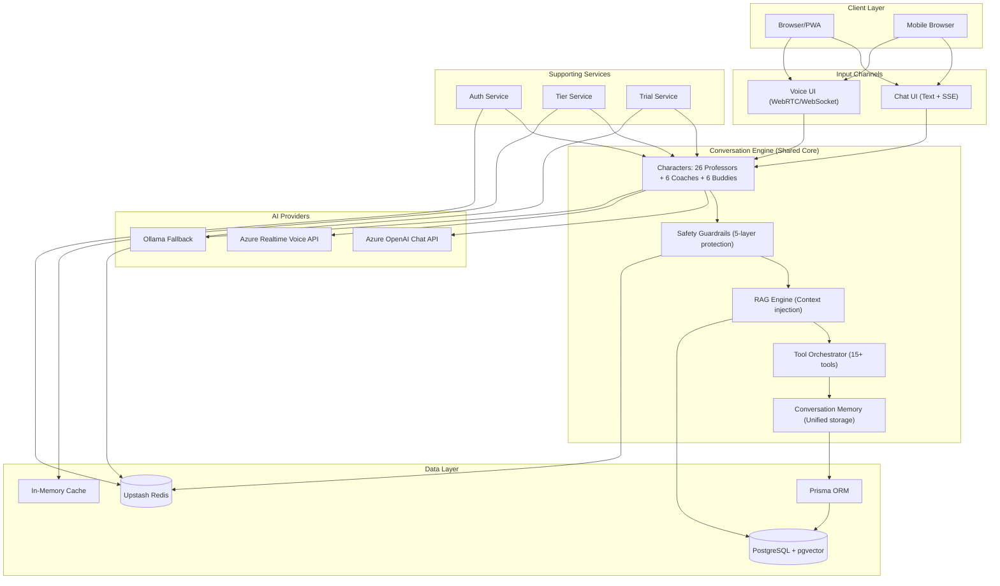

### 1.1 Redis Usage (System-Wide)

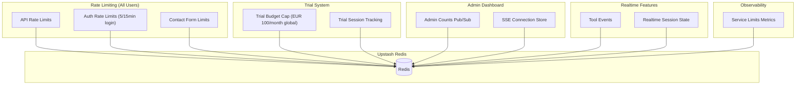

### 1.2 Key Insight: Unified Conversation Engine

**Chat and Voice are input/output channels, NOT separate systems.**

Both channels share:

- **Same Characters**: Identical personality, knowledge base, teaching style
- **Same Safety**: 5-layer guardrails apply to both text and voice
- **Same Tools**: Quiz, mindmap, flashcards work identically
- **Same Conversations**: Unified storage, seamless context switching
- **Same RAG**: User materials enhance both chat and voice responses
- **Same Tier Limits**: Feature access rules apply uniformly

---

## 2. Tech Stack Layers

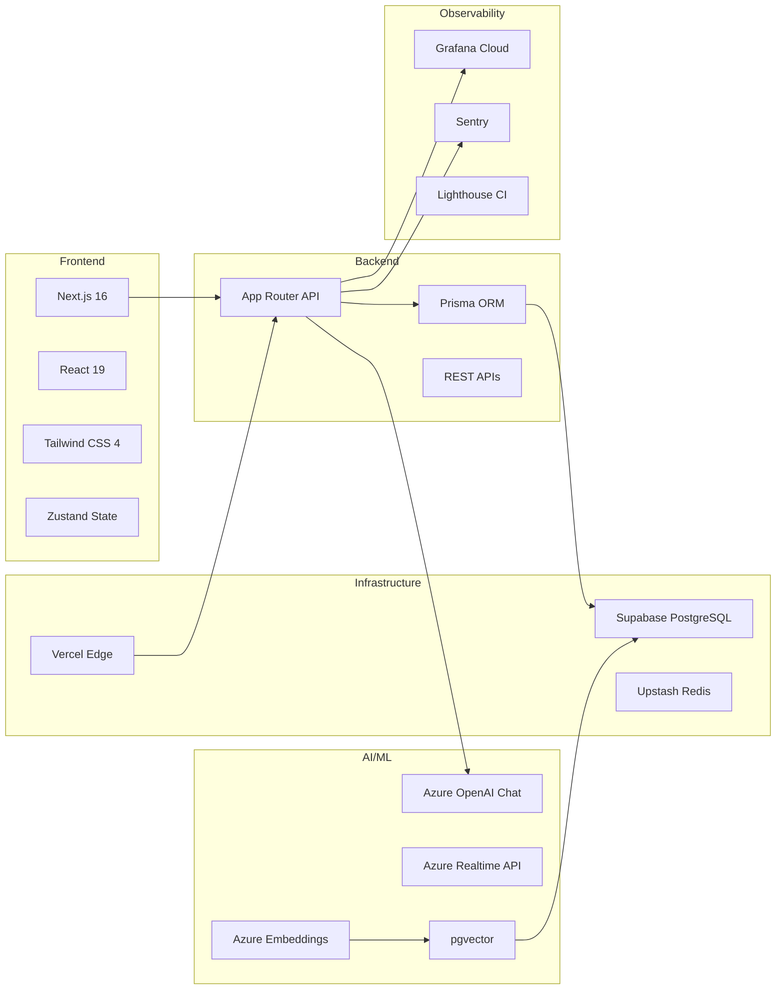

---

## 3. Database Schema

### 3.1 Entity Relationship Diagram

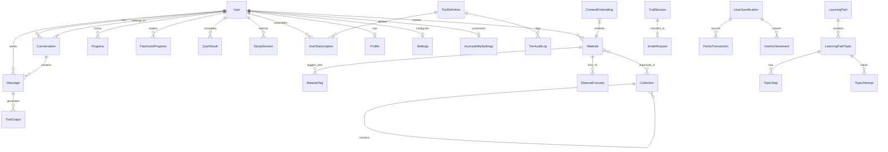

### 3.2 Schema File Organization

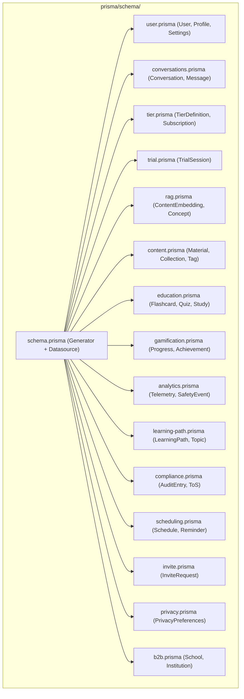

---

## 4. Authentication Flow


### 4.1 Cookie Architecture

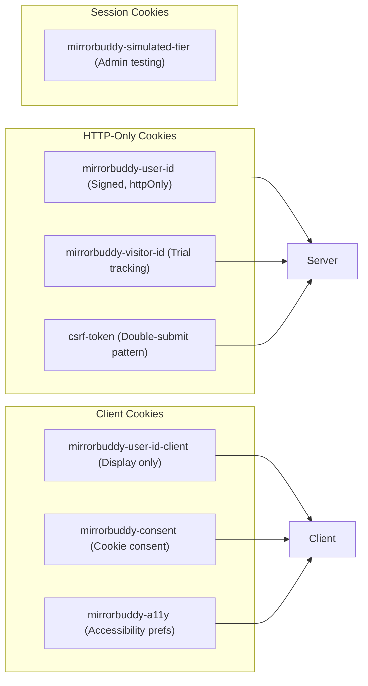

---

## 5. Conversation Engine (Shared Core)

Chat and Voice are **input/output channels** to the same Conversation Engine.
Everything below is shared between both modalities.

### 5.1 Unified Processing Pipeline

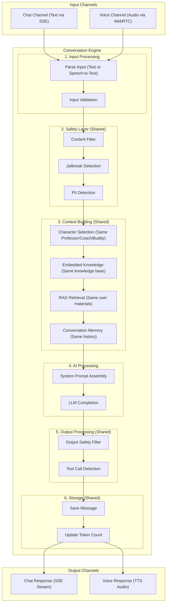

### 5.2 What is Shared vs Channel-Specific

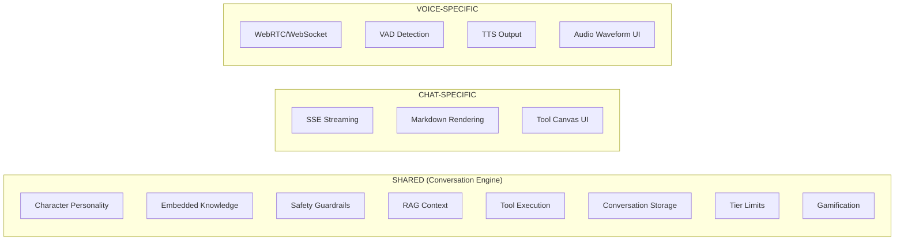

### 5.3 System Prompt Construction (Used by Both)

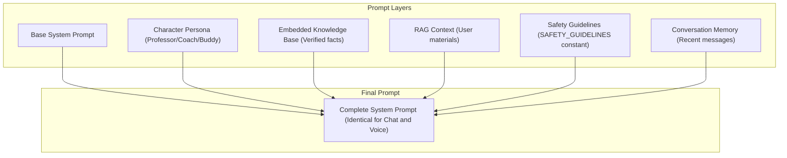

---

## 6. Channel: Chat (Text)

The Chat channel uses SSE (Server-Sent Events) for real-time streaming.

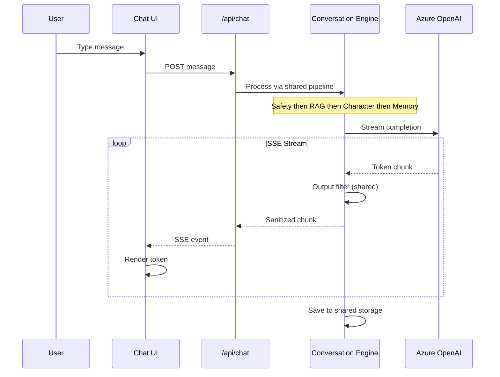

---

## 7. Channel: Voice (Audio)

The Voice channel uses WebRTC for low-latency audio streaming.
**Same Conversation Engine, different transport.**

### 7.1 WebRTC Architecture (ADR 0038)

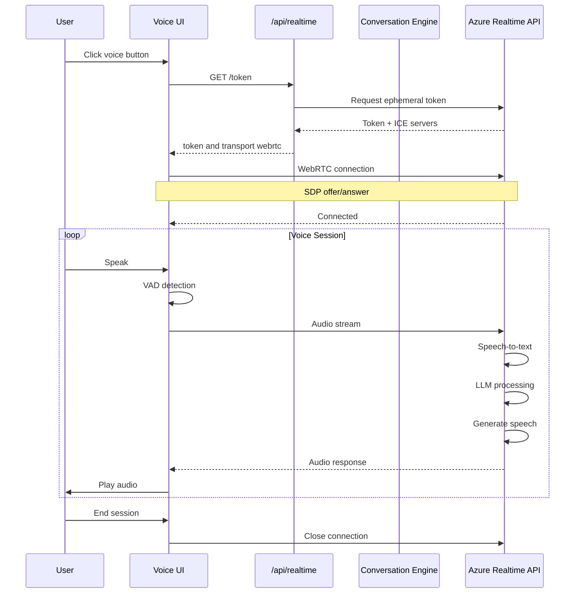

### 7.2 Adaptive VAD (ADR 0069)

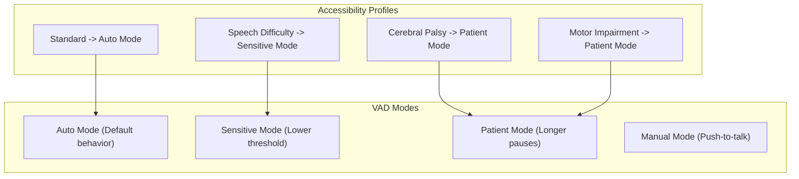

---

## 8. Character System

### 8.1 Support Triangle

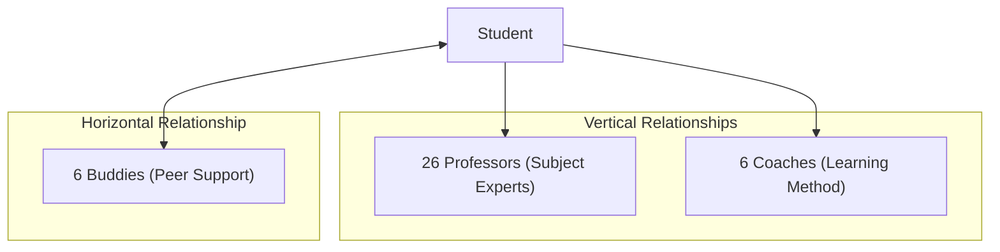

### 8.2 Professors Overview

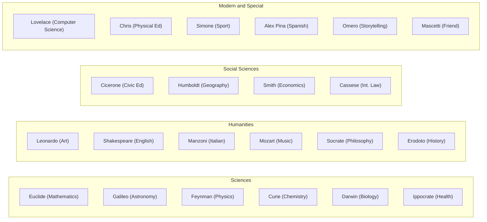

### 8.3 Character Intensity Dial (ADR 0031)

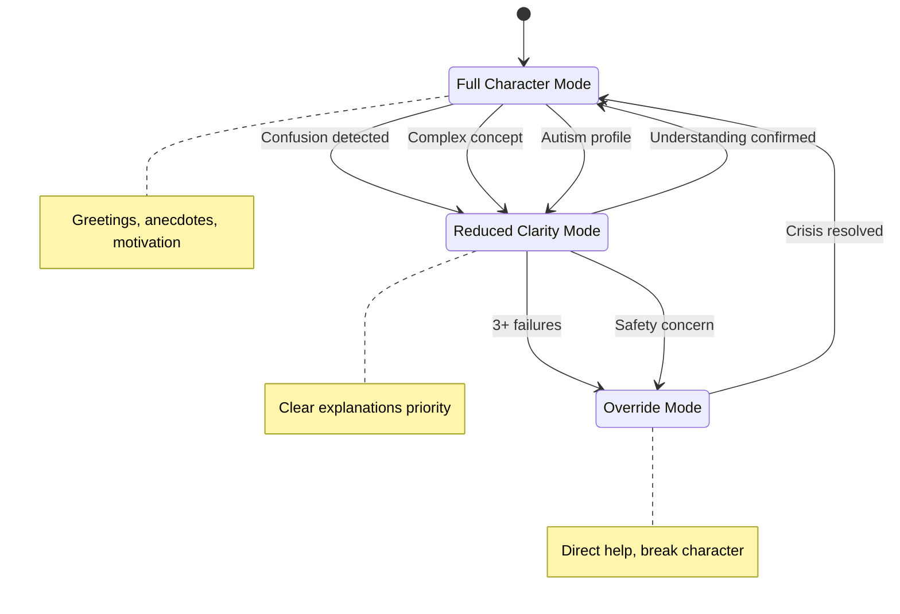

### 8.4 Formal vs Informal Address (ADR 0064)

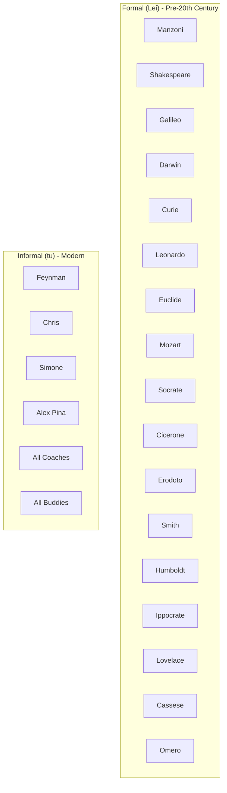

---

## 9. Tool Execution

### 9.1 Tool Plugin Architecture (ADR 0037)

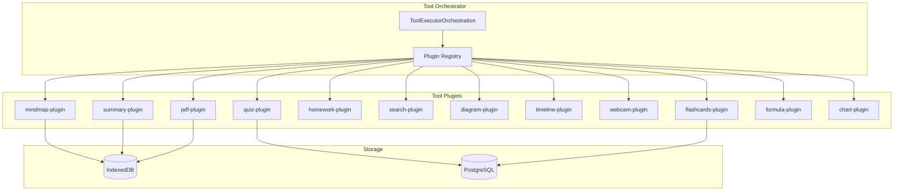

### 9.2 Tool Execution Flow

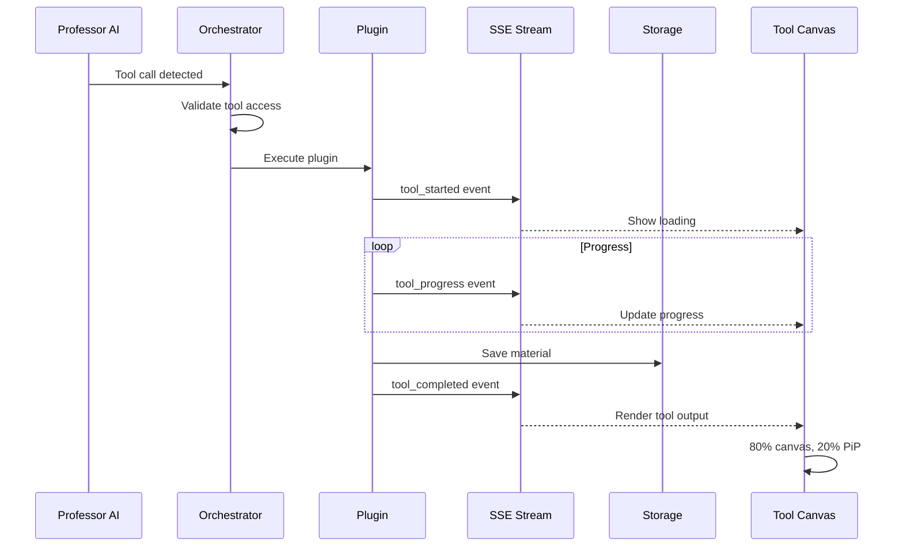

### 9.3 Voice Tool Commands (Unified)

**Tools work identically via Chat and Voice** - the Conversation Engine shares tool execution.

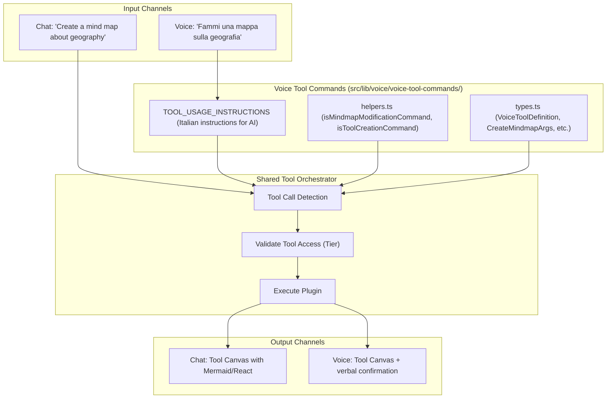

### 9.4 Available Voice Tools

| Tool Command           | Trigger Phrases                      | Output                   |
| ---------------------- | ------------------------------------ | ------------------------ |
| `create_mindmap`       | "Fammi una mappa", "Crea uno schema" | Mind map in canvas       |
| `create_quiz`          | "Interrogami", "Fammi delle domande" | Quiz (written or verbal) |
| `create_flashcards`    | "Fammi delle flashcard"              | Flashcard deck           |
| `create_summary`       | "Riassumimi", "Fai una sintesi"      | AI-generated summary     |
| `open_student_summary` | "Devo scrivere un riassunto"         | Empty editor for student |
| `create_diagram`       | "Fammi un flowchart"                 | Mermaid diagram          |
| `create_timeline`      | "Fai una linea del tempo"            | Timeline visualization   |
| `capture_homework`     | "Ti faccio vedere"                   | Webcam capture           |
| `search_archive`       | "Rivediamo quel quiz"                | Search past materials    |

### 9.5 Voice Mindmap Modification Commands

```mermaid
graph LR
    subgraph Voice_Commands["Real-time Voice Commands"]
        Add["mindmap_add_node: 'Aggiungi [concetto]'"]
        Connect["mindmap_connect_nodes: 'Collega A con B'"]
        Expand["mindmap_expand_node: 'Approfondisci [nodo]'"]
        Delete["mindmap_delete_node: 'Cancella [nodo]'"]
        Focus["mindmap_focus_node: 'Vai a [nodo]'"]
        Color["mindmap_set_color: 'Colora [nodo] di rosso'"]
    end

    subgraph Canvas["Tool Canvas (Live Update)"]
        Mindmap[Active Mindmap]
    end

    Add --> Mindmap
    Connect --> Mindmap
    Expand --> Mindmap
    Delete --> Mindmap
    Focus --> Mindmap
    Color --> Mindmap
```

---

## 10. RAG System

### 10.1 RAG Architecture (ADR 0033)

```mermaid
graph TB
    subgraph Indexing_Pipeline["Indexing Pipeline"]
        Doc[New Material]
        Chunk["Semantic Chunking (500 tokens + 50 overlap)"]
        Embed["Azure Embeddings (text-embedding-ada-002)"]
        Store["pgvector Storage (1536 dimensions)"]
    end

    subgraph Retrieval_Pipeline["Retrieval Pipeline"]
        Query[User Message]
        QEmbed[Query Embedding]
        Search["Cosine Similarity (threshold > 0.6)"]
        Top3[Top 3 Results]
        Inject[Context Injection]
    end

    Doc --> Chunk
    Chunk --> Embed
    Embed --> Store

    Query --> QEmbed
    QEmbed --> Search
    Search --> Store
    Store --> Top3
    Top3 --> Inject
```

### 10.2 Content Embedding Model

```mermaid
erDiagram
    ContentEmbedding {
        string id PK
        string sourceType "material, conversation, note"
        string sourceId FK
        int chunkIndex
        vector embedding "1536 dims"
        string embeddingText "backup"
        json metadata "subject, tags, tokens"
        datetime createdAt
    }

    Material ||--o{ ContentEmbedding : has
    Conversation ||--o{ ContentEmbedding : has
```

---

## 11. Tier and Subscription

### 11.1 Tier Hierarchy (ADR 0071)

```mermaid
graph TB
    subgraph Trial_Tier["Trial Tier"]
        T1[Anonymous User]
        T2[10 chats/month]
        T3[5 min voice]
        T4[3 random Professors]
        T5[10 tool uses]
        T6[gpt-4o-mini]
    end

    subgraph Base_Tier["Base Tier"]
        B1[Registered Free]
        B2[50 chats/month]
        B3[100 min voice]
        B4[All 25 Professors]
        B5[All tools]
        B6[gpt-5.2-edu]
    end

    subgraph Pro_Tier["Pro Tier"]
        P1[Paid Subscriber]
        P2[Unlimited chats]
        P3[Unlimited voice]
        P4[All 26 Professors]
        P5[All tools + priority]
        P6[gpt-5.2-chat]
    end

    T1 -->|Registration| B1
    B1 -->|Subscription| P1
```

### 11.2 TierService Flow

```mermaid
sequenceDiagram
    participant API as API Route
    participant TS as TierService
    participant Cache as Memory Cache
    participant DB as Database

    API->>TS: getEffectiveTier(userId)
    TS->>Cache: Check cache

    alt Cache hit
        Cache-->>TS: Cached tier
    else Cache miss
        TS->>DB: Load subscription
        DB-->>TS: UserSubscription
        TS->>TS: Validate dates
        TS->>Cache: Store result
    end

    TS-->>API: TierName

    API->>TS: checkFeatureAccess(userId, voice)
    TS->>TS: Get tier config
    TS->>TS: Check feature limits
    TS-->>API: boolean
```

### 11.3 Per-Feature Model Selection (ADR 0073)

```mermaid
graph LR
    subgraph Feature_Types["Feature Types"]
        Chat[chat]
        Realtime[realtime]
        PDF[pdf]
        Mindmap[mindmap]
        Quiz[quiz]
        Flash[flashcards]
        Summary[summary]
        Formula[formula]
    end

    subgraph Trial_Models["Trial Models"]
        TM[gpt-4o-mini]
    end

    subgraph Base_Models["Base Models"]
        BM1["gpt-5.2-edu (chat, quiz, homework)"]
        BM2["gpt-5-mini (pdf, mindmap, summary)"]
        BM3["gpt-realtime (voice)"]
    end

    subgraph Pro_Models["Pro Models"]
        PM["gpt-5.2-chat (All features)"]
    end

    Chat --> TM
    Chat --> BM1
    Chat --> PM
```

---

## 12. Trial Mode

### 12.1 Trial Session Flow (ADR 0056)

```mermaid
stateDiagram-v2
    [*] --> Anonymous: Visit site

    Anonymous: Anonymous User
    note right of Anonymous: Generate visitor ID

    Anonymous --> TrialSession: First interaction

    TrialSession: Active Trial
    note right of TrialSession: Track IP hash, limits, Professors

    TrialSession --> LimitReached: Exceed limits
    TrialSession --> Blocked: Abuse detected
    TrialSession --> InviteRequest: Request invite

    LimitReached: Limits Exhausted
    note right of LimitReached: Show upgrade prompt

    Blocked: 24-hour Block
    note right of Blocked: Anti-abuse score >= 15

    InviteRequest: Pending Approval

    InviteRequest --> Registered: Approved
    InviteRequest --> Rejected: Denied

    Registered: Full User
    note right of Registered: Migrate preferences
```

### 12.2 Anti-Abuse Scoring

```mermaid
graph TB
    subgraph Abuse_Signals["Abuse Signals"]
        IP["IP Changes (+5 points)"]
        Rapid["Rapid Requests (+3 points)"]
        Doc["Document Abuse (+2 points)"]
        Reset["Cookie Reset (+3 points)"]
    end

    subgraph Score_Evaluation["Score Evaluation"]
        Score[Abuse Score]
        Threshold{Score >= 15?}
    end

    subgraph Actions["Actions"]
        Allow[Allow Request]
        Block[24-hour Block]
    end

    IP --> Score
    Rapid --> Score
    Doc --> Score
    Reset --> Score

    Score --> Threshold
    Threshold -->|Yes| Block
    Threshold -->|No| Allow
```

---

## 13. Invite System

### 13.1 Invite Flow (ADR 0057)

```mermaid
sequenceDiagram
    participant U as Trial User
    participant UI as Invite Form
    participant API as /api/invites
    participant Admin as Admin
    participant Email as Resend
    participant Auth as Auth System

    U->>UI: Click Request Invite
    UI->>API: POST /request
    API->>API: Create InviteRequest (PENDING)
    API->>Email: Notify admin
    API-->>UI: Success

    Admin->>API: GET /admin/invites
    API-->>Admin: Pending requests

    Admin->>API: POST /approve
    API->>API: Update status (APPROVED)
    API->>API: Generate temp password
    API->>Email: Send approval + credentials

    U->>Auth: First login
    Auth->>Auth: Force password change
    Auth->>API: Migrate trial data
    API-->>U: Welcome to Base tier
```

### 13.2 Invite Request States

```mermaid
stateDiagram-v2
    [*] --> PENDING: Submit request

    PENDING: Pending Review

    PENDING --> APPROVED: Admin approves
    PENDING --> REJECTED: Admin rejects

    APPROVED: Approved
    note right of APPROVED: Email with credentials sent

    REJECTED: Rejected
    note right of REJECTED: Optional reason provided

    APPROVED --> MIGRATED: First login

    MIGRATED: Data Migrated
    note right of MIGRATED: Trial preferences to User profile
```

---

## 14. CI/CD Pipeline

### 14.1 GitHub Actions Workflow

```mermaid
graph TB
    subgraph Trigger["Trigger"]
        Push[Push to main/dev]
        PR[Pull Request]
    end

    subgraph Lane1_Build["Lane 1: Build"]
        Build[Build and Lint]
        Typecheck[TypeScript Check]
        NextBuild[Next.js Build]
        Artifacts[Upload Artifacts]
    end

    subgraph Lane2_Security["Lane 2: Security"]
        TruffleHog[TruffleHog Scan]
        SecretScan[Legacy Secret Check]
        Audit[npm audit]
        SBOM[Generate SBOM]
    end

    subgraph Lane3_Tests["Lane 3: Tests"]
        Unit[Unit Tests]
        Coverage[Coverage Report]
        LLMSafety[LLM Safety Tests]
    end

    subgraph Lane4_Quality["Lane 4: Quality"]
        Docs[Documentation Check]
        Migrations[Migration Check]
        TODOs[Critical TODOs]
        CircularDeps[Circular Imports]
        ConsoleLog[console.log Check]
    end

    subgraph Lane5_E2E["Lane 5: E2E (PR only)"]
        Smoke[Smoke Tests]
        E2E[Full E2E]
        Mobile[Mobile E2E]
    end

    subgraph Lane6_Performance["Lane 6: Performance"]
        Bundle[Bundle Size]
        Lighthouse[Lighthouse CI]
    end

    subgraph Lane7_Docker["Lane 7: Docker"]
        Docker[Docker Build]
    end

    Push --> Build
    PR --> Build

    Build --> Artifacts
    TruffleHog --> SecretScan
    SecretScan --> Audit
    Audit --> SBOM

    Build --> Smoke
    Smoke --> E2E
    E2E --> Mobile

    Build --> Bundle
    Bundle --> Lighthouse
```

### 14.2 CI Job Dependencies

```mermaid
graph LR
    Build[build]
    SecretScan[secret-scanning]
    Security[security]
    Unit[unit-tests]
    LLM[llm-safety-tests]
    Docs[docs]
    Migrations[migrations]
    Quality[quality]
    Smoke[smoke-tests]
    E2E[e2e-tests]
    Mobile[mobile-e2e]
    Perf[performance]
    Docker[docker]

    SecretScan --> Security
    Build --> Smoke
    Build --> E2E
    Build --> Perf
    E2E --> Mobile
```

---

## 15. Git Hooks

### 15.1 Pre-Commit Hook

```mermaid
graph TB
    subgraph Pre_Commit_Checks["Pre-Commit Checks"]
        Secrets["secrets-scan.sh (TruffleHog + regex)"]
        LintStaged["lint-staged (ESLint + Prettier)"]
        CSP{CSP files changed?}
        CSPTest[CSP Validation Tests]
        Mobile{TSX files changed?}
        MobileCheck[Mobile Pattern Check]
    end

    subgraph Outcome["Outcome"]
        Pass[Commit Allowed]
        Fail[Commit Blocked]
    end

    Secrets -->|Pass| LintStaged
    Secrets -->|Fail| Fail

    LintStaged -->|Pass| CSP
    LintStaged -->|Fail| Fail

    CSP -->|Yes| CSPTest
    CSP -->|No| Mobile

    CSPTest -->|Pass| Mobile
    CSPTest -->|Fail| Fail

    Mobile -->|Yes| MobileCheck
    Mobile -->|No| Pass

    MobileCheck -->|Pass| Pass
    MobileCheck -->|Fail| Fail
```

### 15.2 Pre-Push Hook

```mermaid
graph TB
    subgraph Pre_Push_Vercel["pre-push-vercel.sh"]
        MigrationCheck["Migration Naming (YYYYMMDDHHMMSS_name)"]
        PrismaGen[prisma generate]
        Lint[npm run lint]
        Typecheck[npm run typecheck]
        AuditHigh[npm audit --high]
        Build[npm run build]
        VercelEnv[Vercel Env Check]
        CSRFCheck[CSRF Protection Check]
        CriticalTODOs[Critical TODOs Check]
        ConsoleLog[console.log Check]
        SecretsCheck[Secrets Exposure Check]
    end

    subgraph Outcome["Outcome"]
        Allow[Push Allowed]
        Block[Push Blocked]
    end

    MigrationCheck -->|Pass| PrismaGen
    PrismaGen -->|Pass| Lint
    Lint -->|Pass| Typecheck
    Typecheck -->|Pass| AuditHigh
    AuditHigh -->|Pass| Build
    Build -->|Pass| VercelEnv
    VercelEnv -->|Pass| CSRFCheck
    CSRFCheck -->|Pass| CriticalTODOs
    CriticalTODOs -->|Pass| ConsoleLog
    ConsoleLog -->|Pass| SecretsCheck
    SecretsCheck -->|Pass| Allow

    MigrationCheck -->|Fail| Block
    PrismaGen -->|Fail| Block
    Lint -->|Fail| Block
    Typecheck -->|Fail| Block
    Build -->|Fail| Block
```

---

## 16. Cron Jobs

### 16.1 Scheduled Tasks (vercel.json)

```mermaid
graph TB
    subgraph Every_5_Minutes["Every 5 Minutes"]
        Metrics["/api/cron/metrics-push (SLI metrics to Grafana)"]
    end

    subgraph Daily_3AM["Daily 3 AM"]
        DataRetention["/api/cron/data-retention (GDPR cleanup)"]
        BusinessMetrics["/api/cron/business-metrics-daily (KPI aggregation)"]
    end

    subgraph Daily_9AM["Daily 9 AM"]
        TrialNurturing["/api/cron/trial-nurturing (Email automation)"]
    end

    subgraph Authorization["Authorization"]
        CronSecret[CRON_SECRET header]
    end

    CronSecret --> Metrics
    CronSecret --> DataRetention
    CronSecret --> BusinessMetrics
    CronSecret --> TrialNurturing
```

### 16.2 Data Retention Flow

```mermaid
sequenceDiagram
    participant Cron as Cron Trigger
    participant API as /api/cron/data-retention
    participant DB as Database
    participant Log as Audit Log

    Cron->>API: GET (CRON_SECRET)
    API->>DB: Find expired sessions
    Note over DB: TTL 365d conversations, 730d progress

    API->>DB: Anonymize PII
    API->>DB: Delete marked records
    API->>Log: Record deletion count

    API-->>Cron: deleted N, anonymized M
```

---

## 17. API Routes

### 17.1 API Route Organization

```mermaid
graph TB
    subgraph API["/api"]
        subgraph Auth["Auth"]
            AuthLogin[/auth/login]
            AuthLogout[/auth/logout]
            AuthGoogle[/auth/google]
            AuthSession[/auth/session]
        end

        subgraph Chat["Chat"]
            ChatRoute[/chat]
            ChatStream[/chat/stream]
        end

        subgraph Voice["Voice"]
            RealtimeToken[/realtime/token]
            RealtimeEphemeral[/realtime/ephemeral-token]
            RealtimeStart[/realtime/start]
            RealtimeStatus[/realtime/status]
        end

        subgraph User["User"]
            UserProfile[/user/profile]
            UserSettings[/user/settings]
            UserSubscription[/user/subscription]
            UserUsage[/user/usage]
        end

        subgraph Admin["Admin"]
            AdminTiers[/admin/tiers]
            AdminUsers[/admin/users]
            AdminInvites[/admin/invites]
            AdminCounts[/admin/counts]
            AdminFunnel[/admin/funnel]
        end

        subgraph Content["Content"]
            Conversations[/conversations]
            Materials[/materials]
            Collections[/collections]
            Tags[/tags]
        end

        subgraph Education["Education"]
            Flashcards[/flashcards]
            Quizzes[/quizzes]
            LearningPath[/learning-path]
            StudyKit[/study-kit]
        end

        subgraph Gamification["Gamification"]
            Points[/gamification/points]
            Achievements[/gamification/achievements]
            Streak[/gamification/streak]
        end

        subgraph System["System"]
            Health[/health]
            HealthDetailed[/health/detailed]
            Metrics[/metrics]
            CronRoutes[/cron/*]
        end
    end
```

### 17.2 Request Flow

```mermaid
sequenceDiagram
    participant Client
    participant Middleware
    participant Route as API Route
    participant Auth as validateAuth()
    participant CSRF as requireCSRF()
    participant Handler as Business Logic
    participant DB as Database

    Client->>Middleware: Request
    Middleware->>Middleware: Rate limiting
    Middleware->>Route: Forward

    alt Authenticated Endpoint
        Route->>CSRF: Check CSRF (mutations)
        CSRF-->>Route: Valid
        Route->>Auth: validateAuth()
        Auth-->>Route: userId, isAdmin
    end

    Route->>Handler: Process request
    Handler->>DB: Data operations
    DB-->>Handler: Result
    Handler-->>Route: Response
    Route-->>Client: JSON response
```

---

## 18. Accessibility System

### 18.1 Seven DSA Profiles (ADR 0060)

```mermaid
graph TB
    subgraph Accessibility_Profiles["Accessibility Profiles"]
        Dyslexia["Dyslexia (OpenDyslexic, spacing, TTS)"]
        ADHD["ADHD (Pomodoro, focus mode)"]
        Visual["Visual Impairment (High contrast, large text)"]
        Motor["Motor Impairment (Keyboard nav, large targets)"]
        Autism["Autism (Reduced motion, structure)"]
        Auditory["Auditory Impairment (Visual cues, captions)"]
        CP["Cerebral Palsy (Combined adaptations)"]
    end

    subgraph Settings_Storage["Settings Storage"]
        Cookie["mirrorbuddy-a11y (90-day cookie)"]
        Store[Zustand Store]
    end

    subgraph Components["Components"]
        FloatingBtn["a11y-floating-button (44x44px trigger)"]
        QuickPanel["a11y-quick-panel (Settings panel)"]
    end

    Dyslexia --> Store
    ADHD --> Store
    Visual --> Store
    Motor --> Store
    Autism --> Store
    Auditory --> Store
    CP --> Store

    Store --> Cookie
    FloatingBtn --> QuickPanel
    QuickPanel --> Store
```

### 18.2 WCAG 2.1 AA Requirements

```mermaid
graph LR
    subgraph Perceivable["Perceivable"]
        Contrast["4.5:1 contrast"]
        TextAlt[Text alternatives]
        Captions[Captions]
    end

    subgraph Operable["Operable"]
        Keyboard[Keyboard accessible]
        Focus[Visible focus]
        Touch[44px touch targets]
    end

    subgraph Understandable["Understandable"]
        Readable[Readable text]
        Predictable[Predictable]
        Input[Input assistance]
    end

    subgraph Robust["Robust"]
        Compatible[Compatible]
        Valid[Valid HTML]
    end
```

---

## 19. Compliance and Safety

### 19.1 Five-Layer Safety Architecture (ADR 0004)

```mermaid
graph TB
    subgraph Layer1_System_Prompt["Layer 1: System Prompt"]
        Safety[SAFETY_GUIDELINES injection]
    end

    subgraph Layer2_Input_Filter["Layer 2: Input Filter"]
        ContentFilter[Content Filter]
        PII[PII Detection]
    end

    subgraph Layer3_Jailbreak["Layer 3: Jailbreak Detection"]
        Patterns[Pattern Matching]
        Heuristics[Heuristics]
    end

    subgraph Layer4_Output["Layer 4: Output Sanitizer"]
        OutputFilter[Response Filter]
        DOMPurify[DOMPurify]
    end

    subgraph Layer5_Monitoring["Layer 5: Monitoring"]
        SafetyEvent[SafetyEvent logging]
        AdminDash[Admin Dashboard]
    end

    Input[User Input] --> ContentFilter
    ContentFilter --> PII
    PII --> Patterns
    Patterns --> Heuristics
    Heuristics --> LLM[LLM Processing]
    LLM --> OutputFilter
    OutputFilter --> DOMPurify
    DOMPurify --> Output[Safe Output]

    ContentFilter --> SafetyEvent
    Patterns --> SafetyEvent
    OutputFilter --> SafetyEvent
    SafetyEvent --> AdminDash
```

### 19.2 Compliance Framework

```mermaid
graph TB
    subgraph Regulatory_Requirements["Regulatory Requirements"]
        EUAI[EU AI Act 2024/1689]
        Italy[L.132/2025 Italy]
        GDPR[GDPR]
        COPPA[COPPA]
        WCAG[WCAG 2.1 AA]
    end

    subgraph Documentation["Documentation"]
        DPIA[DPIA.md]
        AIPolicy[AI-POLICY.md]
        ModelCard[MODEL-CARD.md]
        RiskMgmt[AI-RISK-MANAGEMENT.md]
        BiasAudit[BIAS-AUDIT-REPORT.md]
    end

    subgraph Public_Pages["Public Pages"]
        AITransparency[/ai-transparency]
        Privacy[/privacy]
        Terms[/terms]
    end

    subgraph Admin_Tools["Admin Tools"]
        SafetyDash[/admin/safety]
        AuditLog[/api/compliance/audit-log]
        DataExport[/api/privacy/export-data]
    end

    EUAI --> DPIA
    EUAI --> AIPolicy
    GDPR --> Privacy
    GDPR --> DataExport
    COPPA --> Terms
    WCAG --> AITransparency
```

### 19.3 COPPA Compliance Flow

Children's Online Privacy Protection Act compliance for users under 13.

```mermaid
stateDiagram-v2
    [*] --> AgeCheck: User starts registration

    AgeCheck: Age Verification
    note right of AgeCheck: Birth date input

    AgeCheck --> Adult: Age >= 13
    AgeCheck --> MinorFlow: Age < 13

    Adult: Standard Registration
    Adult --> [*]: Complete

    MinorFlow: Minor Flow (COPPA)

    MinorFlow --> ParentEmail: Request parent email

    ParentEmail: Parent Contact
    note right of ParentEmail: Store only parent email initially

    ParentEmail --> VerificationSent: Send verification email

    VerificationSent: Awaiting Parent Response
    note right of VerificationSent: 7-day expiry

    VerificationSent --> ParentConsent: Parent clicks link
    VerificationSent --> Expired: No response 7 days

    Expired: Request Expired
    Expired --> DataDeleted: Auto-delete child data

    ParentConsent: Parent Consent Form
    note right of ParentConsent: Explain data collection + rights

    ParentConsent --> Approved: Parent approves
    ParentConsent --> Denied: Parent denies

    Denied: Consent Denied
    Denied --> DataDeleted: Delete all child data

    DataDeleted: Data Purged
    DataDeleted --> [*]

    Approved: Verified Minor Account
    note right of Approved: Limited data collection + parent dashboard access

    Approved --> [*]
```

### 19.4 GDPR Data Lifecycle

Complete data flow from collection to deletion per GDPR Articles 5, 6, 17.

```mermaid
graph TB
    subgraph Collection["1. Data Collection"]
        Input["User Input (Chat, Voice, Profile)"]
        Consent["Consent Capture (Cookie + ToS)"]
        Legal["Legal Basis: Consent or Contract"]
    end

    subgraph Processing["2. Data Processing"]
        Minimize["Data Minimization (Collect only necessary)"]
        Purpose["Purpose Limitation (Education only)"]
        Accuracy["Accuracy (User can correct)"]
    end

    subgraph Storage["3. Data Storage"]
        Encrypt["Encryption at Rest (AES-256)"]
        Transit["Encryption in Transit (TLS 1.3)"]
        Location["EU Data Residency (Supabase EU)"]
    end

    subgraph Retention["4. Retention Policy"]
        Active["Active Data (User account exists)"]
        Inactive["Inactive 365 days: Archive"]
        Expired["Archived 730 days: Delete"]
    end

    subgraph Deletion["5. Data Deletion"]
        UserRequest["User Requests Deletion (Art. 17)"]
        AutoRetention["Auto Retention Expiry"]
        AccountClose["Account Closure"]

        SoftDelete["Soft Delete (30-day grace)"]
        HardDelete["Hard Delete (Irreversible)"]
        AuditLog["Audit Log (Anonymized record)"]
    end

    Input --> Consent
    Consent --> Legal
    Legal --> Minimize
    Minimize --> Purpose
    Purpose --> Accuracy

    Accuracy --> Encrypt
    Encrypt --> Transit
    Transit --> Location

    Location --> Active
    Active --> Inactive
    Inactive --> Expired

    UserRequest --> SoftDelete
    AutoRetention --> SoftDelete
    AccountClose --> SoftDelete
    Expired --> HardDelete

    SoftDelete --> HardDelete
    HardDelete --> AuditLog
```

### 19.5 User Rights (GDPR Articles 15-22)

```mermaid
graph TB
    subgraph User_Rights["GDPR User Rights"]
        Art15["Art. 15: Right of Access"]
        Art16["Art. 16: Right to Rectification"]
        Art17["Art. 17: Right to Erasure"]
        Art18["Art. 18: Right to Restriction"]
        Art20["Art. 20: Right to Portability"]
        Art21["Art. 21: Right to Object"]
        Art22["Art. 22: Automated Decision Rights"]
    end

    subgraph Implementation["Implementation"]
        subgraph Access["Access (Art. 15)"]
            ExportAPI["GET /api/privacy/export-data"]
            ExportFormat["JSON + PDF export"]
        end

        subgraph Rectification["Rectification (Art. 16)"]
            ProfileEdit["PUT /api/user/profile"]
            SettingsEdit["PUT /api/user/settings"]
        end

        subgraph Erasure["Erasure (Art. 17)"]
            DeleteAPI["DELETE /api/user/account"]
            GracePeriod["30-day grace period"]
            Confirmation["Email confirmation required"]
        end

        subgraph Restriction["Restriction (Art. 18)"]
            PauseAPI["POST /api/user/pause-processing"]
            DataFreeze["Freeze data, stop AI processing"]
        end

        subgraph Portability["Portability (Art. 20)"]
            PortableAPI["GET /api/privacy/portable-export"]
            MachineFormat["JSON machine-readable"]
        end

        subgraph Object["Object (Art. 21)"]
            OptOutAPI["POST /api/user/opt-out"]
            MarketingStop["Stop marketing emails"]
            AnalyticsStop["Stop analytics collection"]
        end

        subgraph Automated["Automated Decisions (Art. 22)"]
            ExplainAPI["GET /api/ai/explanation"]
            HumanReview["Request human review"]
            AITransparency["/ai-transparency page"]
        end
    end

    Art15 --> ExportAPI
    Art16 --> ProfileEdit
    Art17 --> DeleteAPI
    Art18 --> PauseAPI
    Art20 --> PortableAPI
    Art21 --> OptOutAPI
    Art22 --> ExplainAPI
```

### 19.6 Consent Management

```mermaid
sequenceDiagram
    participant U as User
    participant UI as Consent UI
    participant API as /api/consent
    participant DB as Database
    participant Cookie as Cookie Store

    Note over U,Cookie: First Visit

    U->>UI: Visit site
    UI->>UI: Show Cookie Banner
    U->>UI: Accept/Customize

    alt Accept All
        UI->>Cookie: Set mirrorbuddy-consent (all)
        UI->>API: POST consent (all categories)
    else Customize
        UI->>UI: Show preference panel
        U->>UI: Select categories
        UI->>Cookie: Set mirrorbuddy-consent (selected)
        UI->>API: POST consent (selected)
    else Reject Non-Essential
        UI->>Cookie: Set mirrorbuddy-consent (essential only)
        UI->>API: POST consent (essential)
    end

    API->>DB: Store ConsentRecord
    Note over DB: userId, categories, timestamp, version

    Note over U,Cookie: Subsequent Visits

    U->>UI: Return visit
    UI->>Cookie: Check mirrorbuddy-consent
    Cookie-->>UI: Consent preferences
    UI->>UI: Apply preferences (no banner)

    Note over U,Cookie: Consent Update

    U->>UI: Open privacy settings
    UI->>API: GET /api/consent
    API->>DB: Load ConsentRecord
    DB-->>API: Current preferences
    API-->>UI: Show current state
    U->>UI: Modify preferences
    UI->>API: PUT /api/consent
    API->>DB: Update + version bump
    API->>Cookie: Update cookie
```

### 19.7 Consent Categories

```mermaid
graph TB
    subgraph Essential["Essential (Always On)"]
        Auth["Authentication cookies"]
        CSRF["CSRF protection"]
        Session["Session management"]
        A11y["Accessibility preferences"]
    end

    subgraph Functional["Functional (Opt-in)"]
        Prefs["User preferences sync"]
        Language["Language settings"]
        Theme["Theme preferences"]
    end

    subgraph Analytics["Analytics (Opt-in)"]
        Usage["Usage analytics"]
        Performance["Performance metrics"]
        ErrorTrack["Error tracking (Sentry)"]
    end

    subgraph Marketing["Marketing (Opt-in)"]
        Email["Email campaigns"]
        Nurturing["Trial nurturing"]
        Updates["Product updates"]
    end

    subgraph AI_Processing["AI Processing (Opt-in)"]
        Training["Conversation for AI improvement"]
        Personalization["Learning personalization"]
        Recommendations["Content recommendations"]
    end
```

### 19.8 Parent Dashboard (ADR 0008)

GDPR-compliant parental oversight for minor users.

```mermaid
graph TB
    subgraph Parent_Access["Parent Access"]
        ParentAuth["Parent Authentication"]
        LinkedMinors["Linked Minor Accounts"]
    end

    subgraph Dashboard_Features["Dashboard Features"]
        subgraph Activity_View["Activity View (Read-Only)"]
            Sessions["Study Sessions (times, duration)"]
            Subjects["Subjects studied"]
            Progress["Learning progress"]
            TimeSpent["Time spent per day/week"]
        end

        subgraph Privacy_Controls["Privacy Controls"]
            DataExport["Export child's data"]
            DataDelete["Request data deletion"]
            ConsentManage["Manage consents"]
            AIOptOut["Opt-out of AI personalization"]
        end

        subgraph Safety_Features["Safety Features"]
            TimeLimit["Set daily time limits"]
            Notifications["Activity notifications"]
            EmergencyStop["Emergency session stop"]
        end
    end

    subgraph NOT_Visible["NOT Visible to Parents"]
        ChatContent["Chat conversation content"]
        VoiceTranscripts["Voice transcripts"]
        PersonalNotes["Personal notes"]
        EmotionalState["Emotional indicators"]
    end

    ParentAuth --> LinkedMinors
    LinkedMinors --> Activity_View
    LinkedMinors --> Privacy_Controls
    LinkedMinors --> Safety_Features
```

### 19.9 Parent-Minor Link Flow

```mermaid
sequenceDiagram
    participant P as Parent
    participant M as Minor
    participant API as API
    participant Email as Email Service
    participant DB as Database

    Note over P,DB: Initial Link (COPPA Flow)

    P->>API: POST /api/parent/verify-consent
    API->>DB: Create ParentMinorLink (pending)
    API->>Email: Send verification to parent

    P->>Email: Click verification link
    Email->>API: GET /api/parent/verify/{token}
    API->>DB: Activate link
    API-->>P: Redirect to dashboard

    Note over P,DB: Ongoing Access

    P->>API: GET /api/parent/dashboard
    API->>API: Validate parent session
    API->>DB: Load linked minors
    DB-->>API: Minor activity (filtered)
    API-->>P: Dashboard data

    Note over P,DB: Revoke Access

    M->>API: POST /api/user/revoke-parent (age >= 13)
    API->>DB: Deactivate ParentMinorLink
    API->>Email: Notify parent
    API-->>M: Confirmation
```

### 19.10 EU AI Act Compliance

High-risk AI system requirements per EU AI Act 2024/1689.

```mermaid
graph TB
    subgraph Risk_Classification["Risk Classification"]
        HighRisk["High-Risk: Education AI System"]
        Note1["Art. 6 Annex III: AI in education"]
    end

    subgraph Required_Documentation["Required Documentation"]
        TechDoc["Technical Documentation (Art. 11)"]
        RiskMgmt["Risk Management System (Art. 9)"]
        DataGov["Data Governance (Art. 10)"]
        Logging["Automatic Logging (Art. 12)"]
        Transparency["Transparency (Art. 13)"]
        HumanOversight["Human Oversight (Art. 14)"]
        Accuracy["Accuracy and Robustness (Art. 15)"]
    end

    subgraph Implementation["MirrorBuddy Implementation"]
        subgraph Tech_Docs["Technical Docs"]
            ModelCard["MODEL-CARD.md"]
            DPIA["DPIA.md"]
            BiasAudit["BIAS-AUDIT-REPORT.md"]
        end

        subgraph Risk_System["Risk System"]
            RiskRegister["AI-RISK-MANAGEMENT.md"]
            SafetyLayers["5-Layer Safety Architecture"]
            IncidentLog["SafetyEvent logging"]
        end

        subgraph Data_Gov["Data Governance"]
            DataPolicy["Privacy Policy"]
            RetentionPolicy["Retention Cron Job"]
            MinimizationRules["Data Minimization"]
        end

        subgraph Logging_System["Logging System"]
            AuditTrail["AuditEntry table"]
            ConversationLog["Message storage"]
            SafetyEvents["SafetyEvent table"]
        end

        subgraph Transparency_UI["Transparency UI"]
            AIPage["/ai-transparency page"]
            Disclosure["AI disclosure in chat"]
            Explanations["Decision explanations"]
        end

        subgraph Human_Oversight_System["Human Oversight"]
            AdminDash["/admin/safety dashboard"]
            ManualReview["Manual incident review"]
            KillSwitch["Emergency AI disable"]
        end
    end

    HighRisk --> TechDoc
    HighRisk --> RiskMgmt
    HighRisk --> DataGov
    HighRisk --> Logging
    HighRisk --> Transparency
    HighRisk --> HumanOversight
    HighRisk --> Accuracy

    TechDoc --> Tech_Docs
    RiskMgmt --> Risk_System
    DataGov --> Data_Gov
    Logging --> Logging_System
    Transparency --> Transparency_UI
    HumanOversight --> Human_Oversight_System
```

### 19.11 Human Oversight Mechanisms (Art. 14)

```mermaid
graph TB
    subgraph Oversight_Levels["Oversight Levels"]
        L1["Level 1: Automated Monitoring"]
        L2["Level 2: Alert Review"]
        L3["Level 3: Manual Intervention"]
        L4["Level 4: Emergency Stop"]
    end

    subgraph L1_Automated["Level 1: Automated"]
        SafetyFilters["5-Layer Safety Filters"]
        MetricsCollect["Metrics Collection"]
        AnomalyDetect["Anomaly Detection"]
    end

    subgraph L2_Alerts["Level 2: Alerts"]
        SafetyAlerts["Safety Event Alerts"]
        ThresholdAlerts["Threshold Breaches"]
        BiasAlerts["Bias Detection Alerts"]
    end

    subgraph L3_Manual["Level 3: Manual Review"]
        IncidentReview["Incident Review Queue"]
        ConversationAudit["Conversation Audit"]
        DecisionOverride["AI Decision Override"]
    end

    subgraph L4_Emergency["Level 4: Emergency"]
        KillSwitch["AI Kill Switch"]
        FeatureDisable["Feature Disable"]
        UserBlock["User Session Block"]
        RollbackDeploy["Rollback Deployment"]
    end

    subgraph Triggers["Escalation Triggers"]
        T1["Severity S0: Immediate L4"]
        T2["Severity S1: L3 + Alert"]
        T3["Severity S2: L2 Review"]
        T4["Severity S3: L1 Log"]
    end

    L1 --> L2
    L2 --> L3
    L3 --> L4

    SafetyFilters --> MetricsCollect
    MetricsCollect --> AnomalyDetect
    AnomalyDetect --> SafetyAlerts

    T1 --> KillSwitch
    T2 --> IncidentReview
    T3 --> SafetyAlerts
    T4 --> MetricsCollect
```

### 19.12 AI Explainability

```mermaid
sequenceDiagram
    participant U as User
    participant UI as Chat UI
    participant API as /api/ai/explanation
    participant LLM as AI Model
    participant DB as AuditEntry

    U->>UI: Click "Why this response?"
    UI->>API: GET /explanation/{messageId}

    API->>DB: Load message context
    DB-->>API: Original prompt, safety flags, tool calls

    API->>API: Build explanation context

    API->>LLM: Generate explanation
    Note over LLM: "Explain why you gave this response"

    LLM-->>API: Explanation text

    API->>DB: Log explanation request (audit)

    API-->>UI: Explanation response
    UI->>U: Show explanation modal

    Note over UI: Includes: reasoning, sources, limitations
```

### 19.13 Compliance Audit Trail

```mermaid
erDiagram
    AuditEntry {
        string id PK
        datetime timestamp
        string action "consent_given, data_exported, etc."
        string actorType "user, parent, admin, system"
        string actorId FK
        string targetType "user, conversation, etc."
        string targetId FK
        json details "action-specific data"
        string ipHash "anonymized IP"
        string userAgent
    }

    ConsentRecord {
        string id PK
        string userId FK
        json categories "essential, functional, analytics, marketing, ai"
        string version "consent version"
        datetime givenAt
        datetime updatedAt
        string source "banner, settings, registration"
    }

    DataRequest {
        string id PK
        string userId FK
        string type "export, delete, rectify, restrict"
        string status "pending, processing, completed, rejected"
        datetime requestedAt
        datetime completedAt
        string completedBy "system or admin ID"
        json response "export URL or rejection reason"
    }

    SafetyEvent {
        string id PK
        string conversationId FK
        string userId FK
        string eventType "content_blocked, jailbreak_detected, pii_detected"
        string severity "S0, S1, S2, S3"
        json details "input, output, action taken"
        datetime timestamp
        boolean reviewed
        string reviewedBy FK
    }

    User ||--o{ AuditEntry : generates
    User ||--o{ ConsentRecord : has
    User ||--o{ DataRequest : submits
    User ||--o{ SafetyEvent : triggers
```

### 19.14 Data Breach Notification (GDPR Art. 33-34)

72-hour notification requirement to supervisory authority.

```mermaid
sequenceDiagram
    participant Detect as Detection System
    participant CISO as Security Team
    participant DPO as Data Protection Officer
    participant DPA as Supervisory Authority
    participant Users as Affected Users
    participant Log as Audit Log

    Note over Detect,Log: T+0: Breach Detected

    Detect->>CISO: Security alert triggered
    CISO->>CISO: Assess breach severity
    CISO->>Log: Log incident (timestamp T+0)

    alt High Risk Breach
        CISO->>DPO: Escalate immediately
        DPO->>DPO: Assess risk to data subjects

        Note over DPO,DPA: T+72h MAX: DPA Notification

        DPO->>DPA: Notify supervisory authority
        Note over DPA: Include: nature, categories,<br/>approx subjects, consequences,<br/>measures taken

        DPO->>Log: Log DPA notification

        alt High Risk to Individuals
            Note over DPO,Users: Without undue delay

            DPO->>Users: Notify affected users
            Note over Users: Clear language: what happened,<br/>likely consequences,<br/>measures to protect themselves

            DPO->>Log: Log user notifications
        end
    else Low Risk Breach
        CISO->>DPO: Document internally
        DPO->>Log: Log decision not to notify
        Note over Log: Justification required
    end

    CISO->>CISO: Implement containment
    CISO->>CISO: Root cause analysis
    CISO->>Log: Log remediation actions
```

### 19.15 Third-Party Data Flow

Data sharing with external processors per GDPR Article 28.

```mermaid
graph TB
    subgraph MirrorBuddy["MirrorBuddy (Controller)"]
        App[Application]
    end

    subgraph EU_Processors["EU Processors (Adequate)"]
        subgraph Supabase["Supabase (Germany)"]
            SB_Data["User profiles, conversations,<br/>learning progress, materials"]
            SB_Risk["Risk: NEGLIGIBLE"]
        end

        subgraph Azure["Azure OpenAI (Sweden)"]
            AZ_Data["Conversation text (sanitized),<br/>NO PII sent"]
            AZ_Risk["Risk: NEGLIGIBLE"]
        end
    end

    subgraph US_Processors["US Processors (SCCs)"]
        subgraph Vercel["Vercel (US + EU Edge)"]
            V_Data["Request logs (IP anonymized),<br/>deployment artifacts"]
            V_Risk["Risk: LOW"]
        end

        subgraph Resend["Resend (US)"]
            R_Data["Email addresses only,<br/>transactional emails"]
            R_Risk["Risk: LOW"]
        end

        subgraph Upstash["Upstash Redis (US)"]
            U_Data["Hashed session IDs,<br/>rate limit counters, 1h TTL"]
            U_Risk["Risk: VERY LOW"]
        end

        subgraph Sentry["Sentry (US)"]
            SE_Data["Error traces (PII scrubbed),<br/>performance metrics"]
            SE_Risk["Risk: LOW"]
        end

        subgraph Grafana["Grafana Cloud (US)"]
            G_Data["Aggregated metrics only,<br/>NO user data"]
            G_Risk["Risk: NEGLIGIBLE"]
        end
    end

    App -->|"Profiles, Conversations"| SB_Data
    App -->|"Chat prompts (sanitized)"| AZ_Data
    App -->|"HTTP requests"| V_Data
    App -->|"Notification emails"| R_Data
    App -->|"Session hashes"| U_Data
    App -->|"Error reports"| SE_Data
    App -->|"System metrics"| G_Data
```

### 19.16 DSAR Response SLA (GDPR Art. 12)

Data Subject Access Request response timeline.

```mermaid
gantt
    title DSAR Response Timeline (30 Days Max)
    dateFormat  YYYY-MM-DD
    axisFormat %d

    section Receipt
    Request received           :milestone, m1, 2026-01-01, 0d
    Acknowledge receipt (24h)  :a1, 2026-01-01, 1d

    section Verification
    Verify identity            :a2, after a1, 2d
    Validate request scope     :a3, after a2, 1d

    section Processing
    Gather data from systems   :a4, after a3, 5d
    Review for third-party data:a5, after a4, 3d
    Prepare export package     :a6, after a5, 3d

    section Delivery
    Quality review             :a7, after a6, 2d
    Deliver to requester       :a8, after a7, 1d
    Log completion             :milestone, m2, after a8, 0d

    section Buffer
    Extension buffer (complex) :crit, a9, after a8, 12d
```

```mermaid
stateDiagram-v2
    [*] --> Received: User submits request

    Received: Request Received
    note right of Received: Auto-acknowledge within 24h

    Received --> Verifying: Start verification

    Verifying: Identity Verification
    note right of Verifying: Email confirmation or ID check

    Verifying --> Rejected: Verification failed
    Verifying --> Processing: Identity confirmed

    Rejected: Request Rejected
    note right of Rejected: Log rejection reason

    Processing: Data Gathering
    note right of Processing: Query all systems

    Processing --> Review: Data compiled

    Review: Privacy Review
    note right of Review: Remove third-party PII

    Review --> Preparing: Review complete

    Preparing: Export Preparation
    note right of Preparing: JSON + PDF format

    Preparing --> Delivered: Export ready

    Delivered: Request Fulfilled
    note right of Delivered: Within 30 days

    Delivered --> [*]
    Rejected --> [*]

    Processing --> Extended: Complex request
    Extended: Extension (max +60 days)
    note right of Extended: Notify user of delay
    Extended --> Review
```

### 19.17 Age Gating Implementation

Content restriction based on user age (COPPA, Italian L.132/2025).

```mermaid
graph TB
    subgraph Age_Verification["Age Verification"]
        Profile["User Profile (age range)"]
        Calculate["Calculate age from birth year"]
    end

    subgraph Age_Brackets["Age Brackets"]
        Under13["Under 13 (COPPA)"]
        Age13_15["13-15 (Italian minor)"]
        Age16_17["16-17 (GDPR minor)"]
        Adult["18+ (Adult)"]
    end

    subgraph Content_Restrictions["Content Restrictions"]
        subgraph Blocked_Under13["Blocked for Under 13"]
            B1["Explicit historical content"]
            B2["Medical/health detailed"]
            B3["Violence in history"]
            B4["Relationship topics"]
        end

        subgraph Blocked_Under16["Blocked for Under 16"]
            B5["Political opinions"]
            B6["Religious debates"]
            B7["Controversial ethics"]
        end

        subgraph Allowed_All["Allowed for All Ages"]
            A1["Core curriculum"]
            A2["Age-appropriate examples"]
            A3["Educational games"]
            A4["Study tools"]
        end
    end

    subgraph Implementation["Implementation"]
        AgeGate["src/lib/safety/age-gating.ts"]
        TopicFilter["Topic filter in system prompt"]
        ResponseCheck["Response age-appropriateness check"]
    end

    Profile --> Calculate
    Calculate --> Under13
    Calculate --> Age13_15
    Calculate --> Age16_17
    Calculate --> Adult

    Under13 --> Blocked_Under13
    Under13 --> Blocked_Under16
    Age13_15 --> Blocked_Under16

    AgeGate --> TopicFilter
    TopicFilter --> ResponseCheck
```

### 19.18 Security Incident Response

Full incident response flow (beyond AI safety events).

```mermaid
stateDiagram-v2
    [*] --> Detection: Incident detected

    state Detection {
        Automated: Automated Detection
        Manual: Manual Report
        External: External Report
    }

    Detection --> Triage: Alert triggered

    Triage: Incident Triage
    note right of Triage: Classify severity (S0-S3)

    Triage --> S0: Critical
    Triage --> S1: High
    Triage --> S2: Medium
    Triage --> S3: Low

    state S0 {
        S0_1: Page on-call immediately
        S0_2: War room activated
        S0_3: All hands on deck
    }

    state S1 {
        S1_1: Alert security team
        S1_2: Begin investigation
        S1_3: Prepare containment
    }

    state S2 {
        S2_1: Queue for review
        S2_2: Investigate next business day
    }

    state S3 {
        S3_1: Log for tracking
        S3_2: Batch review weekly
    }

    S0 --> Containment
    S1 --> Containment
    S2 --> Investigation
    S3 --> Monitoring

    Containment: Containment
    note right of Containment: Isolate, disable, block

    Containment --> Investigation

    Investigation: Investigation
    note right of Investigation: Root cause analysis

    Investigation --> Remediation

    Remediation: Remediation
    note right of Remediation: Fix vulnerability

    Remediation --> Recovery

    Recovery: Recovery
    note right of Recovery: Restore services

    Recovery --> PostMortem

    PostMortem: Post-Mortem
    note right of PostMortem: Document lessons learned

    PostMortem --> [*]

    Monitoring: Monitoring
    Monitoring --> [*]
```

### 19.19 Incident Severity Matrix

```mermaid
graph TB
    subgraph Severity_Levels["Severity Levels"]
        S0["S0: Critical (Data breach, system down)"]
        S1["S1: High (Security vulnerability, data exposure risk)"]
        S2["S2: Medium (Service degradation, minor security issue)"]
        S3["S3: Low (Cosmetic, non-urgent)"]
    end

    subgraph Response_Times["Response Times"]
        R0["S0: 15 min response, 4h resolution target"]
        R1["S1: 1h response, 24h resolution target"]
        R2["S2: 4h response, 72h resolution target"]
        R3["S3: Next business day, 1 week resolution"]
    end

    subgraph Notification["Notification Required"]
        N0["S0: CEO, DPO, Legal, All Engineering"]
        N1["S1: CTO, Security Team, Affected Team"]
        N2["S2: Team Lead, Security Team"]
        N3["S3: Ticket in backlog"]
    end

    S0 --> R0
    S1 --> R1
    S2 --> R2
    S3 --> R3

    S0 --> N0
    S1 --> N1
    S2 --> N2
    S3 --> N3
```

### 19.20 Annual Compliance Calendar

GDPR Article 35(11) requires regular DPIA review.

```mermaid
gantt
    title Annual Compliance Calendar
    dateFormat  YYYY-MM-DD
    axisFormat %b

    section Q1: Review
    DPIA Annual Review          :q1_1, 2026-01-15, 14d
    AI Risk Assessment Update   :q1_2, 2026-01-20, 10d
    Bias Audit                  :q1_3, 2026-02-01, 21d
    Security Penetration Test   :q1_4, 2026-02-15, 14d

    section Q2: Training
    Staff Privacy Training      :q2_1, 2026-04-01, 7d
    Incident Response Drill     :q2_2, 2026-04-15, 3d
    Consent Mechanism Review    :q2_3, 2026-05-01, 14d

    section Q3: Audit
    Third-Party Processor Audit :q3_1, 2026-07-01, 21d
    Data Retention Cleanup      :q3_2, 2026-07-15, 7d
    Access Control Review       :q3_3, 2026-08-01, 14d

    section Q4: Certification
    WCAG Accessibility Audit    :q4_1, 2026-10-01, 21d
    EU AI Act Compliance Check  :q4_2, 2026-11-01, 14d
    Annual Report Preparation   :q4_3, 2026-12-01, 14d
```

### 19.21 Compliance Checklist Summary

```mermaid
graph TB
    subgraph GDPR["GDPR Compliance"]
        G1["✓ Legal basis documented"]
        G2["✓ Privacy policy published"]
        G3["✓ Consent management"]
        G4["✓ Data subject rights (Art. 15-22)"]
        G5["✓ DPIA completed"]
        G6["✓ Breach notification process"]
        G7["✓ Data retention policy"]
        G8["✓ Third-party DPAs signed"]
    end

    subgraph COPPA["COPPA Compliance"]
        C1["✓ Age verification"]
        C2["✓ Parental consent flow"]
        C3["✓ Parent dashboard"]
        C4["✓ Data minimization for minors"]
        C5["✓ No behavioral advertising"]
    end

    subgraph AI_Act["EU AI Act Compliance"]
        A1["✓ Risk classification (High-risk)"]
        A2["✓ Technical documentation"]
        A3["✓ Risk management system"]
        A4["✓ Data governance"]
        A5["✓ Transparency obligations"]
        A6["✓ Human oversight mechanisms"]
        A7["✓ Accuracy and robustness"]
    end

    subgraph WCAG["WCAG 2.1 AA"]
        W1["✓ Perceivable"]
        W2["✓ Operable"]
        W3["✓ Understandable"]
        W4["✓ Robust"]
    end

    subgraph Italian_Law["Italian L.132/2025"]
        I1["✓ AI transparency page"]
        I2["✓ Age-appropriate content"]
        I3["✓ Educational context compliance"]
    end
```

---

## 20. Observability

### 20.1 Monitoring Stack

```mermaid
graph TB
    subgraph Metrics_Collection["Metrics Collection"]
        App[Next.js App]
        Health[/api/health]
        HealthDetailed[/api/health/detailed]
        Metrics[/api/metrics]
    end

    subgraph Push_to_Grafana["Push to Grafana"]
        CronPush["/api/cron/metrics-push (Every 5 min)"]
        PromPush[Prometheus Push Gateway]
    end

    subgraph Grafana_Cloud["Grafana Cloud"]
        Dashboard[Dashboard]
        Alerts[Alert Rules]
    end

    subgraph Error_Tracking["Error Tracking"]
        Sentry[Sentry]
        SourceMaps[Source Maps]
    end

    subgraph Service_Limits["Service Limits"]
        Vercel[Vercel Limits]
        Supabase[Supabase Limits]
        Azure[Azure OpenAI TPM/RPM]
        Redis[Upstash Redis]
        Resend[Resend Email]
    end

    App --> Health
    App --> Metrics
    Health --> CronPush
    Metrics --> CronPush
    CronPush --> PromPush
    PromPush --> Dashboard
    Dashboard --> Alerts

    App --> Sentry
    SourceMaps --> Sentry

    Vercel --> Dashboard
    Supabase --> Dashboard
    Azure --> Dashboard
```

### 20.2 SLI/SLO Metrics (ADR 0058)

```mermaid
graph LR
    subgraph Session_Health["Session Health"]
        SuccessRate[Success Rate]
        DropOff[Drop-off Rate]
        StuckLoop[Stuck Loop Rate]
    end

    subgraph Safety_Metrics["Safety Metrics"]
        RefusalPrec[Refusal Precision]
        JailblockRate[Jailbreak Block Rate]
        Incidents[Incidents S0-S3]
    end

    subgraph Performance["Performance"]
        P95[HTTP Latency P95]
        ErrorRate[Error Rate by Route]
    end

    subgraph Cost["Cost"]
        SessionCost[Per-Session Cost]
        CostSpikes[Cost Spike Detection]
    end
```

---

## 21. External Integrations

### 21.1 Service Map

```mermaid
graph TB
    subgraph MirrorBuddy["MirrorBuddy"]
        App[Next.js Application]
    end

    subgraph AI_Services["AI Services"]
        AzureChat["Azure OpenAI (Chat Completions)"]
        AzureRealtime["Azure Realtime API (Voice Sessions)"]
        AzureEmbed["Azure Embeddings (RAG Indexing)"]
        AzureTTS["Azure TTS (Text-to-Speech)"]
        Ollama["Ollama (Local Fallback)"]
    end

    subgraph Data_Services["Data Services"]
        Supabase["Supabase (PostgreSQL + pgvector)"]
        Upstash["Upstash Redis (Rate Limiting + Cache)"]
    end

    subgraph Communication["Communication"]
        Resend["Resend (Email Notifications)"]
    end

    subgraph Infrastructure["Infrastructure"]
        Vercel["Vercel (Edge Deployment)"]
    end

    subgraph Observability["Observability"]
        Grafana["Grafana Cloud (Metrics Dashboard)"]
        Sentry["Sentry (Error Tracking)"]
    end

    App --> AzureChat
    App --> AzureRealtime
    App --> AzureEmbed
    App --> AzureTTS
    App --> Ollama

    App --> Supabase
    App --> Upstash

    App --> Resend

    App --> Vercel

    App --> Grafana
    App --> Sentry
```

### 21.2 CSP Allowed Domains

```mermaid
graph LR
    subgraph Connect_Src["connect-src"]
        Self[self]
        AzureOpenAI["*.openai.azure.com"]
        AzureRealtime["*.realtimeapi-preview.ai.azure.com"]
        Upstash["*.upstash.io"]
        Supabase["*.supabase.co"]
        Sentry["*.sentry.io"]
        Grafana["*.grafana.net"]
    end

    subgraph Script_Src["script-src"]
        SelfScript[self]
        Nonce[nonce-based]
    end
```

---

## 22. Component Structure

### 22.1 Component Organization

```mermaid
graph TB
    subgraph Src_Components["src/components/"]
        subgraph Core["Core"]
            UI["ui/ (Buttons, Cards, Forms)"]
            Layout["layout/ (Navigation, Footer)"]
            Providers["providers/ (Context Providers)"]
        end

        subgraph Features["Features"]
            Chat["chat/ (Message List, Input)"]
            Conv["conversation/ (Character View, Sidebar)"]
            Voice["voice/ (Waveform, Controls)"]
            Tools["tools/ (Mindmap, Quiz, etc.)"]
        end

        subgraph Education["Education"]
            Edu["education/ (Quiz, Flashcards)"]
            LPath["learning-path/ (Progress, Topics)"]
            Gami["gamification/ (Achievements, Streak)"]
        end

        subgraph User["User"]
            Settings["settings/ (Profile, Preferences)"]
            Profile["profile/ (COPPA, Avatar)"]
            Tier["tier/ (Badge, Upgrade)"]
        end

        subgraph Admin["Admin"]
            AdminComp["admin/ (Dashboard, Users)"]
            Trial["trial/ (Trial UI, Limits)"]
        end

        subgraph A11y["A11y"]
            A11yComp["accessibility/ (Floating Button, Panel)"]
            Typing["typing/ (Loading States)"]
        end
    end
```

---

## 23. State Management

### 23.1 Zustand Stores

```mermaid
graph TB
    subgraph Conversation_State["Conversation State"]
        ConvStore["useConversationStore (Active conversation + messages)"]
        ChatStore["useChatStore (Chat session state)"]
        CharStore["useCharacterStore (Selected professor)"]
    end

    subgraph User_State["User State"]
        SettingsStore["useSettingsStore (User preferences)"]
        A11yStore["useAccessibilityStore (A11y settings)"]
        TierStore["useTierStore (Current tier)"]
    end

    subgraph Trial_State["Trial State"]
        TrialStore["useTrialStore (Trial session + limits)"]
    end

    subgraph Gamification_State["Gamification State"]
        GamiStore["useGamificationStore (Points, streaks)"]
    end

    subgraph Persistence["Persistence"]
        REST[REST APIs]
        Cookies[Cookies]
        Memory[Memory Only]
    end

    ConvStore --> REST
    ChatStore --> Memory
    CharStore --> REST
    SettingsStore --> REST
    A11yStore --> Cookies
    TierStore --> REST
    TrialStore --> REST
    GamiStore --> REST
```

### 23.2 No localStorage Policy (ADR 0015)

```mermaid
graph LR
    subgraph Allowed["Allowed"]
        Zustand[Zustand Stores]
        REST[REST APIs]
        Cookies[Essential Cookies]
        IndexedDB["IndexedDB (Binary files only)"]
    end

    subgraph Forbidden["Forbidden"]
        LocalStorage["localStorage (for user data)"]
    end

    Zustand --> REST
    Zustand --> Cookies
```

---

## 24. Deployment Flow

### 24.1 Vercel Deployment

```mermaid
sequenceDiagram
    participant Dev as Developer
    participant Git as GitHub
    participant Hook as Pre-push Hook
    participant CI as GitHub Actions
    participant Vercel as Vercel

    Dev->>Hook: git push
    Hook->>Hook: pre-push-vercel.sh
    Note over Hook: Lint, Typecheck, Build, etc.
    Hook-->>Dev: Pass/Fail

    Dev->>Git: Push to main
    Git->>CI: Trigger workflow

    par CI Checks
        CI->>CI: Build and Lint
        CI->>CI: Security Scan
        CI->>CI: Unit Tests
        CI->>CI: E2E Tests
    end

    CI-->>Git: All green

    Git->>Vercel: Auto-deploy trigger
    Vercel->>Vercel: prisma generate
    Vercel->>Vercel: npm run build
    Vercel->>Vercel: seed admin
    Vercel-->>Git: Deploy complete
```

### 24.2 SSL Configuration (ADR 0063, 0067)

```mermaid
graph TB
    subgraph Certificate_Handling["Certificate Handling"]
        Cert[Supabase CA Cert]
        Pipe[Pipe-delimited format]
        EnvVar[SUPABASE_CA_CERT env]
    end

    subgraph Connection["Connection"]
        Prisma[Prisma Client]
        Pool[Connection Pool]
        SSL[SSL Config]
    end

    subgraph Never_Use["Never Use"]
        TLSReject["NODE_TLS_REJECT_UNAUTHORIZED=0"]
    end

    Cert --> Pipe
    Pipe --> EnvVar
    EnvVar --> SSL
    SSL --> Pool
    Pool --> Prisma

    TLSReject -.->|Forbidden| SSL
```

---

## 25. ADR Index

### 25.1 Architecture Decision Records

```mermaid
graph TB
    subgraph Data_Storage["Data and Storage"]
        ADR0001[0001 Materials Storage]
        ADR0015[0015 Database-First]
        ADR0028[0028 PostgreSQL + pgvector]
        ADR0033[0033 RAG Semantic Search]
    end

    subgraph AI_Characters["AI and Characters"]
        ADR0003[0003 Support Triangle]
        ADR0031[0031 Embedded Knowledge]
        ADR0064[0064 Formal/Informal]
        ADR0073[0073 Per-Feature Models]
    end

    subgraph Voice_Realtime["Voice and Realtime"]
        ADR0005[0005 SSE Architecture]
        ADR0034[0034 Chat Streaming]
        ADR0038[0038 WebRTC Migration]
        ADR0069[0069 Adaptive VAD]
    end

    subgraph Security_Safety["Security and Safety"]
        ADR0004[0004 Safety Guardrails]
        ADR0060[0060 Security Hardening]
        ADR0072[0072 Secrets Scan]
        ADR0075[0075 Cookie Standards]
        ADR0077[0077 Security Hardening Plan17]
        ADR0078[0078 Vercel Runtime Constraints]
        ADR0080[0080 Security Audit Hardening]
    end

    subgraph Business_Logic["Business Logic"]
        ADR0056[0056 Trial Mode]
        ADR0057[0057 Invite System]
        ADR0071[0071 Tier Subscription]
    end

    subgraph Infrastructure_ADRs["Infrastructure"]
        ADR0047[0047 Grafana Cloud]
        ADR0063[0063 Supabase SSL]
        ADR0067[0067 DB Performance]
        ADR0070[0070 Sentry]
        ADR0076[0076 Centralized Logging]
    end

    subgraph Compliance_ADRs["Compliance"]
        ADR0008[0008 Parent Dashboard GDPR]
        ADR0059[0059 E2E Test Setup]
        ADR0062[0062 AI Compliance]
        ADR0079[0079 Web Vitals and Legal Docs]
        ADR0081[0081 Test Data Isolation]
    end
```

---

### 25.2 Recently Added ADRs

```mermaid
graph TB
    subgraph New_ADRs["Recently Added"]
        ADR0002[0002 Use MarkMap for Mind Map ]
        ADR0006[0006 Telemetry System with Pro]
        ADR0007[0007 Server-Side Notification ]
        ADR0010[0010 Separate Conversations Pe]
        ADR0011[0011 Voice Commands for Mindma]
        ADR0012[0012 Unified Maestri Voice Exp]
        ADR0013[0013 Platform Support Handled ]
        ADR0014[0014 PWA Push Notifications]
        ADR0016[0016 Component Modularization ]
        ADR0017[0017 Voice Commands for Summar]
        ADR0018[0018 Audio Coordination Archit]
        ADR0019[0019 Session Summaries & Unifi]
        ADR0020[0020 Mindmap Data Structure an]
        ADR0021[0021 Conversational Memory Inj]
        ADR0022[0022 Knowledge Hub Architectur]
        ADR0023[0023 Apache 2.0 License]
        ADR0024[0024 Demo HTML Builder Central]
        ADR0026[0026 Maestro-Agent Communicati]
        ADR0027[0027 Bilingual Voice Recogniti]
        ADR0029[0029 Claude Code Optimization ]
        ADR0030[0030 E2E Test Optimization]
        ADR0032[0032 E2E Conversation Test Fra]
        ADR0035[0035 Voice Session Context Con]
        ADR0036[0036 Per-Character Conversatio]
        ADR0039[0039 Deferred Production Items]
        ADR0040[0040 Google Drive Integration]
        ADR0041[0041 Adaptive Difficulty Engin]
        ADR0042[0042 Vocal Prosody Frustration]
        ADR0043[0043 Brave Search API Integrat]
        ADR0044[0044 Performance Optimizations]
        ADR0045[0045 Domain Boundaries and Mod]
        ADR0046[0046 Production Hardening (Pla]
        ADR0049[0049 Enterprise Reliability Fe]
        ADR0050[0050 Voice Cost Guards]
        ADR0051[0051 CLAUDE.md Optimization]
        ADR0052[0052 Vercel Deployment Configu]
        ADR0053[0053 Supabase Migration]
        ADR0054[0054 Upstash Redis for Distrib]
        ADR0061[0061 Admin Section Redesign]
        ADR0065[0065 Service Limits Monitoring]
        ADR0066[0066 Multi-Language i18n Archi]
        ADR0068[0068 Conversion Funnel Dashboa]
        ADR0074[0074 Contact Form Security and]
        ADR0082[0082 i18n Namespace-Based Stru]
        ADR0083[0083 i18n Context Architecture]
        ADR0090[0090 Total Memory System]
        ADR0091[0091 SSE Push Architecture for]
        ADR0092[0092 Hreflang SEO Tags for Mul]
        ADR0093[0093 Redirect Metadata + E2E G]
        ADR0094[0094 Language Preference Synch]
        ADR0095[0095 Localized Open Graph Meta]
        ADR0096[0096 i18n Implementation and M]
        ADR0097[0097 Tier-Specific Memory Syst]
        ADR0098[0098 Trial Security Implementa]
    end
```

### 25.2 Recently Added ADRs

```mermaid
graph TB
    subgraph New_ADRs["Recently Added"]
        ADR0099[0099 Vercel Deployment Checks ]
        ADR0100[0100 Multi-Country Compliance ]
        ADR0101[0101 i18n Translation Key Nami]
    end
```

## Quick Reference

| Category   | Key Files                                                     | ADRs                   |
| ---------- | ------------------------------------------------------------- | ---------------------- |
| Database   | `prisma/schema/*.prisma`                                      | 0015, 0028, 0033       |
| Auth       | `src/lib/auth/`                                               | 0055, 0075, 0077, 0080 |
| Chat       | `src/lib/ai/`, `src/app/api/chat/`                            | 0034                   |
| Voice      | `src/app/api/realtime/`, `src/lib/voice/`                     | 0038, 0069, 0078       |
| Professors | `src/data/maestri/`                                           | 0031, 0064             |
| Tools      | `src/lib/tools/`, `src/lib/voice/voice-tool-commands/`        | 0009, 0037             |
| Tiers      | `src/lib/tier/`                                               | 0071, 0073             |
| Trial      | `src/lib/trial/`                                              | 0056, 0057             |
| Safety     | `src/lib/safety/`                                             | 0004, 0062             |
| A11y       | `src/lib/accessibility/`                                      | 0060                   |
| CI/CD      | `.github/workflows/ci.yml`                                    | -                      |
| Hooks      | `.husky/pre-commit`, `scripts/pre-push-vercel.sh`             | 0072                   |
| Vercel     | `src/lib/ssl-config.ts`, `.claude/rules/vercel-deployment.md` | 0063, 0067, 0078       |
| Compliance | `docs/compliance/`                                            | 0079, 0081             |

---

_Version: 0.12.0_
_Last updated: 26 January 2026_
_Generated from codebase analysis and ADR documentation_
_Updated on each release via `/release` command_
