# MirrorBuddy Architecture Diagrams

> Complete visual documentation of the MirrorBuddy platform architecture.
> All diagrams are in Mermaid format for easy maintenance and version control.

---

## Table of Contents

1. [System Overview](#1-system-overview)
2. [Tech Stack Layers](#2-tech-stack-layers)
3. [Database Schema](#3-database-schema)
4. [Authentication Flow](#4-authentication-flow)
5. [Conversation Engine (Shared Core)](#5-conversation-engine-shared-core)
6. [Channel: Chat (Text)](#6-channel-chat-text)
7. [Channel: Voice (Audio)](#7-channel-voice-audio)
8. [Character System](#8-character-system)
9. [Tool Execution](#9-tool-execution)
10. [RAG System](#10-rag-system)
11. [Tier & Subscription](#11-tier--subscription)
12. [Trial Mode](#12-trial-mode)
13. [Invite System](#13-invite-system)
14. [CI/CD Pipeline](#14-cicd-pipeline)
15. [Git Hooks](#15-git-hooks)
16. [Cron Jobs](#16-cron-jobs)
17. [API Routes](#17-api-routes)
18. [Accessibility System](#18-accessibility-system)
19. [Compliance & Safety](#19-compliance--safety)
20. [Observability](#20-observability)
21. [External Integrations](#21-external-integrations)
22. [Component Structure](#22-component-structure)
23. [State Management](#23-state-management)
24. [Deployment Flow](#24-deployment-flow)
25. [ADR Index](#25-adr-index)

---

## 1. System Overview


### 1.1 Redis Usage (System-Wide)

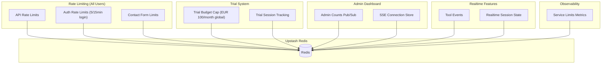

### 1.2 Key Insight: Unified Conversation Engine

**Chat and Voice are input/output channels, NOT separate systems.**

Both channels share:

- **Same Characters**: Identical personality, knowledge base, teaching style
- **Same Safety**: 5-layer guardrails apply to both text and voice
- **Same Tools**: Quiz, mindmap, flashcards work identically
- **Same Conversations**: Unified storage, seamless context switching
- **Same RAG**: User materials enhance both chat and voice responses
- **Same Tier Limits**: Feature access rules apply uniformly

---

## 2. Tech Stack Layers

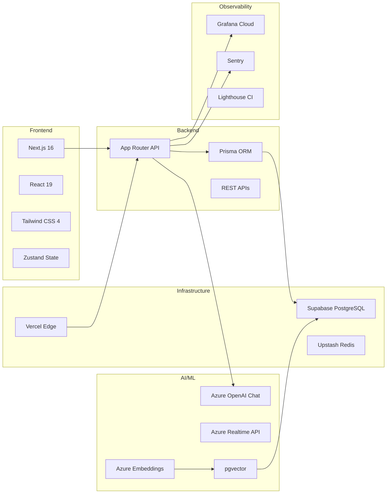

---

## 3. Database Schema

### 3.1 Entity Relationship Diagram

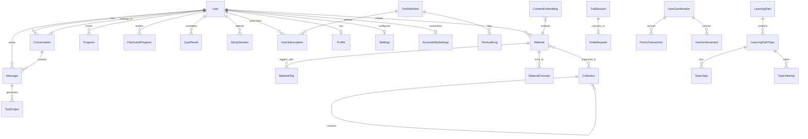

### 3.2 Schema File Organization

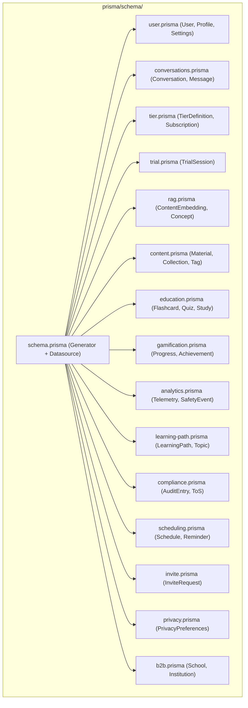

---

## 4. Authentication Flow


### 4.1 Cookie Architecture

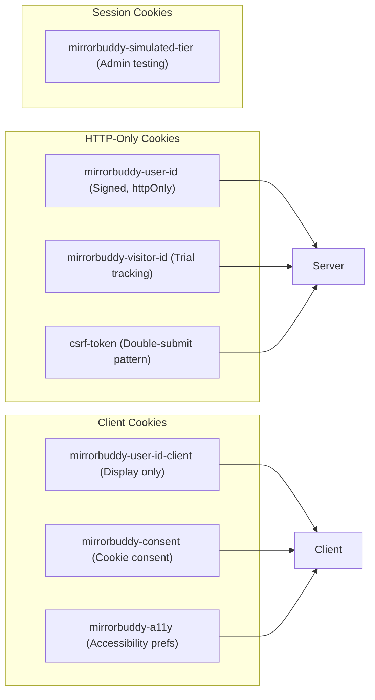

---

## 5. Conversation Engine (Shared Core)

Chat and Voice are **input/output channels** to the same Conversation Engine.
Everything below is shared between both modalities.

### 5.1 Unified Processing Pipeline

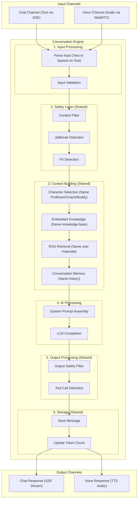

### 5.2 What is Shared vs Channel-Specific

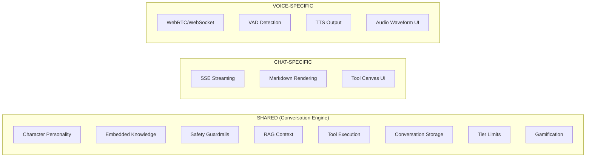

### 5.3 System Prompt Construction (Used by Both)

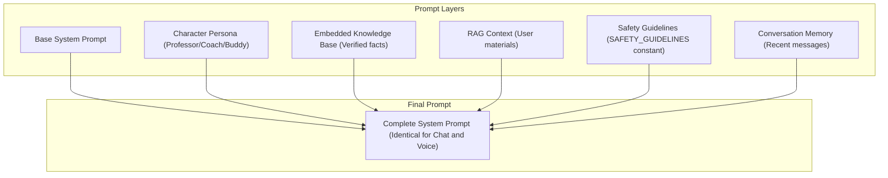

---

## 6. Channel: Chat (Text)

The Chat channel uses SSE (Server-Sent Events) for real-time streaming.

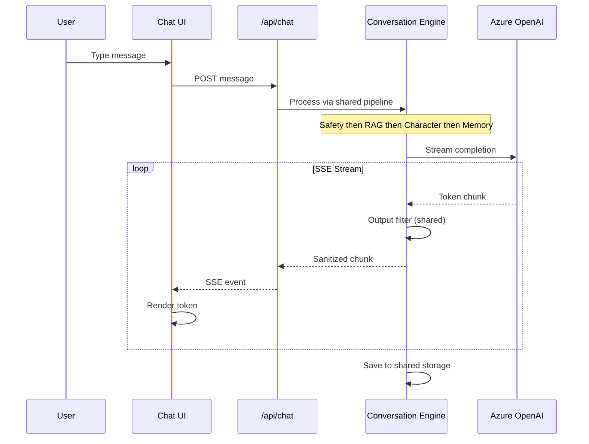

---

## 7. Channel: Voice (Audio)

The Voice channel uses WebRTC for low-latency audio streaming.
**Same Conversation Engine, different transport.**

### 7.1 WebRTC Architecture (ADR 0038)

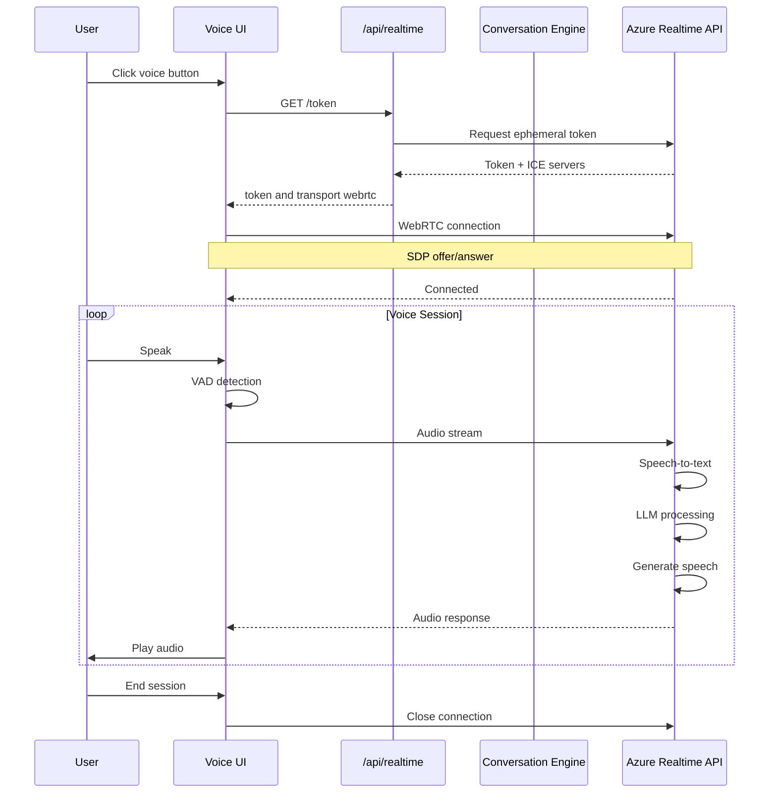

### 7.2 Adaptive VAD (ADR 0069)

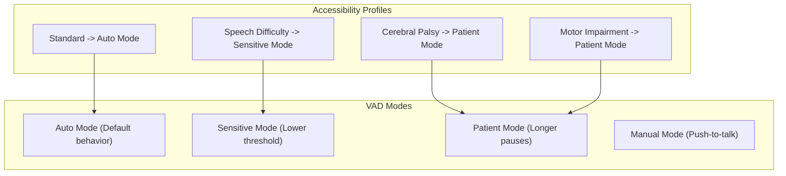

---

## 8. Character System

### 8.1 Support Triangle


### 8.2 Professors Overview

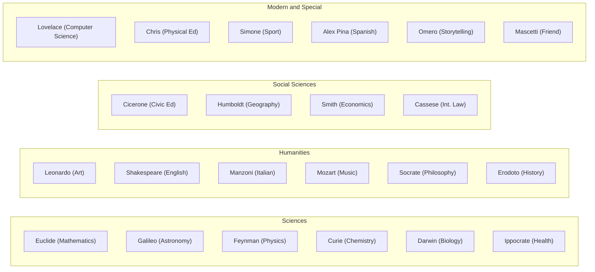

### 8.3 Character Intensity Dial (ADR 0031)

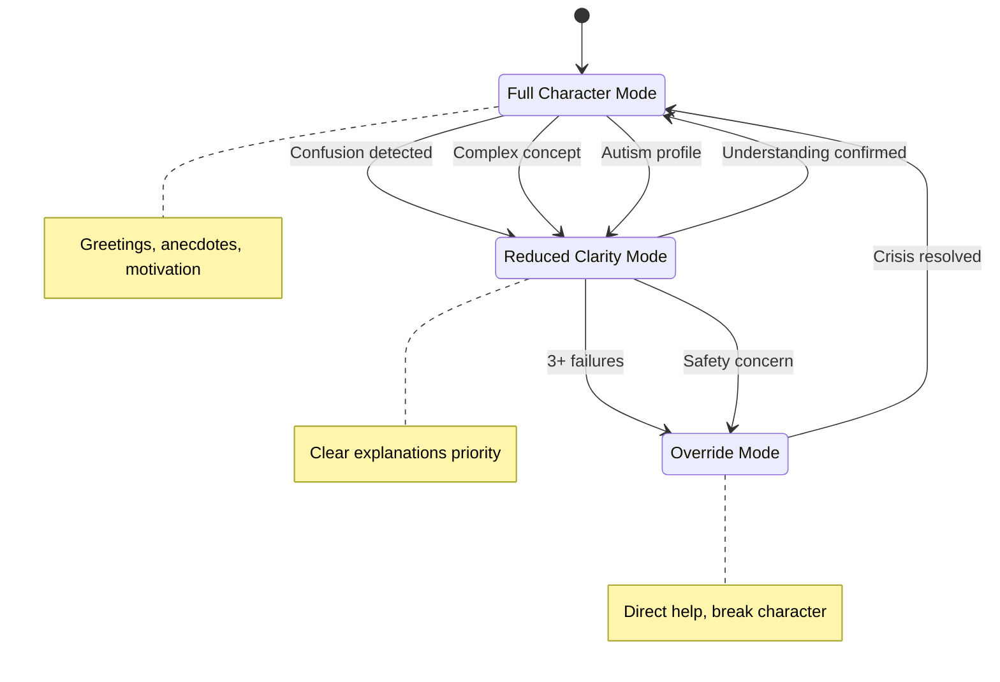

### 8.4 Formal vs Informal Address (ADR 0064)

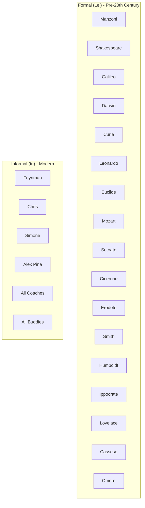

---

## 9. Tool Execution

### 9.1 Tool Plugin Architecture (ADR 0037)

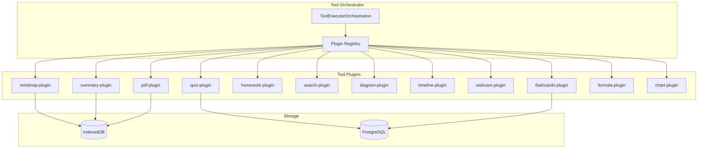

### 9.2 Tool Execution Flow

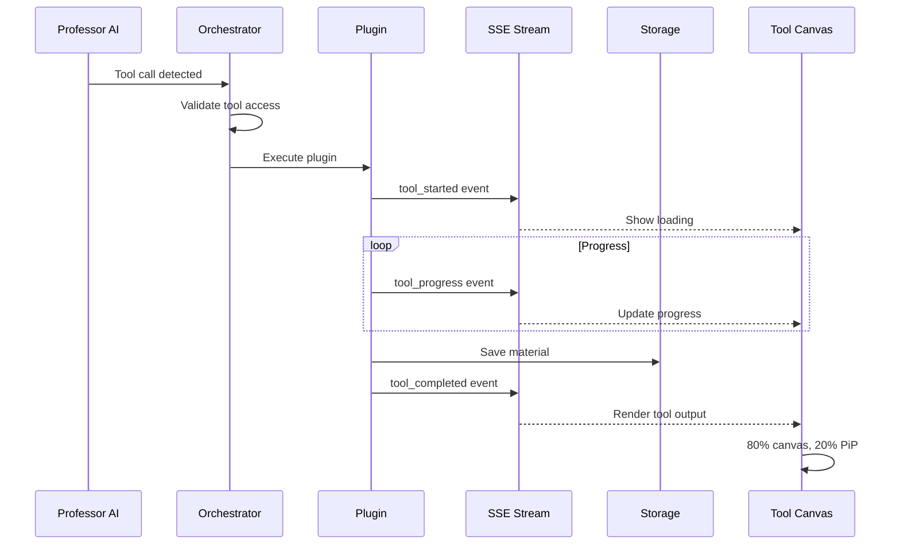

---

## 10. RAG System

### 10.1 RAG Architecture (ADR 0033)

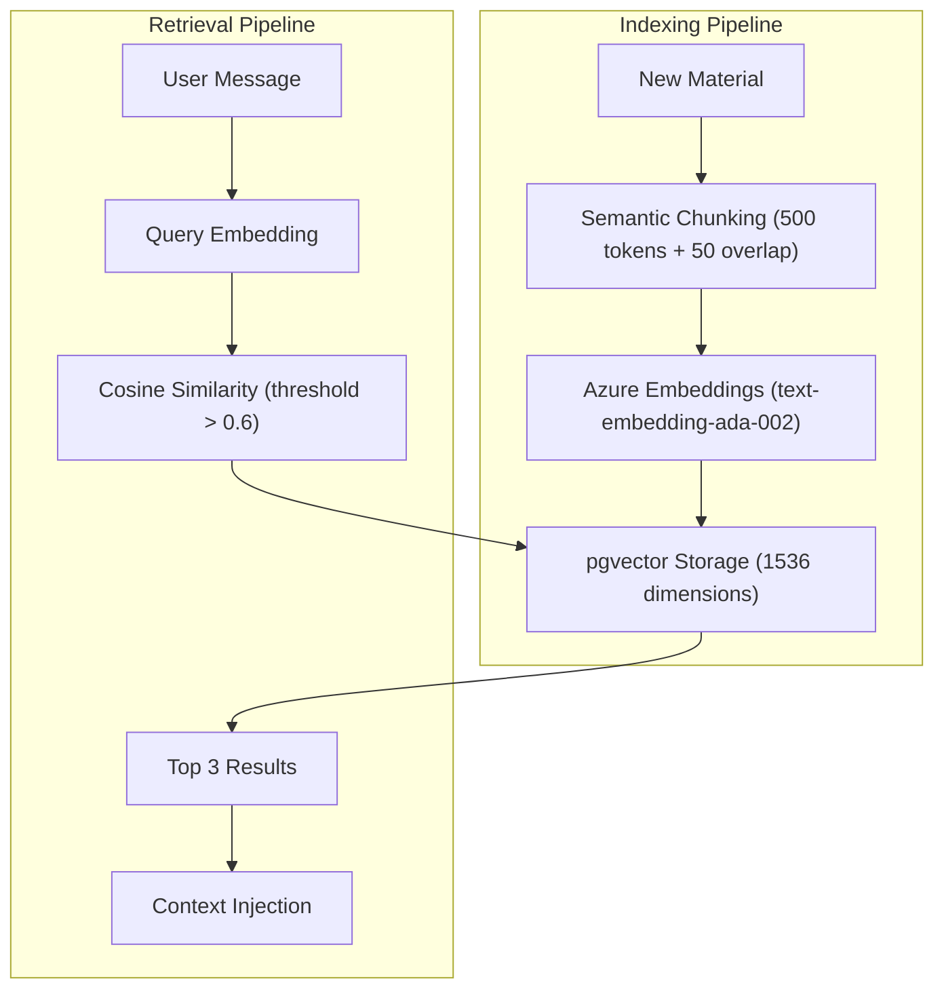

### 10.2 Content Embedding Model

```mermaid
erDiagram
    ContentEmbedding {
        string id PK
        string sourceType "material, conversation, note"
        string sourceId FK
        int chunkIndex
        vector embedding "1536 dims"
        string embeddingText "backup"
        json metadata "subject, tags, tokens"
        datetime createdAt
    }

    Material ||--o{ ContentEmbedding : has
    Conversation ||--o{ ContentEmbedding : has
```

---

## 11. Tier and Subscription

### 11.1 Tier Hierarchy (ADR 0071)

```mermaid
graph TB
    subgraph Trial_Tier["Trial Tier"]
        T1[Anonymous User]
        T2[10 chats/month]
        T3[5 min voice]
        T4[3 random Professors]
        T5[10 tool uses]
        T6[gpt-4o-mini]
    end

    subgraph Base_Tier["Base Tier"]
        B1[Registered Free]
        B2[50 chats/month]
        B3[100 min voice]
        B4[All 22 Professors]
        B5[All tools]
        B6[gpt-5.2-edu]
    end

    subgraph Pro_Tier["Pro Tier"]
        P1[Paid Subscriber]
        P2[Unlimited chats]
        P3[Unlimited voice]
        P4[All 22 Professors]
        P5[All tools + priority]
        P6[gpt-5.2-chat]
    end

    T1 -->|Registration| B1
    B1 -->|Subscription| P1
```

### 11.2 TierService Flow

```mermaid
sequenceDiagram
    participant API as API Route
    participant TS as TierService
    participant Cache as Memory Cache
    participant DB as Database

    API->>TS: getEffectiveTier(userId)
    TS->>Cache: Check cache

    alt Cache hit
        Cache-->>TS: Cached tier
    else Cache miss
        TS->>DB: Load subscription
        DB-->>TS: UserSubscription
        TS->>TS: Validate dates
        TS->>Cache: Store result
    end

    TS-->>API: TierName

    API->>TS: checkFeatureAccess(userId, voice)
    TS->>TS: Get tier config
    TS->>TS: Check feature limits
    TS-->>API: boolean
```

### 11.3 Per-Feature Model Selection (ADR 0073)

```mermaid
graph LR
    subgraph Feature_Types["Feature Types"]
        Chat[chat]
        Realtime[realtime]
        PDF[pdf]
        Mindmap[mindmap]
        Quiz[quiz]
        Flash[flashcards]
        Summary[summary]
        Formula[formula]
    end

    subgraph Trial_Models["Trial Models"]
        TM[gpt-4o-mini]
    end

    subgraph Base_Models["Base Models"]
        BM1["gpt-5.2-edu (chat, quiz, homework)"]
        BM2["gpt-5-mini (pdf, mindmap, summary)"]
        BM3["gpt-realtime (voice)"]
    end

    subgraph Pro_Models["Pro Models"]
        PM["gpt-5.2-chat (All features)"]
    end

    Chat --> TM
    Chat --> BM1
    Chat --> PM
```

---

## 12. Trial Mode

### 12.1 Trial Session Flow (ADR 0056)

```mermaid
stateDiagram-v2
    [*] --> Anonymous: Visit site

    Anonymous: Anonymous User
    note right of Anonymous: Generate visitor ID

    Anonymous --> TrialSession: First interaction

    TrialSession: Active Trial
    note right of TrialSession: Track IP hash, limits, Professors

    TrialSession --> LimitReached: Exceed limits
    TrialSession --> Blocked: Abuse detected
    TrialSession --> InviteRequest: Request invite

    LimitReached: Limits Exhausted
    note right of LimitReached: Show upgrade prompt

    Blocked: 24-hour Block
    note right of Blocked: Anti-abuse score >= 15

    InviteRequest: Pending Approval

    InviteRequest --> Registered: Approved
    InviteRequest --> Rejected: Denied

    Registered: Full User
    note right of Registered: Migrate preferences
```

### 12.2 Anti-Abuse Scoring

```mermaid
graph TB
    subgraph Abuse_Signals["Abuse Signals"]
        IP["IP Changes (+5 points)"]
        Rapid["Rapid Requests (+3 points)"]
        Doc["Document Abuse (+2 points)"]
        Reset["Cookie Reset (+3 points)"]
    end

    subgraph Score_Evaluation["Score Evaluation"]
        Score[Abuse Score]
        Threshold{Score >= 15?}
    end

    subgraph Actions["Actions"]
        Allow[Allow Request]
        Block[24-hour Block]
    end

    IP --> Score
    Rapid --> Score
    Doc --> Score
    Reset --> Score

    Score --> Threshold
    Threshold -->|Yes| Block
    Threshold -->|No| Allow
```

---

## 13. Invite System

### 13.1 Invite Flow (ADR 0057)

```mermaid
sequenceDiagram
    participant U as Trial User
    participant UI as Invite Form
    participant API as /api/invites
    participant Admin as Admin
    participant Email as Resend
    participant Auth as Auth System

    U->>UI: Click Request Invite
    UI->>API: POST /request
    API->>API: Create InviteRequest (PENDING)
    API->>Email: Notify admin
    API-->>UI: Success

    Admin->>API: GET /admin/invites
    API-->>Admin: Pending requests

    Admin->>API: POST /approve
    API->>API: Update status (APPROVED)
    API->>API: Generate temp password
    API->>Email: Send approval + credentials

    U->>Auth: First login
    Auth->>Auth: Force password change
    Auth->>API: Migrate trial data
    API-->>U: Welcome to Base tier
```

### 13.2 Invite Request States

```mermaid
stateDiagram-v2
    [*] --> PENDING: Submit request

    PENDING: Pending Review

    PENDING --> APPROVED: Admin approves
    PENDING --> REJECTED: Admin rejects

    APPROVED: Approved
    note right of APPROVED: Email with credentials sent

    REJECTED: Rejected
    note right of REJECTED: Optional reason provided

    APPROVED --> MIGRATED: First login

    MIGRATED: Data Migrated
    note right of MIGRATED: Trial preferences to User profile
```

---

## 14. CI/CD Pipeline

### 14.1 GitHub Actions Workflow

```mermaid
graph TB
    subgraph Trigger["Trigger"]
        Push[Push to main/dev]
        PR[Pull Request]
    end

    subgraph Lane1_Build["Lane 1: Build"]
        Build[Build and Lint]
        Typecheck[TypeScript Check]
        NextBuild[Next.js Build]
        Artifacts[Upload Artifacts]
    end

    subgraph Lane2_Security["Lane 2: Security"]
        TruffleHog[TruffleHog Scan]
        SecretScan[Legacy Secret Check]
        Audit[npm audit]
        SBOM[Generate SBOM]
    end

    subgraph Lane3_Tests["Lane 3: Tests"]
        Unit[Unit Tests]
        Coverage[Coverage Report]
        LLMSafety[LLM Safety Tests]
    end

    subgraph Lane4_Quality["Lane 4: Quality"]
        Docs[Documentation Check]
        Migrations[Migration Check]
        TODOs[Critical TODOs]
        CircularDeps[Circular Imports]
        ConsoleLog[console.log Check]
    end

    subgraph Lane5_E2E["Lane 5: E2E (PR only)"]
        Smoke[Smoke Tests]
        E2E[Full E2E]
        Mobile[Mobile E2E]
    end

    subgraph Lane6_Performance["Lane 6: Performance"]
        Bundle[Bundle Size]
        Lighthouse[Lighthouse CI]
    end

    subgraph Lane7_Docker["Lane 7: Docker"]
        Docker[Docker Build]
    end

    Push --> Build
    PR --> Build

    Build --> Artifacts
    TruffleHog --> SecretScan
    SecretScan --> Audit
    Audit --> SBOM

    Build --> Smoke
    Smoke --> E2E
    E2E --> Mobile

    Build --> Bundle
    Bundle --> Lighthouse
```

### 14.2 CI Job Dependencies

```mermaid
graph LR
    Build[build]
    SecretScan[secret-scanning]
    Security[security]
    Unit[unit-tests]
    LLM[llm-safety-tests]
    Docs[docs]
    Migrations[migrations]
    Quality[quality]
    Smoke[smoke-tests]
    E2E[e2e-tests]
    Mobile[mobile-e2e]
    Perf[performance]
    Docker[docker]

    SecretScan --> Security
    Build --> Smoke
    Build --> E2E
    Build --> Perf
    E2E --> Mobile
```

---

## 15. Git Hooks

### 15.1 Pre-Commit Hook

```mermaid
graph TB
    subgraph Pre_Commit_Checks["Pre-Commit Checks"]
        Secrets["secrets-scan.sh (TruffleHog + regex)"]
        LintStaged["lint-staged (ESLint + Prettier)"]
        CSP{CSP files changed?}
        CSPTest[CSP Validation Tests]
        Mobile{TSX files changed?}
        MobileCheck[Mobile Pattern Check]
    end

    subgraph Outcome["Outcome"]
        Pass[Commit Allowed]
        Fail[Commit Blocked]
    end

    Secrets -->|Pass| LintStaged
    Secrets -->|Fail| Fail

    LintStaged -->|Pass| CSP
    LintStaged -->|Fail| Fail

    CSP -->|Yes| CSPTest
    CSP -->|No| Mobile

    CSPTest -->|Pass| Mobile
    CSPTest -->|Fail| Fail

    Mobile -->|Yes| MobileCheck
    Mobile -->|No| Pass

    MobileCheck -->|Pass| Pass
    MobileCheck -->|Fail| Fail
```

### 15.2 Pre-Push Hook

```mermaid
graph TB
    subgraph Pre_Push_Vercel["pre-push-vercel.sh"]
        MigrationCheck["Migration Naming (YYYYMMDDHHMMSS_name)"]
        PrismaGen[prisma generate]
        Lint[npm run lint]
        Typecheck[npm run typecheck]
        AuditHigh[npm audit --high]
        Build[npm run build]
        VercelEnv[Vercel Env Check]
        CSRFCheck[CSRF Protection Check]
        CriticalTODOs[Critical TODOs Check]
        ConsoleLog[console.log Check]
        SecretsCheck[Secrets Exposure Check]
    end

    subgraph Outcome["Outcome"]
        Allow[Push Allowed]
        Block[Push Blocked]
    end

    MigrationCheck -->|Pass| PrismaGen
    PrismaGen -->|Pass| Lint
    Lint -->|Pass| Typecheck
    Typecheck -->|Pass| AuditHigh
    AuditHigh -->|Pass| Build
    Build -->|Pass| VercelEnv
    VercelEnv -->|Pass| CSRFCheck
    CSRFCheck -->|Pass| CriticalTODOs
    CriticalTODOs -->|Pass| ConsoleLog
    ConsoleLog -->|Pass| SecretsCheck
    SecretsCheck -->|Pass| Allow

    MigrationCheck -->|Fail| Block
    PrismaGen -->|Fail| Block
    Lint -->|Fail| Block
    Typecheck -->|Fail| Block
    Build -->|Fail| Block
```

---

## 16. Cron Jobs

### 16.1 Scheduled Tasks (vercel.json)

```mermaid
graph TB
    subgraph Every_5_Minutes["Every 5 Minutes"]
        Metrics["/api/cron/metrics-push (SLI metrics to Grafana)"]
    end

    subgraph Daily_3AM["Daily 3 AM"]
        DataRetention["/api/cron/data-retention (GDPR cleanup)"]
        BusinessMetrics["/api/cron/business-metrics-daily (KPI aggregation)"]
    end

    subgraph Daily_9AM["Daily 9 AM"]
        TrialNurturing["/api/cron/trial-nurturing (Email automation)"]
    end

    subgraph Authorization["Authorization"]
        CronSecret[CRON_SECRET header]
    end

    CronSecret --> Metrics
    CronSecret --> DataRetention
    CronSecret --> BusinessMetrics
    CronSecret --> TrialNurturing
```

### 16.2 Data Retention Flow

```mermaid
sequenceDiagram
    participant Cron as Cron Trigger
    participant API as /api/cron/data-retention
    participant DB as Database
    participant Log as Audit Log

    Cron->>API: GET (CRON_SECRET)
    API->>DB: Find expired sessions
    Note over DB: TTL 365d conversations, 730d progress

    API->>DB: Anonymize PII
    API->>DB: Delete marked records
    API->>Log: Record deletion count

    API-->>Cron: deleted N, anonymized M
```

---

## 17. API Routes

### 17.1 API Route Organization

```mermaid
graph TB
    subgraph API["/api"]
        subgraph Auth["Auth"]
            AuthLogin[/auth/login]
            AuthLogout[/auth/logout]
            AuthGoogle[/auth/google]
            AuthSession[/auth/session]
        end

        subgraph Chat["Chat"]
            ChatRoute[/chat]
            ChatStream[/chat/stream]
        end

        subgraph Voice["Voice"]
            RealtimeToken[/realtime/token]
            RealtimeEphemeral[/realtime/ephemeral-token]
            RealtimeStart[/realtime/start]
            RealtimeStatus[/realtime/status]
        end

        subgraph User["User"]
            UserProfile[/user/profile]
            UserSettings[/user/settings]
            UserSubscription[/user/subscription]
            UserUsage[/user/usage]
        end

        subgraph Admin["Admin"]
            AdminTiers[/admin/tiers]
            AdminUsers[/admin/users]
            AdminInvites[/admin/invites]
            AdminCounts[/admin/counts]
            AdminFunnel[/admin/funnel]
        end

        subgraph Content["Content"]
            Conversations[/conversations]
            Materials[/materials]
            Collections[/collections]
            Tags[/tags]
        end

        subgraph Education["Education"]
            Flashcards[/flashcards]
            Quizzes[/quizzes]
            LearningPath[/learning-path]
            StudyKit[/study-kit]
        end

        subgraph Gamification["Gamification"]
            Points[/gamification/points]
            Achievements[/gamification/achievements]
            Streak[/gamification/streak]
        end

        subgraph System["System"]
            Health[/health]
            HealthDetailed[/health/detailed]
            Metrics[/metrics]
            CronRoutes[/cron/*]
        end
    end
```

### 17.2 Request Flow

```mermaid
sequenceDiagram
    participant Client
    participant Middleware
    participant Route as API Route
    participant Auth as validateAuth()
    participant CSRF as requireCSRF()
    participant Handler as Business Logic
    participant DB as Database

    Client->>Middleware: Request
    Middleware->>Middleware: Rate limiting
    Middleware->>Route: Forward

    alt Authenticated Endpoint
        Route->>CSRF: Check CSRF (mutations)
        CSRF-->>Route: Valid
        Route->>Auth: validateAuth()
        Auth-->>Route: userId, isAdmin
    end

    Route->>Handler: Process request
    Handler->>DB: Data operations
    DB-->>Handler: Result
    Handler-->>Route: Response
    Route-->>Client: JSON response
```

---

## 18. Accessibility System

### 18.1 Seven DSA Profiles (ADR 0060)

```mermaid
graph TB
    subgraph Accessibility_Profiles["Accessibility Profiles"]
        Dyslexia["Dyslexia (OpenDyslexic, spacing, TTS)"]
        ADHD["ADHD (Pomodoro, focus mode)"]
        Visual["Visual Impairment (High contrast, large text)"]
        Motor["Motor Impairment (Keyboard nav, large targets)"]
        Autism["Autism (Reduced motion, structure)"]
        Auditory["Auditory Impairment (Visual cues, captions)"]
        CP["Cerebral Palsy (Combined adaptations)"]
    end

    subgraph Settings_Storage["Settings Storage"]
        Cookie["mirrorbuddy-a11y (90-day cookie)"]
        Store[Zustand Store]
    end

    subgraph Components["Components"]
        FloatingBtn["a11y-floating-button (44x44px trigger)"]
        QuickPanel["a11y-quick-panel (Settings panel)"]
    end

    Dyslexia --> Store
    ADHD --> Store
    Visual --> Store
    Motor --> Store
    Autism --> Store
    Auditory --> Store
    CP --> Store

    Store --> Cookie
    FloatingBtn --> QuickPanel
    QuickPanel --> Store
```

### 18.2 WCAG 2.1 AA Requirements

```mermaid
graph LR
    subgraph Perceivable["Perceivable"]
        Contrast["4.5:1 contrast"]
        TextAlt[Text alternatives]
        Captions[Captions]
    end

    subgraph Operable["Operable"]
        Keyboard[Keyboard accessible]
        Focus[Visible focus]
        Touch[44px touch targets]
    end

    subgraph Understandable["Understandable"]
        Readable[Readable text]
        Predictable[Predictable]
        Input[Input assistance]
    end

    subgraph Robust["Robust"]
        Compatible[Compatible]
        Valid[Valid HTML]
    end
```

---

## 19. Compliance and Safety

### 19.1 Five-Layer Safety Architecture (ADR 0004)

```mermaid
graph TB
    subgraph Layer1_System_Prompt["Layer 1: System Prompt"]
        Safety[SAFETY_GUIDELINES injection]
    end

    subgraph Layer2_Input_Filter["Layer 2: Input Filter"]
        ContentFilter[Content Filter]
        PII[PII Detection]
    end

    subgraph Layer3_Jailbreak["Layer 3: Jailbreak Detection"]
        Patterns[Pattern Matching]
        Heuristics[Heuristics]
    end

    subgraph Layer4_Output["Layer 4: Output Sanitizer"]
        OutputFilter[Response Filter]
        DOMPurify[DOMPurify]
    end

    subgraph Layer5_Monitoring["Layer 5: Monitoring"]
        SafetyEvent[SafetyEvent logging]
        AdminDash[Admin Dashboard]
    end

    Input[User Input] --> ContentFilter
    ContentFilter --> PII
    PII --> Patterns
    Patterns --> Heuristics
    Heuristics --> LLM[LLM Processing]
    LLM --> OutputFilter
    OutputFilter --> DOMPurify
    DOMPurify --> Output[Safe Output]

    ContentFilter --> SafetyEvent
    Patterns --> SafetyEvent
    OutputFilter --> SafetyEvent
    SafetyEvent --> AdminDash
```

### 19.2 Compliance Framework

```mermaid
graph TB
    subgraph Regulatory_Requirements["Regulatory Requirements"]
        EUAI[EU AI Act 2024/1689]
        Italy[L.132/2025 Italy]
        GDPR[GDPR]
        COPPA[COPPA]
        WCAG[WCAG 2.1 AA]
    end

    subgraph Documentation["Documentation"]
        DPIA[DPIA.md]
        AIPolicy[AI-POLICY.md]
        ModelCard[MODEL-CARD.md]
        RiskMgmt[AI-RISK-MANAGEMENT.md]
        BiasAudit[BIAS-AUDIT-REPORT.md]
    end

    subgraph Public_Pages["Public Pages"]
        AITransparency[/ai-transparency]
        Privacy[/privacy]
        Terms[/terms]
    end

    subgraph Admin_Tools["Admin Tools"]
        SafetyDash[/admin/safety]
        AuditLog[/api/compliance/audit-log]
        DataExport[/api/privacy/export-data]
    end

    EUAI --> DPIA
    EUAI --> AIPolicy
    GDPR --> Privacy
    GDPR --> DataExport
    COPPA --> Terms
    WCAG --> AITransparency
```

---

## 20. Observability

### 20.1 Monitoring Stack

```mermaid
graph TB
    subgraph Metrics_Collection["Metrics Collection"]
        App[Next.js App]
        Health[/api/health]
        HealthDetailed[/api/health/detailed]
        Metrics[/api/metrics]
    end

    subgraph Push_to_Grafana["Push to Grafana"]
        CronPush["/api/cron/metrics-push (Every 5 min)"]
        PromPush[Prometheus Push Gateway]
    end

    subgraph Grafana_Cloud["Grafana Cloud"]
        Dashboard[Dashboard]
        Alerts[Alert Rules]
    end

    subgraph Error_Tracking["Error Tracking"]
        Sentry[Sentry]
        SourceMaps[Source Maps]
    end

    subgraph Service_Limits["Service Limits"]
        Vercel[Vercel Limits]
        Supabase[Supabase Limits]
        Azure[Azure OpenAI TPM/RPM]
        Redis[Upstash Redis]
        Resend[Resend Email]
    end

    App --> Health
    App --> Metrics
    Health --> CronPush
    Metrics --> CronPush
    CronPush --> PromPush
    PromPush --> Dashboard
    Dashboard --> Alerts

    App --> Sentry
    SourceMaps --> Sentry

    Vercel --> Dashboard
    Supabase --> Dashboard
    Azure --> Dashboard
```

### 20.2 SLI/SLO Metrics (ADR 0058)

```mermaid
graph LR
    subgraph Session_Health["Session Health"]
        SuccessRate[Success Rate]
        DropOff[Drop-off Rate]
        StuckLoop[Stuck Loop Rate]
    end

    subgraph Safety_Metrics["Safety Metrics"]
        RefusalPrec[Refusal Precision]
        JailblockRate[Jailbreak Block Rate]
        Incidents[Incidents S0-S3]
    end

    subgraph Performance["Performance"]
        P95[HTTP Latency P95]
        ErrorRate[Error Rate by Route]
    end

    subgraph Cost["Cost"]
        SessionCost[Per-Session Cost]
        CostSpikes[Cost Spike Detection]
    end
```

---

## 21. External Integrations

### 21.1 Service Map

```mermaid
graph TB
    subgraph MirrorBuddy["MirrorBuddy"]
        App[Next.js Application]
    end

    subgraph AI_Services["AI Services"]
        AzureChat["Azure OpenAI (Chat Completions)"]
        AzureRealtime["Azure Realtime API (Voice Sessions)"]
        AzureEmbed["Azure Embeddings (RAG Indexing)"]
        AzureTTS["Azure TTS (Text-to-Speech)"]
        Ollama["Ollama (Local Fallback)"]
    end

    subgraph Data_Services["Data Services"]
        Supabase["Supabase (PostgreSQL + pgvector)"]
        Upstash["Upstash Redis (Rate Limiting + Cache)"]
    end

    subgraph Communication["Communication"]
        Resend["Resend (Email Notifications)"]
    end

    subgraph Infrastructure["Infrastructure"]
        Vercel["Vercel (Edge Deployment)"]
    end

    subgraph Observability["Observability"]
        Grafana["Grafana Cloud (Metrics Dashboard)"]
        Sentry["Sentry (Error Tracking)"]
    end

    App --> AzureChat
    App --> AzureRealtime
    App --> AzureEmbed
    App --> AzureTTS
    App --> Ollama

    App --> Supabase
    App --> Upstash

    App --> Resend

    App --> Vercel

    App --> Grafana
    App --> Sentry
```

### 21.2 CSP Allowed Domains

```mermaid
graph LR
    subgraph Connect_Src["connect-src"]
        Self[self]
        AzureOpenAI["*.openai.azure.com"]
        AzureRealtime["*.realtimeapi-preview.ai.azure.com"]
        Upstash["*.upstash.io"]
        Supabase["*.supabase.co"]
        Sentry["*.sentry.io"]
        Grafana["*.grafana.net"]
    end

    subgraph Script_Src["script-src"]
        SelfScript[self]
        Nonce[nonce-based]
    end
```

---

## 22. Component Structure

### 22.1 Component Organization

```mermaid
graph TB
    subgraph Src_Components["src/components/"]
        subgraph Core["Core"]
            UI["ui/ (Buttons, Cards, Forms)"]
            Layout["layout/ (Navigation, Footer)"]
            Providers["providers/ (Context Providers)"]
        end

        subgraph Features["Features"]
            Chat["chat/ (Message List, Input)"]
            Conv["conversation/ (Character View, Sidebar)"]
            Voice["voice/ (Waveform, Controls)"]
            Tools["tools/ (Mindmap, Quiz, etc.)"]
        end

        subgraph Education["Education"]
            Edu["education/ (Quiz, Flashcards)"]
            LPath["learning-path/ (Progress, Topics)"]
            Gami["gamification/ (Achievements, Streak)"]
        end

        subgraph User["User"]
            Settings["settings/ (Profile, Preferences)"]
            Profile["profile/ (COPPA, Avatar)"]
            Tier["tier/ (Badge, Upgrade)"]
        end

        subgraph Admin["Admin"]
            AdminComp["admin/ (Dashboard, Users)"]
            Trial["trial/ (Trial UI, Limits)"]
        end

        subgraph A11y["A11y"]
            A11yComp["accessibility/ (Floating Button, Panel)"]
            Typing["typing/ (Loading States)"]
        end
    end
```

---

## 23. State Management

### 23.1 Zustand Stores

```mermaid
graph TB
    subgraph Conversation_State["Conversation State"]
        ConvStore["useConversationStore (Active conversation + messages)"]
        ChatStore["useChatStore (Chat session state)"]
        CharStore["useCharacterStore (Selected professor)"]
    end

    subgraph User_State["User State"]
        SettingsStore["useSettingsStore (User preferences)"]
        A11yStore["useAccessibilityStore (A11y settings)"]
        TierStore["useTierStore (Current tier)"]
    end

    subgraph Trial_State["Trial State"]
        TrialStore["useTrialStore (Trial session + limits)"]
    end

    subgraph Gamification_State["Gamification State"]
        GamiStore["useGamificationStore (Points, streaks)"]
    end

    subgraph Persistence["Persistence"]
        REST[REST APIs]
        Cookies[Cookies]
        Memory[Memory Only]
    end

    ConvStore --> REST
    ChatStore --> Memory
    CharStore --> REST
    SettingsStore --> REST
    A11yStore --> Cookies
    TierStore --> REST
    TrialStore --> REST
    GamiStore --> REST
```

### 23.2 No localStorage Policy (ADR 0015)

```mermaid
graph LR
    subgraph Allowed["Allowed"]
        Zustand[Zustand Stores]
        REST[REST APIs]
        Cookies[Essential Cookies]
        IndexedDB["IndexedDB (Binary files only)"]
    end

    subgraph Forbidden["Forbidden"]
        LocalStorage["localStorage (for user data)"]
    end

    Zustand --> REST
    Zustand --> Cookies
```

---

## 24. Deployment Flow

### 24.1 Vercel Deployment

```mermaid
sequenceDiagram
    participant Dev as Developer
    participant Git as GitHub
    participant Hook as Pre-push Hook
    participant CI as GitHub Actions
    participant Vercel as Vercel

    Dev->>Hook: git push
    Hook->>Hook: pre-push-vercel.sh
    Note over Hook: Lint, Typecheck, Build, etc.
    Hook-->>Dev: Pass/Fail

    Dev->>Git: Push to main
    Git->>CI: Trigger workflow

    par CI Checks
        CI->>CI: Build and Lint
        CI->>CI: Security Scan
        CI->>CI: Unit Tests
        CI->>CI: E2E Tests
    end

    CI-->>Git: All green

    Git->>Vercel: Auto-deploy trigger
    Vercel->>Vercel: prisma generate
    Vercel->>Vercel: npm run build
    Vercel->>Vercel: seed admin
    Vercel-->>Git: Deploy complete
```

### 24.2 SSL Configuration (ADR 0063, 0067)

```mermaid
graph TB
    subgraph Certificate_Handling["Certificate Handling"]
        Cert[Supabase CA Cert]
        Pipe[Pipe-delimited format]
        EnvVar[SUPABASE_CA_CERT env]
    end

    subgraph Connection["Connection"]
        Prisma[Prisma Client]
        Pool[Connection Pool]
        SSL[SSL Config]
    end

    subgraph Never_Use["Never Use"]
        TLSReject["NODE_TLS_REJECT_UNAUTHORIZED=0"]
    end

    Cert --> Pipe
    Pipe --> EnvVar
    EnvVar --> SSL
    SSL --> Pool
    Pool --> Prisma

    TLSReject -.->|Forbidden| SSL
```

---

## 25. ADR Index

### 25.1 Architecture Decision Records

```mermaid
graph TB
    subgraph Data_Storage["Data and Storage"]
        ADR0001[0001 Materials Storage]
        ADR0015[0015 Database-First]
        ADR0028[0028 PostgreSQL + pgvector]
        ADR0033[0033 RAG Semantic Search]
    end

    subgraph AI_Characters["AI and Characters"]
        ADR0003[0003 Support Triangle]
        ADR0031[0031 Embedded Knowledge]
        ADR0064[0064 Formal/Informal]
        ADR0073[0073 Per-Feature Models]
    end

    subgraph Voice_Realtime["Voice and Realtime"]
        ADR0005[0005 SSE Architecture]
        ADR0034[0034 Chat Streaming]
        ADR0038[0038 WebRTC Migration]
        ADR0069[0069 Adaptive VAD]
    end

    subgraph Security_Safety["Security and Safety"]
        ADR0004[0004 Safety Guardrails]
        ADR0060[0060 Security Hardening]
        ADR0072[0072 Secrets Scan]
        ADR0075[0075 Cookie Standards]
    end

    subgraph Business_Logic["Business Logic"]
        ADR0056[0056 Trial Mode]
        ADR0057[0057 Invite System]
        ADR0071[0071 Tier Subscription]
    end

    subgraph Infrastructure_ADRs["Infrastructure"]
        ADR0047[0047 Grafana Cloud]
        ADR0063[0063 Supabase SSL]
        ADR0067[0067 DB Performance]
        ADR0070[0070 Sentry]
        ADR0076[0076 Centralized Logging]
    end

    subgraph Compliance_ADRs["Compliance"]
        ADR0008[0008 Parent Dashboard GDPR]
        ADR0059[0059 E2E Test Setup]
        ADR0062[0062 AI Compliance]
    end
```

---

## Quick Reference

| Category   | Key Files                                         | ADRs             |
| ---------- | ------------------------------------------------- | ---------------- |
| Database   | `prisma/schema/*.prisma`                          | 0015, 0028, 0033 |
| Auth       | `src/lib/auth/`                                   | 0055, 0075       |
| Chat       | `src/lib/ai/`, `src/app/api/chat/`                | 0034             |
| Voice      | `src/app/api/realtime/`                           | 0038, 0069       |
| Professors | `src/data/maestri/`                               | 0031, 0064       |
| Tools      | `src/lib/tools/`                                  | 0009, 0037       |
| Tiers      | `src/lib/tier/`                                   | 0071, 0073       |
| Trial      | `src/lib/trial/`                                  | 0056, 0057       |
| Safety     | `src/lib/safety/`                                 | 0004, 0062       |
| A11y       | `src/lib/accessibility/`                          | 0060             |
| CI/CD      | `.github/workflows/ci.yml`                        | -                |
| Hooks      | `.husky/pre-commit`, `scripts/pre-push-vercel.sh` | 0072             |

---

_Last updated: January 2025_
_Generated from codebase analysis and ADR documentation_
