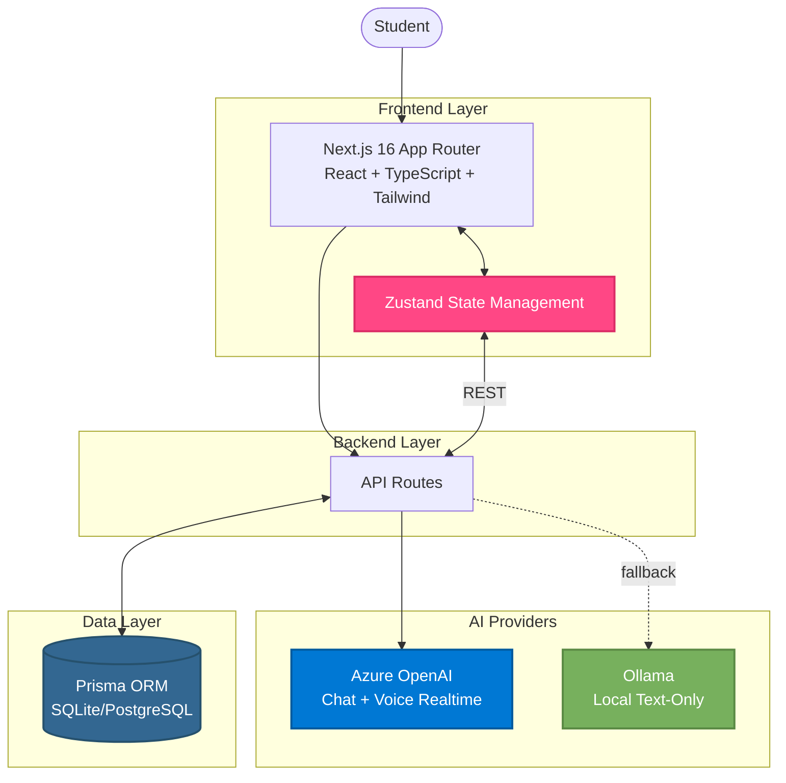

# MirrorBuddy Architecture

> Technical overview of the MirrorBuddy platform architecture

---

## Architecture Overview



---

## Key Architectural Decisions

### ADR 0015 - State Management

Zustand stores sync with backend via REST APIs. User data is NEVER stored in localStorage—only in the database.

**Why:** Data consistency, GDPR compliance (right to be forgotten), proper server-side validation, no stale data.

**Implementation:** `src/lib/stores/app-store.ts` (Zustand stores), API routes handle all persistence, state updates trigger API calls.

### AI Provider Strategy

Azure OpenAI primary (chat + voice), Ollama fallback (text-only).

**Selection:** Azure → Ollama → Showcase Mode (demo)

**Implementation:** `src/lib/ai/providers.ts` handles provider detection, environment variables control configuration.

### Data Flow

User Action → UI Component → Zustand Store (optimistic) → API Route → AI Provider/Database → Response → Zustand Store (final) → UI re-render

---

## Tech Stack

| Layer | Technology | Purpose |
|-------|------------|---------|
| **Framework** | Next.js 16 (App Router) | SSR, routing, API routes |
| **Language** | TypeScript 5 (strict mode) | Type safety, developer experience |
| **Styling** | Tailwind CSS 4 | Utility-first styling |
| **State** | Zustand | Lightweight state management |
| **Voice** | Azure OpenAI Realtime API | Real-time voice conversations |
| **Mind Maps** | MarkMap | Interactive mind map visualization |
| **Diagrams** | Mermaid.js | Flowchart, sequence, class, state, ER diagrams |
| **Math** | KaTeX | LaTeX math rendering |
| **Database** | Prisma + SQLite/PostgreSQL | Type-safe ORM |
| **Testing** | Playwright E2E | End-to-end testing |

---

## Directory Structure

```
src/
├── app/              # Next.js App Router (pages, API routes, showcase)
├── components/       # React components (ui/, features)
├── lib/              # Core (ai/, stores/, safety/, education/, accessibility/)
├── data/             # maestri-full.ts
├── types/            # TypeScript definitions
└── middleware.ts

prisma/schema.prisma  # Database schema
docs/claude/          # On-demand AI documentation
```

---

## Key Components

### Frontend
- **Next.js App Router** (`src/app/`) - SSR, routing, API routes
- **Zustand Stores** (`src/lib/stores/`) - app-store.ts, conversation-store.ts, progress-store.ts

### Backend
- **API Routes** (`src/app/api/`) - /chat, /realtime/token, /conversations, /progress, /tools/*

### AI Providers
- **Azure OpenAI** - GPT-4o (chat), GPT-4o Realtime (voice), requires Azure credentials
- **Ollama** - Local fallback, llama3.2/mistral/llama3.1:70b, text-only

### Database
- **Prisma ORM** - Type-safe, SQLite (dev), PostgreSQL (prod)

---

## Security & Privacy

**GDPR:** All user data in database (not localStorage), data export/deletion APIs, parental consent for minors, session-only cookies.

**Content Safety:** Input validation/sanitization (`src/lib/safety/`), content moderation, age-appropriate filtering, educational context enforcement.

**Auth:** Session-based, no client passwords, parent-child verification, dual consent for parent dashboard.

---

## Accessibility

WCAG 2.1 AA compliant with 7 profiles (`src/lib/accessibility/profiles.ts`):

| Profile | Condition | Key Features |
|---------|-----------|--------------|
| dyslexia | Dyslexia | OpenDyslexic font, extra spacing |
| dyscalculia | Dyscalculia | Visual numbers |
| adhd | ADHD | Focus mode, reduced distractions |
| autism | Autism | Predictable layouts |
| cerebral-palsy | Cerebral Palsy | Large targets, keyboard nav |
| visual-impairment | Low vision | High contrast, screen reader |
| motor-difficulties | Motor impairments | Voice control |

---

## Testing & Monitoring

**E2E Tests:** 1945 Playwright tests (80.75% coverage), all critical flows, voice sessions, accessibility, cross-browser.

**CI/CD:** GitHub Actions - Lint + TypeScript + Build + E2E on every PR.

**Telemetry:** Event tracking (`/api/telemetry/events`), session analytics, error tracking, performance metrics.

**Diagnostics:** System health (`/api/health`), API connectivity, provider status, settings page.

---

**See also:** [SETUP.md](SETUP.md) | [FEATURES.md](FEATURES.md) | [CONTRIBUTING.md](CONTRIBUTING.md) | [`docs/AZURE_REALTIME_API.md`](docs/AZURE_REALTIME_API.md) for voice integration
