# MirrorBuddy Architecture

> Technical overview of the MirrorBuddy platform architecture
> Last updated: 2026-01-18

---

## Architecture Overview

```mermaid
flowchart TB
    User([Student])

    subgraph Frontend["Frontend Layer"]
        UI[Next.js 16 App Router<br/>React 19 + TypeScript + Tailwind 4]
        State[Zustand State Management]
    end

    subgraph Backend["Backend Layer"]
        API[API Routes]
        SSE[SSE Streaming]
    end

    subgraph AI["AI Providers"]
        Azure[Azure OpenAI<br/>Chat + Voice + Embeddings]
        Ollama[Ollama<br/>Local Text-Only]
        RAG[RAG Retrieval<br/>pgvector]
    end

    subgraph Data["Data Layer"]
        DB[(Prisma ORM<br/>PostgreSQL + pgvector)]
    end

    subgraph Observability["Observability"]
        Metrics[Prometheus Push]
        Grafana[Grafana Cloud]
    end

    User --> UI
    UI <--> State
    UI --> API
    State <-- REST --> API
    API --> Azure
    API -.fallback.-> Ollama
    Azure --> RAG
    RAG --> DB
    API <--> DB
    API --> Metrics --> Grafana

    style Azure fill:#0078D4,stroke:#005A9E,color:#fff,stroke-width:2px
    style Ollama fill:#77B05D,stroke:#5A8A44,color:#fff,stroke-width:2px
    style State fill:#FF4785,stroke:#DB2C66,color:#fff,stroke-width:2px
    style DB fill:#336791,stroke:#26516D,color:#fff,stroke-width:2px
    style RAG fill:#8B5CF6,stroke:#7C3AED,color:#fff,stroke-width:2px
    style Grafana fill:#F46800,stroke:#E05400,color:#fff,stroke-width:2px
```



---

## Key Architectural Decisions

### ADR 0015 - State Management

Zustand stores sync with backend via REST APIs. User data is NEVER stored in localStorage—only in the database.

**Why:** Data consistency, GDPR compliance (right to be forgotten), proper server-side validation, no stale data.

**Implementation:** `src/lib/stores/` (10+ Zustand stores), API routes handle all persistence, state updates trigger API calls.

### ADR 0028 - PostgreSQL + pgvector

PostgreSQL 17 with pgvector extension for semantic search. Migrated from SQLite.

**Why:** Vector storage for RAG, production-ready scaling, native cosine similarity search.

### ADR 0033 - RAG Semantic Search

Retrieval-Augmented Generation using Azure OpenAI embeddings (text-embedding-3-small, 1536 dims) stored in pgvector.

**Flow:** User query → Embedding → Cosine similarity search → Top 3 materials → Enhanced prompt → AI response

### ADR 0047 - Grafana Cloud Observability

Prometheus push metrics to Grafana Cloud (60s interval). Dashboard at https://mirrorbuddy.grafana.net/d/dashboard/

**Metrics:** Session health, safety incidents, latency P50/P95/P99, business metrics (DAU/WAU/MAU)

### AI Provider Strategy

Azure OpenAI primary (chat + voice + embeddings), Ollama fallback (text-only).

**Selection:** Azure → Ollama → Showcase Mode (demo)

**Implementation:** `src/lib/ai/providers/` handles provider detection, environment variables control configuration.

### Data Flow

User Action → UI Component → Zustand Store (optimistic) → API Route → AI Provider/Database → Response → Zustand Store (final) → UI re-render

---

## Tech Stack

| Layer             | Technology                        | Purpose                                |
| ----------------- | --------------------------------- | -------------------------------------- |
| **Framework**     | Next.js 16.1.1 (App Router)       | SSR, routing, API routes               |
| **Language**      | TypeScript 5 (strict mode)        | Type safety, developer experience      |
| **UI**            | React 19.2.3                      | Component framework                    |
| **Styling**       | Tailwind CSS 4, Radix UI          | Utility-first + accessible components  |
| **State**         | Zustand 5.0.9                     | Lightweight state management           |
| **Voice**         | Azure OpenAI Realtime API         | Real-time voice conversations (WebRTC) |
| **AI**            | Azure OpenAI (chat, embeddings)   | GPT-4o, text-embedding-3-small         |
| **RAG**           | pgvector                          | Semantic search (1536 dims)            |
| **Mind Maps**     | MarkMap                           | Interactive mind map visualization     |
| **Database**      | Prisma + PostgreSQL 17 + pgvector | Type-safe ORM + vector search          |
| **Testing**       | Playwright (E2E) + Vitest (unit)  | 229 E2E, 5169+ unit tests              |
| **Observability** | Grafana Cloud                     | Prometheus push metrics                |

---

## Directory Structure

```
src/
├── app/              # Next.js App Router (pages, 50+ API routes)
├── components/       # React components (150+)
├── lib/
│   ├── ai/           # Providers, character routing, intent detection
│   ├── rag/          # Embeddings, semantic search, vector store
│   ├── stores/       # 10+ Zustand stores
│   ├── safety/       # 5-layer content safety
│   ├── education/    # FSRS, adaptive difficulty, mastery
│   ├── accessibility/# 7 DSA profiles
│   ├── observability/# Prometheus push to Grafana
│   └── tools/        # Tool handlers & plugins
├── data/
│   ├── maestri/      # 20 AI maestro definitions (modular)
│   ├── buddy-profiles/
│   └── support-teachers/
├── hooks/            # 20+ React hooks
├── types/            # TypeScript definitions (barrel export)
└── middleware.ts

prisma/schema/        # PostgreSQL + pgvector schema
docs/adr/             # 51+ Architecture Decision Records
```

---

## Key Components

### Frontend

- **Next.js App Router** (`src/app/`) - SSR, routing, 50+ API routes
- **Zustand Stores** (`src/lib/stores/`) - progress, settings, conversation, pomodoro, voice, accessibility, etc.

### Backend

- **API Routes** (`src/app/api/`) - /chat, /chat/stream (SSE), /voice/\*, /tools/stream, /materials, /progress, /health, /metrics

### AI Providers

- **Azure OpenAI** - GPT-4o (chat), GPT-4o Realtime (voice WebRTC), text-embedding-3-small (RAG)
- **Ollama** - Local fallback, text-only

### RAG System

- **Embeddings** (`src/lib/rag/`) - Azure embeddings → pgvector storage → cosine similarity search
- **Integration** - Conversation memory injection, material context enhancement

### Database

- **Prisma ORM** + **PostgreSQL 17** + **pgvector** - Semantic search, GDPR-compliant data management

---

## Security & Privacy

**GDPR:** All user data in database (not localStorage), data export/deletion APIs, parental consent for minors, session-only cookies.

**Content Safety:** Input validation/sanitization (`src/lib/safety/`), content moderation, age-appropriate filtering, educational context enforcement.

**Auth:** Session-based, no client passwords, parent-child verification, dual consent for parent dashboard.

---

## Beta Launch Architecture

### Trial Mode (ADR 0056)

Anonymous users can try MirrorBuddy without registration:

```
Trial User → Fingerprint ID → 3 Chat Messages → Soft Limit (reminder) → Hard Limit (CTA) → Beta Request
```

**Components:**

- `src/lib/trial/trial-service.ts` - Session management, limit checking
- `src/lib/trial/fingerprint.ts` - Browser fingerprinting for anonymous IDs
- `src/components/trial/trial-limit-banner.tsx` - Limit notifications
- `prisma/schema/trial.prisma` - TrialSession model

**Budget:** `TRIAL_BUDGET_LIMIT_EUR` env var (default: 100 EUR/month) controls trial API costs.

### Invite System (ADR 0057)

Beta access requires admin approval:

```
Beta Request → Admin Review → Approve/Reject → Email Notification → First Login → Trial Migration (optional)
```

**API Endpoints:**

- `POST /api/invites/request` - Submit beta request
- `GET /api/invites` - List invites (admin only)
- `POST /api/invites/approve` - Approve with auto-generated credentials
- `POST /api/invites/reject` - Reject with reason

**Components:**

- `src/lib/invite/invite-service.ts` - Approval workflow, email notifications
- `src/lib/email/templates/invite-templates.ts` - Resend email templates
- `src/app/admin/invites/page.tsx` - Admin management UI
- `prisma/schema/invite.prisma` - InviteRequest model

### Authentication Flow


**Session Auth:** `src/lib/auth/session-auth.ts` - Cookie-based sessions with `validateSessionAuth()` and `validateAdminAuth()`.

---

## Accessibility

WCAG 2.1 AA compliant with 7 profiles (`src/lib/accessibility/profiles.ts`):

| Profile            | Condition         | Key Features                     |
| ------------------ | ----------------- | -------------------------------- |
| dyslexia           | Dyslexia          | OpenDyslexic font, extra spacing |
| dyscalculia        | Dyscalculia       | Visual numbers                   |
| adhd               | ADHD              | Focus mode, reduced distractions |
| autism             | Autism            | Predictable layouts              |
| cerebral-palsy     | Cerebral Palsy    | Large targets, keyboard nav      |
| visual-impairment  | Low vision        | High contrast, screen reader     |
| motor-difficulties | Motor impairments | Voice control                    |

---

## Testing & Monitoring

**E2E Tests:** 229 Playwright tests, critical paths (chat, tools, accessibility), API-focused strategy (ADR 0030).

**Unit Tests:** 5169+ Vitest tests, 80%+ coverage on business logic.

**CI/CD:** GitHub Actions - Lint + TypeScript + Build + Tests on every PR.

**Observability:**

- **Dashboard:** https://mirrorbuddy.grafana.net/d/dashboard/
- **Health:** `GET /api/health` (k8s probes), `GET /api/health/detailed` (full metrics)
- **Metrics:** `GET /api/metrics` (Prometheus format), push every 60s to Grafana Cloud

---

**See also:** [SETUP.md](SETUP.md) | [FEATURES.md](FEATURES.md) | [CONTRIBUTING.md](CONTRIBUTING.md) | [`docs/AZURE_REALTIME_API.md`](docs/AZURE_REALTIME_API.md) for voice integration
