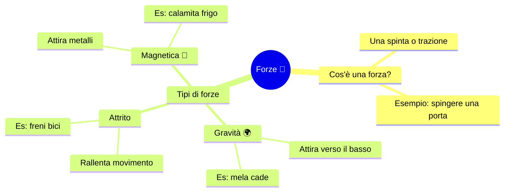

# Voice & Mind Maps Strategy - Technical Decisions
**Date**: 2025-10-12
**Status**: Updated with latest findings

---

## 🎤 Voice Strategy (Updated)

### Available Voice Technologies (October 2025)

| Technology | Transcription | Synthesis | Real-time | Italian | Cost | Open Source |
|-----------|---------------|-----------|-----------|---------|------|-------------|
| **GPT-5 Realtime** | ✅ Native | ✅ Native | ✅ Bidirectional | ✅ Excellent | TBD | ❌ |
| **Mistral Voxtral** | ✅ SOTA | ❌ | ❌ | ✅ **Best** | $0.001/min | ✅ Apache 2.0 |
| **OpenAI Whisper** | ✅ Good | ❌ | ❌ | ✅ Good | $0.006/min | ✅ MIT |
| **GPT-4o Transcribe** | ✅ Excellent | ❌ | ❌ | ✅ Excellent | ~$0.006/min | ❌ |
| **Apple Speech** | ✅ On-device | ✅ On-device | ✅ Streaming | ✅ Good | FREE | ❌ |

### Key Findings

#### 1. Mistral Voxtral (July 2025) 🏆
**Released**: July 15, 2025
**License**: Apache 2.0 (open-source)
**Italian Support**: Explicitly supported (8 languages)

**Performance**:
- **Beats Whisper large-v3** on all benchmarks
- **Beats GPT-4o mini Transcribe** and Gemini 2.5 Flash
- **SOTA on FLEURS** (multilingual benchmark)
- **Superior on European languages** (perfect for Italian!)

**Pricing**:
- **$0.001/min** (vs Whisper $0.006/min)
- **83% cheaper than Whisper**
- **Voxtral Mini**: Even cheaper option available

**Advanced Features**:
- Native audio understanding (not just transcription)
- Function calling from audio
- Better at understanding context and intent

**Recommendation**: ✅ **Use Voxtral for transcription** (best quality + lowest cost)

---

#### 2. GPT-5 Realtime API
**Best For**: Real-time bidirectional voice conversation

**Why still use it?**:
- Only solution for **true real-time conversation**
- Bidirectional (interrupt, natural flow)
- Integrated synthesis + transcription
- Best for coaching conversations

**Recommendation**: ✅ **Use for primary study coach voice interface**

---

#### 3. Apple Speech Framework
**Best For**: Offline, privacy-sensitive, quick interactions

**Why use it?**:
- Works offline (no internet)
- FREE
- On-device privacy
- Good for basic TTS (read materials aloud)
- Streaming recognition

**Recommendation**: ✅ **Use for offline mode and material narration**

---

### Optimal Voice Architecture

```
┌──────────────────────────────────────────────────┐
│           MirrorBuddy Voice System               │
└───────────────┬──────────────────────────────────┘
                │
    ┌───────────┼───────────┬──────────────────┐
    │           │           │                  │
    │           │           │                  │
┌───▼────┐  ┌──▼────┐  ┌───▼──────┐  ┌───────▼────────┐
│ GPT-5  │  │Voxtral│  │  Apple   │  │  NotebookLM    │
│Realtime│  │ Mini  │  │  Speech  │  │ Audio Overview │
└───┬────┘  └──┬────┘  └───┬──────┘  └───────┬────────┘
    │          │           │                  │
    │          │           │                  │
Real-time   Transcribe   Offline          Pre-generated
Coaching    Recordings   Fallback         Lessons
$$$         $            FREE             FREE
```

---

### Use Case Matrix

| Scenario | Technology | Why | Cost |
|----------|-----------|-----|------|
| **Live coaching conversation** | GPT-5 Realtime | Real-time, bidirectional, natural | $$$ |
| **Transcribe class recording** | Voxtral Mini | Best Italian, cheapest, accurate | $ |
| **Read material aloud** | Apple Speech | Offline, instant, FREE | FREE |
| **Audio lesson (pre-generated)** | NotebookLM | AI discussion, FREE, engaging | FREE |
| **Voice commands** | Apple Speech → GPT-5 | Fast local, cloud for understanding | $-$$$ |
| **Homework explanation (voice)** | GPT-5 Realtime | Natural explanation, interrupt if confused | $$$ |

---

### Implementation Strategy

#### Phase 1: Foundation
```swift
class VoiceManager {
    // Offline/Quick interactions
    let appleVoice = AppleSpeechService()

    // Transcription (best quality/price for Italian)
    let voxtral = VoxtralService() // $0.001/min

    // Real-time conversation
    let gptRealtime = GPT5RealtimeService()

    func selectVoiceService(for context: VoiceContext) -> VoiceService {
        switch context {
        case .realtimeCoaching:
            return gptRealtime // Real-time conversation

        case .transcribeRecording:
            return voxtral // Best for Italian transcription

        case .readMaterialAloud:
            return appleVoice // TTS, offline, free

        case .quickCommand:
            return appleVoice // Fast, on-device

        case .offlineMode:
            return appleVoice // Only option
        }
    }
}
```

#### Phase 2: Advanced Features
- **Hybrid approach**: Start with Apple Speech (fast), upgrade to cloud if needed
- **Cost optimization**: Cache transcriptions locally, don't re-transcribe
- **Quality fallback**: If Voxtral fails, try GPT-4o Transcribe

---

## 🗺️ Mind Maps Strategy (Updated)

### Export Format Options

| Format | Pros | Cons | Ecosystem | Recommendation |
|--------|------|------|-----------|----------------|
| **Mermaid Markdown** | Simple syntax, Obsidian/GitHub support, text-based | Limited styling | Developer-friendly | ⭐⭐⭐⭐⭐ |
| **XMind (.xmind)** | Industry standard, rich features | Binary (ZIP+JSON) | Professional tools | ⭐⭐⭐⭐ |
| **OPML** | Universal, text-based, widely supported | Basic structure only | Cross-platform | ⭐⭐⭐⭐ |
| **JSON (Custom)** | Full control, flexible | Need custom renderer | MirrorBuddy native | ⭐⭐⭐⭐⭐ |
| **FreeMind (.mm)** | Open-source standard, XML-based | Older format | Open-source tools | ⭐⭐⭐ |
| **Markdown (Plain)** | Simple, human-readable | No visual hierarchy | Note-taking apps | ⭐⭐⭐ |

---

### Recommended Multi-Format Strategy

#### 1. Native Format: JSON (Primary)
**For**: MirrorBuddy internal storage and rendering

```json
{
  "id": "mindmap_fisica_cap5",
  "title": "Fisica - Capitolo 5: Forze",
  "subject": "Fisica",
  "created": "2025-10-12T10:00:00Z",
  "level": "simplified", // Mario's comprehension level
  "nodes": [
    {
      "id": "root",
      "text": "Forze",
      "emoji": "💪",
      "color": "#4A90E2",
      "children": ["n1", "n2", "n3"]
    },
    {
      "id": "n1",
      "text": "Cos'è una forza?",
      "description": "Una spinta o trazione su un oggetto",
      "example": "Come quando spingi una porta",
      "children": [],
      "style": {
        "fontSize": "large",
        "importance": "high"
      }
    },
    {
      "id": "n2",
      "text": "Tipi di forze",
      "children": ["n2_1", "n2_2", "n2_3"]
    },
    {
      "id": "n2_1",
      "text": "Gravità",
      "emoji": "🌍",
      "description": "Forza che attira verso il basso",
      "example": "La mela cade dall'albero"
    }
  ],
  "connections": [
    {
      "from": "n1",
      "to": "n2_1",
      "label": "esempio pratico",
      "type": "dashed"
    }
  ],
  "metadata": {
    "source": "Capitolo_5_Fisica.pdf",
    "voiceWalkthrough": "audio_mindmap_fisica_cap5.m4a",
    "difficulty": "medium",
    "estimatedStudyTime": "15 min"
  }
}
```

**Advantages**:
- Full control over structure
- Store Mario-specific data (examples, voice, difficulty)
- Efficient for SwiftUI rendering
- Easy to cache and sync

---

#### 2. Export Format: Mermaid Markdown (Interoperability)
**For**: Sharing with teachers, using in other apps (Obsidian, GitHub)



**Advantages**:
- Human-readable (Mario's teacher can view on GitHub)
- Renders in Obsidian, VS Code, GitHub
- Plain text (easy to version control)
- Simple syntax

**Export Function**:
```swift
extension MindMap {
    func exportToMermaid() -> String {
        """
        ```mermaid
        mindmap
        \(generateMermaidNodes(from: rootNode, level: 0))
        ```
        """
    }
}
```

---

#### 3. Export Format: XMind (Professional)
**For**: Teachers, sharing with professionals

**Implementation**:
```swift
extension MindMap {
    func exportToXMind() -> Data {
        // XMind format: ZIP archive containing:
        // - content.json (mind map structure)
        // - metadata.json (properties)
        // - Thumbnails/thumbnail.png

        let xmindData = XMindArchiveBuilder()
            .addContent(generateXMindJSON())
            .addMetadata(title: title, author: "Mario")
            .addThumbnail(generateThumbnail())
            .build()

        return xmindData
    }
}
```

**XMind JSON Structure**:
```json
{
  "id": "root",
  "class": "central-topic",
  "title": "Forze",
  "children": [
    {
      "id": "node1",
      "class": "main-topic",
      "title": "Cos'è una forza?",
      "notes": {
        "plain": "Una spinta o trazione su un oggetto"
      }
    }
  ]
}
```

---

#### 4. Export Format: OPML (Universal)
**For**: Maximum compatibility (FreeMind, MindManager, etc.)

```xml
<?xml version="1.0" encoding="UTF-8"?>
<opml version="2.0">
  <head>
    <title>Fisica - Capitolo 5: Forze</title>
    <ownerName>Mario</ownerName>
    <dateCreated>2025-10-12T10:00:00Z</dateCreated>
  </head>
  <body>
    <outline text="Forze 💪">
      <outline text="Cos'è una forza?">
        <outline text="Una spinta o trazione" />
        <outline text="Esempio: spingere una porta" />
      </outline>
      <outline text="Tipi di forze">
        <outline text="Gravità 🌍">
          <outline text="Attira verso il basso" />
          <outline text="Es: mela cade" />
        </outline>
      </outline>
    </outline>
  </body>
</opml>
```

---

### Mind Map Generation Prompt (Claude Sonnet 4.5)

```swift
let systemPrompt = """
You are a mind map generator for Mario, a student with dyslexia, dyscalculia, and limited working memory.

CRITICAL RULES:
1. Use SIMPLE, SHORT words and phrases (max 5-7 words per node)
2. Maximum 3 levels deep (root → main topics → details)
3. Use CONCRETE examples from daily life
4. Add emojis for visual cues (but don't overuse)
5. Limit to 5-7 main branches from root
6. Each node should be self-contained (no need to remember previous nodes)

OUTPUT FORMAT: JSON matching this structure
{
  "title": "Main Topic",
  "nodes": [
    {
      "id": "root",
      "text": "Short title",
      "emoji": "📚",
      "children": ["n1", "n2"]
    },
    {
      "id": "n1",
      "text": "Subtopic",
      "description": "One sentence explanation",
      "example": "Concrete example from daily life",
      "children": []
    }
  ]
}

LANGUAGE: Italian (Mario's native language)
TONE: Friendly, encouraging, never patronizing
"""

let userPrompt = """
Create a mind map for this material:

\(materialText)

Remember: Mario has limited working memory, so keep it simple and visual.
"""
```

---

### Implementation Roadmap

#### Phase 1: Native Rendering (Week 1-2)
- [x] JSON data model
- [ ] SwiftUI mind map renderer
- [ ] Interactive navigation (zoom, pan, tap to expand)
- [ ] Voice walkthrough integration
- [ ] Save/load from SwiftData

#### Phase 2: AI Generation (Week 3-4)
- [ ] Claude Sonnet 4.5 integration
- [ ] Prompt optimization for Mario's needs
- [ ] A/B test different complexity levels
- [ ] Cache generated maps

#### Phase 3: Export Formats (Week 5-6)
- [ ] Export to Mermaid Markdown
- [ ] Export to OPML
- [ ] Export to XMind (nice-to-have)
- [ ] Share via AirDrop, email, Files app

#### Phase 4: Advanced Features (Week 7-8)
- [ ] Voice-driven exploration ("Tell me about gravity")
- [ ] Progressive disclosure (show more details as Mario masters topics)
- [ ] Link to related materials
- [ ] Spaced repetition integration

---

### Cost Analysis: Mind Maps

| Operation | Model | Frequency | Cost/Operation | Monthly Cost |
|-----------|-------|-----------|----------------|--------------|
| Generate mind map | Claude Sonnet 4.5 (cached) | 20/month | $0.15 | $3 |
| Regenerate (complexity adjust) | Claude Sonnet 4.5 (cached) | 10/month | $0.15 | $1.50 |
| Voice walkthrough | NotebookLM | 20/month | FREE | $0 |
| Export to formats | Local processing | Unlimited | FREE | $0 |

**Total Mind Map Cost**: ~$5/month

---

## 🎯 Recommendations Summary

### Voice System
1. ✅ **Primary conversation**: GPT-5 Realtime (best experience)
2. ✅ **Transcription**: Mistral Voxtral (best Italian + cheapest)
3. ✅ **Offline/TTS**: Apple Speech (free, works offline)
4. ✅ **Audio lessons**: NotebookLM Audio Overviews (free, engaging)

### Mind Maps
1. ✅ **Native format**: JSON (flexible, Mario-optimized)
2. ✅ **Primary export**: Mermaid Markdown (interoperable, simple)
3. ✅ **Secondary export**: OPML (universal compatibility)
4. ✅ **Optional**: XMind (professional, nice-to-have)
5. ✅ **Generation**: Claude Sonnet 4.5 with prompt caching

### Cost Optimization
- Use Voxtral instead of Whisper → **Save 83%** on transcription
- Use NotebookLM for audio lessons → **Save 100%** (it's free!)
- Cache Claude prompts for mind maps → **Save 90%**
- Use Apple Speech for material narration → **Free**

**Estimated Savings**: $50-80/month vs original plan

---

**Last Updated**: 2025-10-12
