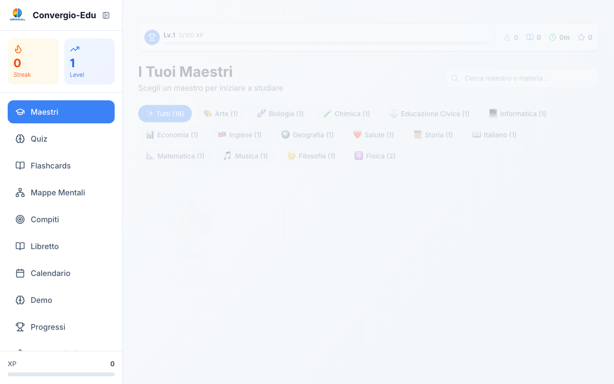

<p align="center">
  
</p>

<h1 align="center">ConvergioEdu</h1>
<h3 align="center">La Scuola Che Vorrei</h3>

<p align="center">
  <strong>The school we wished existed. Now it does.</strong>
</p>

<p align="center">
  <a href="https://github.com/Roberdan/ConvergioEdu/actions/workflows/ci.yml"></a>
  <a href="https://opensource.org/licenses/MIT"></a>
  <a href="https://github.com/Roberdan/ConvergioEdu/releases"></a>
</p>

<p align="center">
  <a href="https://nextjs.org/"></a>
  <a href="https://www.typescriptlang.org/"></a>
  <a href="https://www.w3.org/WAI/WCAG21/quickref/"></a>
  <a href="https://fightthestroke.org"></a>
</p>

<p align="center">
  <em>Following <a href="https://microsoft.github.io/code-with-engineering-playbook/">ISE Engineering Fundamentals</a> (personal project, no Microsoft affiliation)</em>
</p>

<p align="center">
  
</p>

---

## The Manifesto

**Every child deserves an education that fits them—not the other way around.**

Traditional schools were designed for the "average" student. But there is no average student. There are children with dyslexia who think in pictures. Children with ADHD who need movement and variety. Children with autism who thrive on structure and clarity. Children with cerebral palsy who need adaptive interfaces.

These children are not broken. The system is.

**ConvergioEdu is our answer: a school that adapts to each student, not students who must adapt to school.**

---

## The Story Behind This

This project was born for **Mario**.

Mario survived a pediatric stroke at birth. It left him with cerebral palsy. Like millions of children with learning differences, Mario faced a school system that wasn't built for him: rigid schedules, inflexible methods, one-size-fits-all teaching.

In 2013, his parents founded [FightTheStroke](https://fightthestroke.org) to fight for children like Mario. After a decade of advocacy, research, and watching AI transform what's possible, they built what they always wanted: **the school Mario deserved**.

> *"A birth accident should not dictate a child's future."*

Watch their story: [TED Talk - In our baby's illness, a life lesson](https://www.ted.com/talks/roberto_d_angelo_and_francesca_fedeli_in_our_baby_s_illness_a_life_lesson)

---

## Learning WITH the Greats, Not About Them

Here's what makes ConvergioEdu different.

Instead of reading *about* Euclid in a textbook, students learn mathematics **with Euclid himself**. Instead of memorizing dates about Darwin, they explore evolution **alongside Darwin**. Instead of watching a video about Marie Curie, they discuss chemistry **with Curie**.

Each **Maestro** is an AI tutor embodying a legendary figure from history—someone who revolutionized their field. Students don't just learn subjects; they learn *from the masters*.

| Maestro | Subject | Why This Legend? |
|---------|---------|------------------|
| **Euclide** | Mathematics | Father of geometry, wrote *Elements*—the most influential math textbook ever |
| **Leonardo** | Art | The original Renaissance polymath who merged art and science |
| **Darwin** | Science | Changed our understanding of life itself with evolution |
| **Curie** | Chemistry | First woman to win a Nobel, pioneer of radioactivity |
| **Feynman** | Physics | Made quantum physics understandable, legendary teacher |
| **Galileo** | Astronomy | Father of modern science and the scientific method |
| **Lovelace** | Computer Science | The first programmer, a century before computers existed |
| **Shakespeare** | English | The Bard who shaped the English language |
| **Mozart** | Music | Composed masterpieces from age 5, pure musical genius |
| **Socrate** | Philosophy | Invented the Socratic method—learning through questions |
| **Erodoto** | History | The "Father of History" who pioneered historical inquiry |
| **Manzoni** | Italian | Italy's greatest novelist, master of language |
| **Cicerone** | Civic Education | Rome's greatest orator, defender of the republic |
| **Humboldt** | Geography | Explorer who invented biogeography and ecology |
| **Ippocrate** | Physical Education | Father of medicine, champion of healthy living |
| **Smith** | Economics | Wrote *The Wealth of Nations*, founded modern economics |
| **Chris** | Storytelling | Chris Anderson, TED curator who spread "ideas worth sharing" worldwide |

### What Makes Each Maestro Special

Every Maestro:
- **Speaks naturally** — Real voice conversations, not text-to-speech robots
- **Adapts in real-time** — Slower when you struggle, faster when you're ready
- **Never judges** — No frustration, no impatience, infinite patience
- **Creates for you** — Generates mind maps, flashcards, quizzes on the fly
- **Remembers you** — Knows your progress, your struggles, your victories

---

## Built for Every Mind

ConvergioEdu isn't just "accessible." It's designed from the ground up for neurodiversity.

| Condition | How We Adapt |
|-----------|--------------|
| **Dyslexia** | OpenDyslexic font, extra spacing, text-to-speech, visual learning |
| **Dyscalculia** | Step-by-step breakdowns, visual number representations |
| **ADHD** | Reduced distractions, focus mode, movement breaks, gamification |
| **Autism** | Predictable layouts, sensory-friendly colors, clear structure |
| **Cerebral Palsy** | Large touch targets, full keyboard navigation, voice control |

WCAG 2.1 AA compliant. Because accessibility isn't a feature—it's the foundation.

---

## Features in Detail

### Voice Sessions

Talk to your Maestro like you would talk to a real teacher. Ask questions, discuss concepts, explore ideas—all through natural voice conversation.

- **Real-time voice interaction** powered by Azure OpenAI Realtime API
- **Automatic transcription** so you can review what was said
- **Voice-to-voice** responses with natural intonation
- **Interrupt anytime** — the Maestro listens and adapts
- **Session recordings** saved for later review

### Mind Maps

Visual learners rejoice. Every concept can become a mind map.

- **Auto-generated** from conversations with your Maestro
- **Interactive** — expand, collapse, zoom, pan
- **Export to PNG** for studying offline
- **Powered by MarkMap** for beautiful, responsive visualizations
- **Hierarchical structure** that mirrors how concepts connect

### FSRS Flashcards

Spaced repetition done right, backed by cognitive science.

- **FSRS algorithm** (Free Spaced Repetition Scheduler) — more effective than Anki's SM-2
- **Optimal review timing** based on your memory patterns
- **Difficulty tracking** per card
- **Auto-generated** from your learning sessions
- **Progress analytics** showing retention rates

### Quizzes

Test your knowledge with adaptive assessments.

- **Multiple choice** and **open-ended** questions
- **Instant feedback** with explanations
- **Difficulty adapts** to your performance
- **Generated from** your flashcards and conversations
- **Mastery gates** — must pass to unlock new content

### Gamification

Learning should be rewarding.

- **XP system** — earn points for every activity
- **Levels** — watch yourself grow
- **Badges** — achievements for milestones
- **Streaks** — daily consistency rewards
- **Leaderboards** (optional) — friendly competition

### Progress Tracking

Know exactly where you stand.

- **Subject mastery** — percentage complete per topic
- **Session history** — what you learned and when
- **Time tracking** — minutes spent learning
- **Weak areas** — automatically identified for review
- **Parent/teacher dashboard** (coming soon)

---

## Configuration

### AI Providers

ConvergioEdu supports multiple AI providers. Choose based on your needs:

| Provider | Voice Support | Best For | Cost |
|----------|--------------|----------|------|
| **Azure OpenAI** | Full voice | Production, schools | Pay-per-use |
| **Ollama** | Text only | Local dev, privacy | Free |

### Option 1: Azure OpenAI (Recommended)

Full functionality including voice sessions.

```bash
# .env.local

# Chat (text conversations)
AZURE_OPENAI_ENDPOINT=https://your-resource.openai.azure.com
AZURE_OPENAI_API_KEY=your-api-key
AZURE_OPENAI_CHAT_DEPLOYMENT=gpt-4o
AZURE_OPENAI_API_VERSION=2024-08-01-preview

# Voice (real-time conversations) — REQUIRED for voice features
AZURE_OPENAI_REALTIME_ENDPOINT=https://your-resource.openai.azure.com
AZURE_OPENAI_REALTIME_API_KEY=your-api-key
AZURE_OPENAI_REALTIME_DEPLOYMENT=gpt-4o-realtime-preview
```

**Note:** Voice features require the `gpt-4o-realtime-preview` model, currently available in select Azure regions.

### Option 2: Ollama (100% Local)

Free, private, runs entirely on your machine. No voice support.

```bash
# Install Ollama
brew install ollama

# Start the server
ollama serve

# Pull a model (in another terminal)
ollama pull llama3.2        # Fast, good for education (~2GB)
ollama pull mistral         # Alternative (~4GB)
ollama pull llama3.1:70b    # Best quality (needs 64GB+ RAM)
```

```bash
# .env.local
OLLAMA_URL=http://localhost:11434
OLLAMA_MODEL=llama3.2
```

The app auto-detects Ollama when Azure is not configured.

### Azure Cost Management (Optional)

Track your Azure spending in the Settings page.

```bash
# .env.local (optional)
AZURE_TENANT_ID=your-tenant-id
AZURE_CLIENT_ID=your-service-principal-client-id
AZURE_CLIENT_SECRET=your-service-principal-secret
AZURE_SUBSCRIPTION_ID=your-subscription-id
```

Requires a Service Principal with "Cost Management Reader" role.

---

## Quick Start

### Prerequisites

- Node.js 18+
- npm or yarn
- Azure OpenAI account (for voice) OR Ollama (for local text-only)

### Installation

```bash
# Clone the repository
git clone https://github.com/Roberdan/ConvergioEdu.git
cd ConvergioEdu

# Install dependencies
npm install

# Configure environment
cp .env.example .env.local
# Edit .env.local with your API keys

# Initialize database
npx prisma generate
npx prisma db push

# Start development server
npm run dev
```

Open http://localhost:3000 and start learning.

### Available Scripts

```bash
npm run dev        # Start development server
npm run build      # Build for production
npm run start      # Start production server
npm run lint       # Run ESLint
npm run typecheck  # Run TypeScript compiler
npm run test       # Run Playwright E2E tests
```

---

## The Convergio Ecosystem

ConvergioEdu is part of a larger vision:

| Project | Description |
|---------|-------------|
| [**convergio-cli**](https://github.com/Roberdan/convergio-cli) | CLI with 50+ specialized AI agents |
| [**MyConvergio**](https://github.com/Roberdan/MyConvergio) | Native macOS/iOS app |
| [**Convergio**](https://github.com/Roberdan/Convergio) | Core framework |

---

## Tech Stack

| Layer | Technology |
|-------|------------|
| Framework | Next.js 16 (App Router) |
| Language | TypeScript 5 (strict mode) |
| Styling | Tailwind CSS 4 |
| State | Zustand |
| Voice | Azure OpenAI Realtime API |
| Diagrams | Mermaid.js + MarkMap |
| Math | KaTeX |
| Database | Prisma + SQLite/PostgreSQL |
| Testing | Playwright E2E |

---

## Contributing

We welcome contributions! See [CONTRIBUTING.md](CONTRIBUTING.md).

This project was born for inclusion. Every contribution must be:
- Keyboard accessible
- Screen reader compatible
- Color-blind friendly
- Available to everyone

---

## Contact

- **Email**: roberdan@fightthestroke.org
- **Organization**: [FightTheStroke](https://fightthestroke.org)
- **TED Talk**: [In our baby's illness, a life lesson](https://www.ted.com/talks/roberto_d_angelo_and_francesca_fedeli_in_our_baby_s_illness_a_life_lesson)

---

## License

MIT — See [LICENSE](LICENSE)

---

<p align="center">
  <strong>Every child can learn. We just need to teach them differently.</strong>
</p>

<p align="center">
  <a href="https://fightthestroke.org">
    
  </a>
</p>
