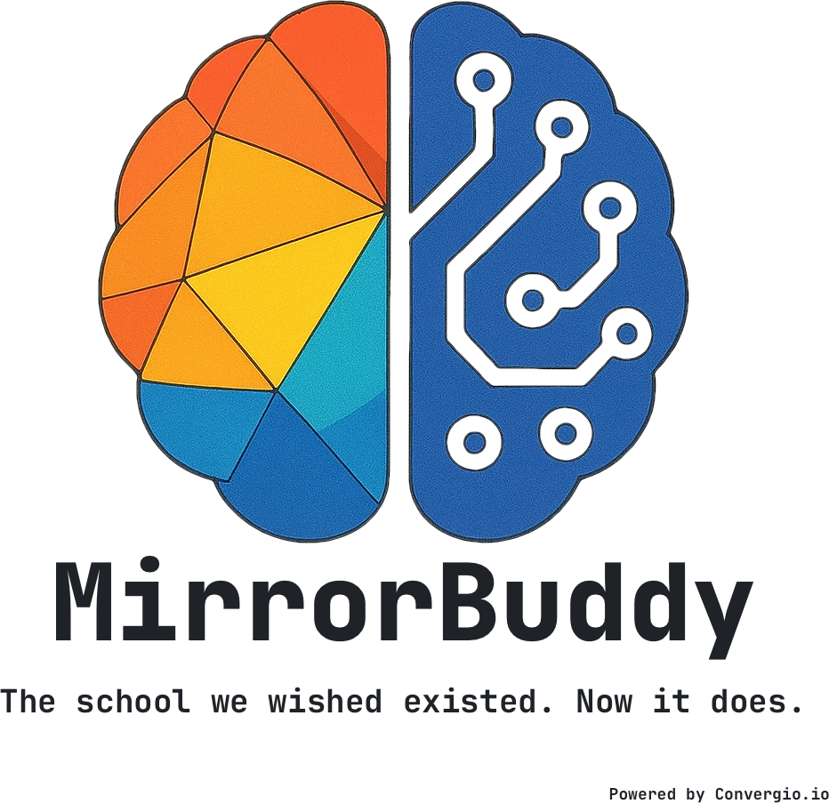
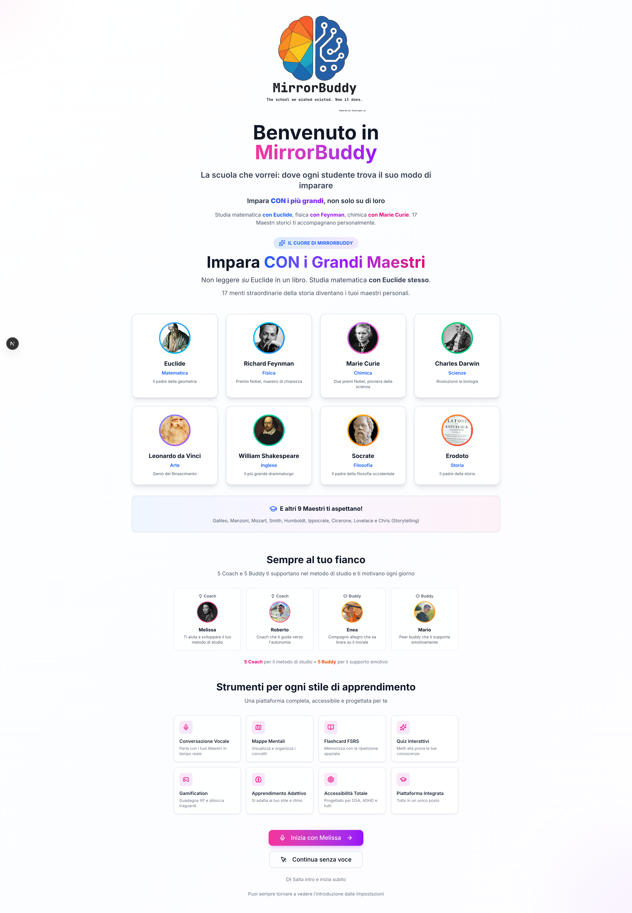

<p align="center">
  
</p>

<h1 align="center">MirrorBuddy</h1>
<h3 align="center">La Scuola Che Vorrei</h3>

<p align="center">
  <strong>The school we wished existed. Now it does.</strong>
</p>

<p align="center">
  <a href="https://github.com/FightTheStroke/MirrorBuddy/actions/workflows/ci.yml"></a>
  
  
  
  <a href="https://www.apache.org/licenses/LICENSE-2.0"></a>
  <a href="https://github.com/FightTheStroke/MirrorBuddy/releases"></a>
</p>

<p align="center">
  <a href="https://nextjs.org/"></a>
  <a href="https://www.typescriptlang.org/"></a>
  <a href="https://www.w3.org/WAI/WCAG21/quickref/"></a>
  <a href="https://fightthestroke.org"></a>
</p>

<p align="center">
  <em>Following <a href="https://microsoft.github.io/code-with-engineering-playbook/">ISE Engineering Fundamentals</a> (personal project, no Microsoft affiliation)</em>
</p>

<p align="center">
  
</p>

---

## The Manifesto

**Every child deserves an education that fits them—not the other way around.**

Traditional schools were designed for the "average" student. But there is no average student. There are children with dyslexia who think in pictures. Children with ADHD who need movement and variety. Children with autism who thrive on structure and clarity. Children with cerebral palsy who need adaptive interfaces.

These children are not broken. The system is.

**MirrorBuddy is our answer: a school that adapts to each student, not students who must adapt to school.**

---

## The Support Triangle

Every student in MirrorBuddy has access to three types of AI support:

```
                         STUDENT
                            |
              +-------------+-------------+
              |             |             |
              v             v             v
        +-----------+ +-----------+ +-----------+
        |   COACH   | |   BUDDY   | |  MAESTRI  |
        |  (5 AI)   | |  (5 AI)   | |  (16 AI)  |
        |           | |           | |           |
        |  Method   | |   Peer    | |  Content  |
        |  Support  | |  Support  | |  Experts  |
        +-----------+ +-----------+ +-----------+
```

| Type | Characters | Relationship | Goal |
|------|------------|--------------|------|
| **Maestri** | 16 historical figures | Mentor (vertical) | Teach subjects with passion |
| **Coaches** | Melissa, Roberto, Chiara, Andrea, Favij | Learning coach (vertical) | Develop METHOD and autonomy |
| **Buddies** | Mario, Noemi, Enea, Bruno, Sofia | Peer friend (horizontal) | Emotional support, shared struggles |

### Learning WITH the Greats, Not About Them

Instead of reading *about* Euclid in a textbook, students learn mathematics **with Euclid himself**. Instead of memorizing dates about Darwin, they explore evolution **alongside Darwin**. Instead of watching a video about Marie Curie, they discuss chemistry **with Curie**.

Each **Maestro** is an AI tutor embodying a legendary figure from history:

**16 Maestri:** Euclide (Math), Leonardo (Art), Darwin (Science), Curie (Chemistry), Feynman (Physics), Galileo (Astronomy), Lovelace (CS), Shakespeare (English), Mozart (Music), Socrate (Philosophy), Erodoto (History), Manzoni (Italian), Cicerone (Civic Ed), Humboldt (Geography), Ippocrate (PE), Smith (Economics)

---

## The Story Behind This

This project was born for **Mario**.

Mario survived a pediatric stroke at birth. It left him with cerebral palsy. Like millions of children with learning differences, Mario faced a school system that wasn't built for him: rigid schedules, inflexible methods, one-size-fits-all teaching.

In 2013, his parents founded [FightTheStroke](https://fightthestroke.org) to fight for children like Mario. After a decade of advocacy, research, and watching AI transform what's possible, they built what they always wanted: **the school Mario deserved**.

> *"A birth accident should not dictate a child's future."*

Watch their story: [TED Talk - In our baby's illness, a life lesson](https://www.ted.com/talks/roberto_d_angelo_and_francesca_fedeli_in_our_baby_s_illness_a_life_lesson)

---

## Features at a Glance

- **🎤 Voice Sessions** — Natural voice conversations with AI Maestri (Azure OpenAI Realtime API)
- **🗺️ Mind Maps** — Auto-generated, interactive visualizations with voice commands
- **🎴 FSRS Flashcards** — Spaced repetition backed by cognitive science
- **📝 Quizzes** — Adaptive assessments with instant feedback
- **⚖️ Adaptive Difficulty** — Multi-signal difficulty tuning (chat/voice/quiz/flashcard)
- **📸 Homework Help** — Photo capture + AI-powered step-by-step guidance (no direct answers)
- **🎮 Gamification** — XP, levels, badges, streaks, leaderboards
- **⏱️ Pomodoro Timer** — ADHD-friendly focus sessions
- **📊 Progress Tracking** — Subject mastery, session history, analytics
- **♿ Accessibility** — WCAG 2.1 AA, 7 specialized profiles for neurodiversity

**→ See full feature documentation: [FEATURES.md](FEATURES.md)**

---

## Built for Every Mind

**WCAG 2.1 AA:** Dyslexia (OpenDyslexic, spacing, TTS) | Dyscalculia (visual numbers) | ADHD (focus mode, breaks) | Autism (predictable layouts) | Cerebral Palsy (large targets, keyboard, voice)

---

## Safety & Privacy by Design

MirrorBuddy implements Microsoft's [Ethical Design Hacker](https://www.microsoft.com/en-us/security/blog/2025/01/13/the-ethical-design-hacker-6-mindsets-for-secure-ux-in-ai/) security mindsets, designed specifically for protecting children with learning differences.

### Privacy Protection (GDPR Compliant)
| Feature | Protection |
|---------|------------|
| **PII Detection** | Auto-detects Italian fiscal codes, names, emails, phones |
| **Anonymization** | Replaces sensitive data before AI processing |
| **Data Retention** | Configurable TTL (365d conversations, 730d progress) |
| **Right to Erasure** | GDPR Article 17 deletion with audit trail |

### AI Transparency
| Indicator | Meaning |
|-----------|---------|
| 🟢 Green | High confidence, knowledge-base backed |
| 🟡 Yellow | Medium confidence, partial sources |
| 🟠 Orange | Low confidence, AI-generated |
| 🔴 Red | Hallucination risk detected |

### Child Safety
- **Content Filtering**: Age-appropriate responses with Italian messaging
- **Jailbreak Detection**: Pattern matching for prompt injection attempts
- **Session Throttling**: Gradual escalation from warnings to timeouts
- **Audit Trail**: Anonymized logging for safety monitoring

### Security Hardening
- **Unicode Normalization**: Prevents Cyrillic/Greek homoglyph attacks
- **Configuration Versioning**: Rollback safety settings with history
- **Knowledge Base Auditing**: Content validation before embedding

**→ Technical details: [docs/adr/0042-ethical-design-hardening.md](docs/adr/0042-ethical-design-hardening.md)**

---

## Quick Start

```bash
# Clone and install
git clone https://github.com/FightTheStroke/MirrorBuddy.git
cd MirrorBuddy
npm install

# Configure environment
cp .env.example .env.local
# Edit .env.local with your Azure OpenAI or Ollama credentials

# Initialize database
npx prisma generate
npx prisma db push

# Start development server
npm run dev
```

Open http://localhost:3000 and start learning.

**→ See full setup guide: [SETUP.md](SETUP.md)**
**→ Having issues? Check: [TROUBLESHOOTING.md](TROUBLESHOOTING.md)**

---

## Architecture

**Stack:** Next.js 16 App Router → Zustand State → API Routes → Azure OpenAI (chat+voice+embeddings) / Ollama (fallback, text) → Prisma ORM → PostgreSQL + pgvector

**Key Decisions:**
- **ADR 0015:** Zustand syncs with backend via REST APIs. User data NEVER in localStorage—only database.
- **ADR 0033:** RAG (Retrieval-Augmented Generation) using Azure OpenAI embeddings + pgvector for semantic search of user materials.

**→ Full architecture & diagram: [ARCHITECTURE.md](ARCHITECTURE.md)**

---

## Tech Stack

| Layer | Technology |
|-------|------------|
| Framework | Next.js 16 (App Router) |
| Language | TypeScript 5 (strict mode) |
| Styling | Tailwind CSS 4 |
| State | Zustand |
| AI | Azure OpenAI (chat, voice, embeddings) |
| RAG | pgvector (semantic search) |
| Mind Maps | MarkMap |
| Database | Prisma + PostgreSQL + pgvector |
| Testing | Playwright E2E (API-focused) + Vitest unit |

---

## Azure Cost Management

Monitor Azure spending with the included Python backend:

```bash
# Setup
cd backend
cp .env.example .env
# Edit .env with your Azure subscription ID

# Install dependencies
pip install -r requirements.txt

# Run API server
uvicorn api.main:app --reload
```

**Endpoints:**
- `GET /api/v1/costs?days=30` — Cost summary by service
- `GET /api/v1/costs/forecast` — Monthly forecast
- `GET /api/v1/costs/drilldown?days=30` — Detailed breakdown with AI model usage

**Configuration** (all from `.env`, never hardcoded):
```env
AZURE_SUBSCRIPTION_ID=your-subscription-id  # Required
AZURE_SUBSCRIPTION_NAME=My Subscription     # Optional display name
# Optional - for service principal auth (if not using az login)
AZURE_TENANT_ID=...
AZURE_CLIENT_ID=...
AZURE_CLIENT_SECRET=...
```

**Quick test** (requires `az login`):
```bash
cd backend && python3 -c "
from api.azure_costs import AzureCostService
import asyncio
result = asyncio.run(AzureCostService().get_cost_summary(7))
print(f'Last 7 days: \${result.total_cost:.2f}')
"
```

---

## Documentation

| Document | Description |
|----------|-------------|
| [FEATURES.md](FEATURES.md) | Comprehensive feature documentation |
| [SETUP.md](SETUP.md) | Installation and configuration guide |
| [TROUBLESHOOTING.md](TROUBLESHOOTING.md) | Common issues and solutions |
| [ARCHITECTURE.md](ARCHITECTURE.md) | Technical architecture details |
| [CONTRIBUTING.md](CONTRIBUTING.md) | Contribution guidelines |
| [CLAUDE.md](CLAUDE.md) | Developer quick reference |
| [backend/.env.example](backend/.env.example) | Azure Cost API configuration |

---

## Contributing

We welcome contributions! See [CONTRIBUTING.md](CONTRIBUTING.md).

**Important:** All PRs must follow the [Execution Checklist](docs/EXECUTION-CHECKLIST.md). PRs without a completed checklist will be rejected.

This project was born for inclusion. Every contribution must be:
- Keyboard accessible
- Screen reader compatible
- Color-blind friendly
- Available to everyone

---

## Contact

- **Email**: roberdan@fightthestroke.org
- **Organization**: [FightTheStroke](https://fightthestroke.org)
- **TED Talk**: [In our baby's illness, a life lesson](https://www.ted.com/talks/roberto_d_angelo_and_francesca_fedeli_in_our_baby_s_illness_a_life_lesson)

---

## License

Apache 2.0 — See [LICENSE](LICENSE)

Chosen for patent protection (critical for AI/ML projects) and institutional trust.

---

<p align="center">
  <strong>Every child can learn. We just need to teach them differently.</strong>
</p>

<p align="center">
  <a href="https://fightthestroke.org">
    
  </a>
</p>
