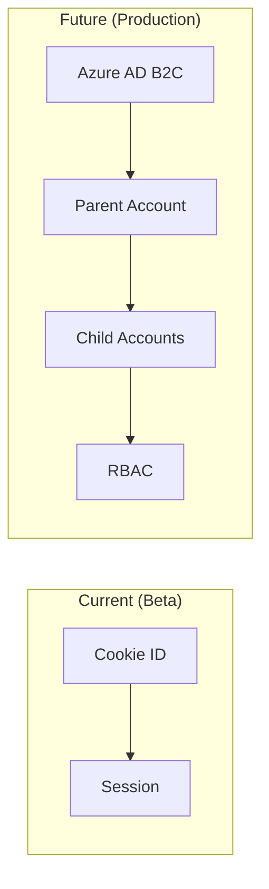

# ADR 0039: Deferred Production Items

| | |
|---|---|
| **Status** | Accepted |
| **Date** | 2025-01-11 (Updated: 2025-01-17) |
| **Deciders** | Roberto D'Angelo |
| **Technical Story** | Production hardening review |

## Context and Problem Statement

During production hardening, several enterprise-grade capabilities were identified as important for scale deployment but not required for closed beta. We need to document what is deferred and why, ensuring clear timeline and risk mitigation.

## Decision Drivers

- **Beta Phase**: Known users, supervised environment
- **Resource Focus**: Core educational features over infrastructure
- **Time to Value**: Ship to beta users faster
- **Risk Management**: Document known gaps with mitigations

## Considered Options

1. Implement everything before beta
2. Defer non-critical items with documentation
3. Implement partial solutions

## Decision Outcome

**Chosen option**: "Defer non-critical items with documentation"

## Deferred Items Analysis

### 1. Authentication System

| Aspect | Current | Future |
|--------|---------|--------|
| Identity | Cookie-based | OAuth 2.0 + OIDC |
| Parent verification | Manual | ID verification flow |
| Child consent | Assumed | Dual-consent GDPR flow |
| Session management | Memory | Redis + JWT |

**Why Deferred**: Beta users are known entities with parent supervision. Adding auth requires significant UX changes and legal review for child data handling.

**Risk Mitigation**: Application not exposed publicly; safety guardrails operate regardless of auth.

**Timeline**: Before public beta launch

### 2. Redis for Rate Limiting

| Aspect | Current | Future |
|--------|---------|--------|
| Storage | In-memory | Redis Cluster |
| Persistence | Lost on restart | Persistent |
| Scaling | Single instance | Multi-instance |

**Why Deferred**: Single-instance deployment is sufficient for beta scale. In-memory rate limiting protects against abuse; state loss on restart is acceptable.

**Risk Mitigation**: Conservative rate limits; safety systems have independent protections.

**Timeline**: Before horizontal scaling

### 3. Infrastructure as Code

| Aspect | Current | Future |
|--------|---------|--------|
| Deployment | Docker Compose | Azure Container Apps |
| Provisioning | Manual | Bicep/Terraform |
| Secrets | .env files | Azure Key Vault |

**Why Deferred**: Focus on application hardening first. IaC provides diminishing returns for single-environment beta.

**Timeline**: Production deployment milestone

### 4. Distributed Tracing (OpenTelemetry)

| Aspect | Current | Future |
|--------|---------|--------|
| Logging | Structured JSON | OTel + Azure Monitor |
| Tracing | None | Distributed spans |
| Metrics | Health endpoint | Custom metrics |

**Why Deferred**: Structured logging is sufficient for single-service debugging. OTel requires collector infrastructure.

**Timeline**: Multi-service architecture phase

## Items Addressed by Plan 46 (Jan 2025)

The following capabilities were implemented as part of Plan 46 production hardening (see [ADR 0046](./0046-production-hardening-plan46.md)):

| Item | Previous | Now |
|------|----------|-----|
| **Rate Limiting** | None | Token bucket in-memory (60 req/min) |
| **Request Tracing** | None | Request IDs in `src/lib/tracing/` |
| **Structured Logging** | Basic | JSON production, human-readable dev |
| **Admin Authorization** | None | UserRole enum + `requireAdmin()` |
| **CSP/CSRF** | None | Strict CSP + cookie signing |
| **Health Endpoints** | None | `/api/health` + `/api/health/detailed` |
| **Runbook/SLI-SLO** | None | `docs/operations/` documentation |

**Still Deferred:**
- Full OAuth (Azure AD B2C)
- Redis for distributed rate limiting
- OpenTelemetry (have request IDs, not full OTel)
- Infrastructure as Code (Bicep/Terraform)

## Consequences

### Positive

- Faster iteration on educational features
- Reduced operational complexity
- Clear production roadmap

### Negative

- Not suitable for public exposure
- Manual intervention for scaling
- Limited debugging for complex issues

### Risks and Mitigations

| Risk | Likelihood | Impact | Mitigation |
|------|------------|--------|------------|
| Unauthorized access | Low | High | Network isolation, parent supervision |
| Rate limit exhaustion | Low | Medium | Conservative limits, restart clears state |
| Debugging difficulty | Medium | Low | Structured logs, health endpoints |

## Related ADRs

- [ADR 0015: Database-First Architecture](./0015-database-first-architecture.md)
- [ADR 0004: Safety Guardrails](./0004-safety-guardrails.md)
- [ADR 0046: Production Hardening Plan 46](./0046-production-hardening-plan46.md)

## References

- [Azure Well-Architected Framework](https://learn.microsoft.com/azure/well-architected/)
- [ISE Engineering Playbook](https://microsoft.github.io/code-with-engineering-playbook/)

---
*Version 2.0 | January 2025 | Technical Fellow Review*
