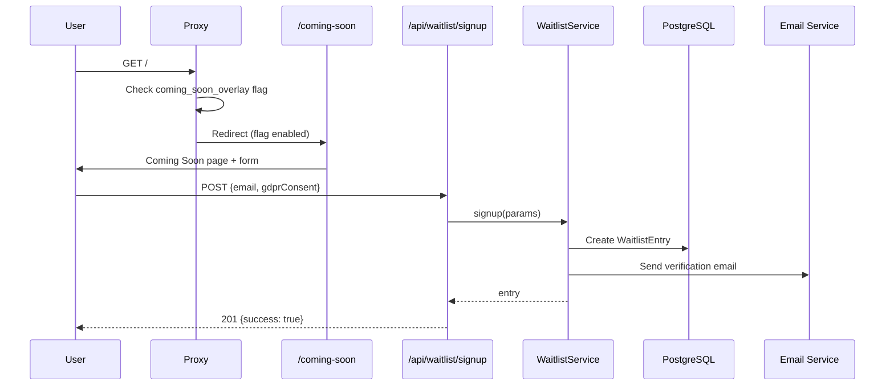
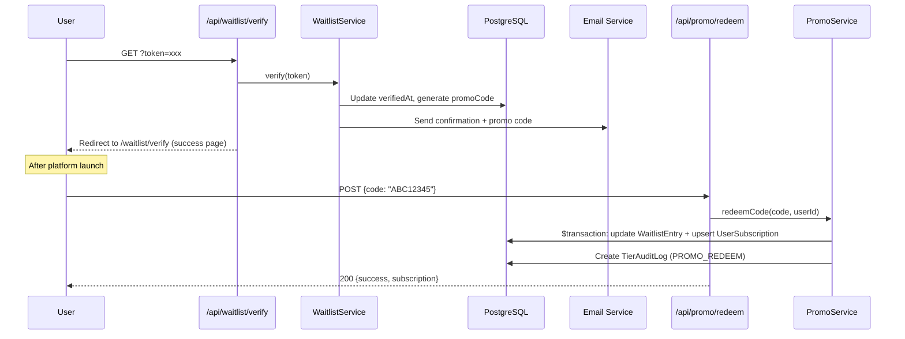
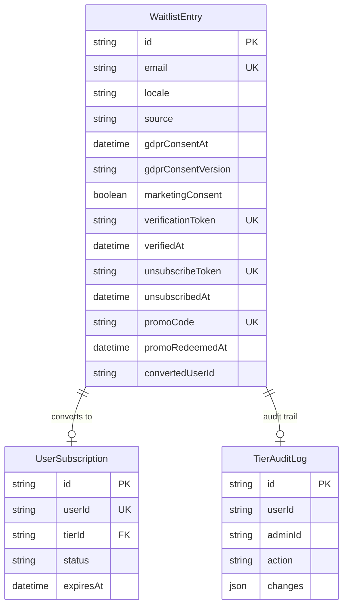

# Waitlist & Coming Soon — Architecture

**ADR**: 0158 | **Plan**: 157 | **Feature Flag**: `coming_soon_overlay`

## Overview

Pre-launch waitlist system with GDPR double opt-in, promo codes, admin dashboard, and automated cleanup.

## Signup Flow

## Verification & Promo Flow

## Data Model

## API Routes

| Method | Path                         | Auth                | Description              |
| ------ | ---------------------------- | ------------------- | ------------------------ |
| POST   | `/api/waitlist/signup`       | Public + rate limit | Create waitlist entry    |
| GET    | `/api/waitlist/verify`       | Public (token)      | Verify email             |
| GET    | `/api/waitlist/unsubscribe`  | Public (token)      | Unsubscribe              |
| POST   | `/api/promo/redeem`          | Auth + rate limit   | Redeem promo code        |
| GET    | `/api/admin/waitlist`        | Admin               | List entries (paginated) |
| GET    | `/api/admin/waitlist/stats`  | Admin               | Aggregate stats          |
| POST   | `/api/cron/waitlist-cleanup` | CRON_SECRET         | Delete unverified >90d   |

## Metrics (Grafana)

| Metric                          | Description          |
| ------------------------------- | -------------------- |
| `waitlist_signups_total`        | Total signups        |
| `waitlist_verified_total`       | Verified emails      |
| `waitlist_unsubscribed_total`   | Unsubscribed         |
| `waitlist_promo_redeemed_total` | Promo codes redeemed |
| `waitlist_conversion_rate`      | Converted / total    |

## Key Files

| File                                           | Purpose                                    |
| ---------------------------------------------- | ------------------------------------------ |
| `src/lib/waitlist/waitlist-service.ts`         | Core service (signup, verify, unsubscribe) |
| `src/lib/promo/promo-service.ts`               | Promo validation + redemption              |
| `src/components/coming-soon/waitlist-form.tsx` | Signup form component                      |
| `src/app/[locale]/coming-soon/page.tsx`        | Coming Soon page                           |
| `src/lib/email/campaign-service.ts`            | Dual-source campaigns                      |
| `src/app/api/cron/waitlist-cleanup/route.ts`   | Cleanup cron                               |
| `prisma/schema/waitlist.prisma`                | Data model                                 |
