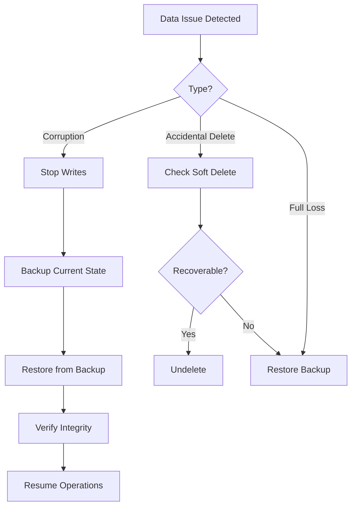
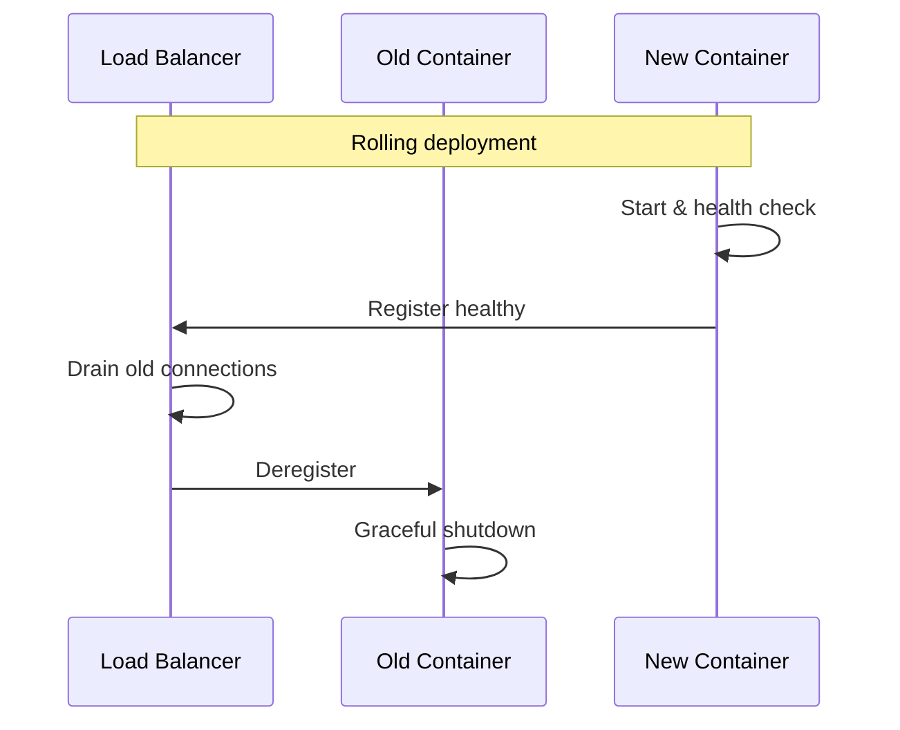

# MirrorBuddy Operational Procedures

> Supplementary to [RUNBOOK.md](./RUNBOOK.md)
>
> **Deployment Note:** Docker commands below apply to local/self-hosted environments. For Vercel production, use: `vercel logs`, Supabase SQL Editor, and Grafana dashboards.

## Recovery Procedures

### Data Recovery Flow



### Backup Commands

```bash
# Create backup
docker exec mirrorbuddy-db pg_dump -U mirrorbuddy mirrorbuddy | gzip > backup-$(date +%Y%m%d-%H%M).sql.gz

# Verify backup
gunzip -t backup-*.sql.gz && echo "Backup valid"

# Restore backup
gunzip -c backup-YYYYMMDD.sql.gz | docker exec -i mirrorbuddy-db psql -U mirrorbuddy mirrorbuddy
```

## Deployment Procedures

### Zero-Downtime Deploy



### Rollback Procedure

```bash
# 1. Identify previous version
docker images mirrorbuddy --format "{{.Tag}}" | head -5

# 2. Roll back
docker-compose pull mirrorbuddy-app:previous-tag
docker-compose up -d app

# 3. Verify
curl -s localhost:3000/api/health | jq '.version'
```

## Maintenance Windows

### Database Maintenance

| Task | Frequency | Duration | Impact |
|------|-----------|----------|--------|
| VACUUM ANALYZE | Weekly | 5-15 min | None (online) |
| Index rebuild | Monthly | 10-30 min | Degraded perf |
| Extension upgrade | Quarterly | 5 min | Brief restart |

### Maintenance Commands

```bash
# Analyze tables
docker exec mirrorbuddy-db psql -U mirrorbuddy -c "ANALYZE;"

# Check table bloat
docker exec mirrorbuddy-db psql -U mirrorbuddy -c \
  "SELECT relname, n_dead_tup FROM pg_stat_user_tables ORDER BY n_dead_tup DESC LIMIT 5;"
```

## Post-Incident Template

```markdown
# Post-Mortem: [Title]

**Date**: YYYY-MM-DD | **Severity**: SEV[1-4] | **Duration**: Xh Ym

## Summary
[One paragraph description]

## Impact
- Users affected: X
- Features impacted: [list]
- SLO impact: X% of monthly budget consumed

## Timeline (UTC)
| Time | Event |
|------|-------|
| HH:MM | Detection |
| HH:MM | Response began |
| HH:MM | Mitigation applied |
| HH:MM | Resolution confirmed |

## Root Cause
[Technical explanation of what went wrong]

## Resolution
[What fixed the issue]

## Prevention
| Action | Owner | Due Date | Status |
|--------|-------|----------|--------|
| [Action] | [Name] | YYYY-MM-DD | Open |

## Lessons Learned
- What went well: [list]
- What to improve: [list]
```

## Health Check Schedule

| Check | Frequency | Method |
|-------|-----------|--------|
| App health | Every 30s | `/api/health` |
| DB connectivity | Every 30s | Health endpoint |
| Backup verification | Weekly | Restore test |
| Security scan | Monthly | npm audit |

---
*Version 2.0 | January 2025 | Technical Fellow Review*
