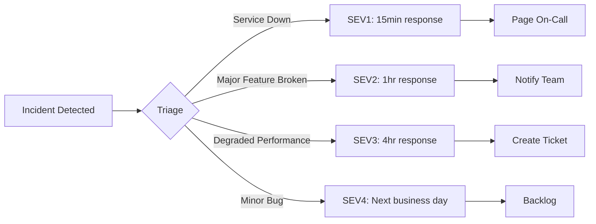
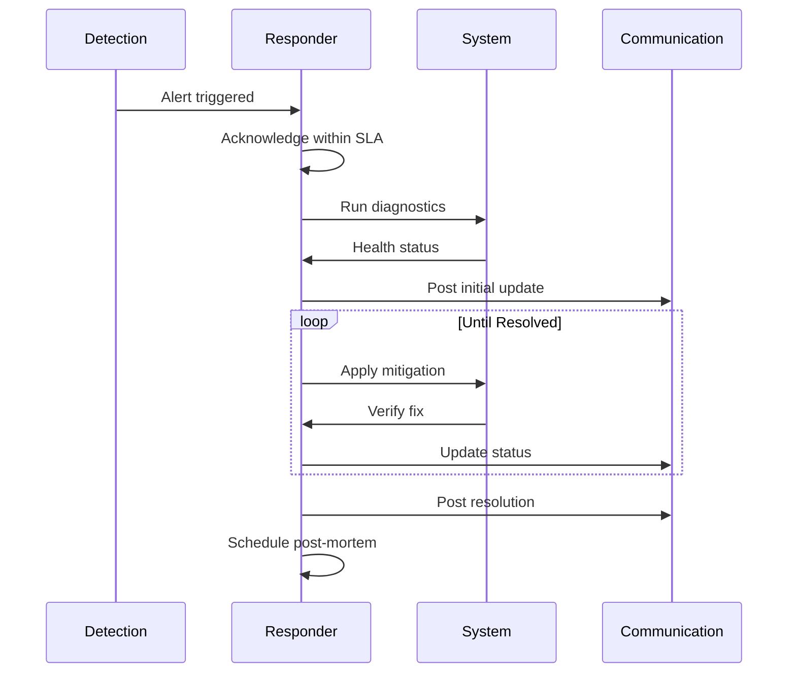

# MirrorBuddy Incident Response Runbook

> Reference: [ISE Incident Management](https://microsoft.github.io/code-with-engineering-playbook/observability/incident-response/) | [Google SRE - Managing Incidents](https://sre.google/sre-book/managing-incidents/)

## Incident Classification



| SEV   | Impact            | Response | Examples                               |
| ----- | ----------------- | -------- | -------------------------------------- |
| **1** | Complete outage   | 15 min   | Service down, data loss, safety bypass |
| **2** | Major degradation | 1 hour   | Voice broken, high error rate          |
| **3** | Partial impact    | 4 hours  | Slow responses, single feature broken  |
| **4** | Minimal           | Next day | Cosmetic bugs, minor UX issues         |

## Quick Diagnosis

```bash
# 1. Health check (always start here)
curl -s https://[domain]/api/health | jq

# 2. Container status
docker ps -a | grep mirrorbuddy
docker logs mirrorbuddy-app --tail 100 --since 5m

# 3. Database connectivity
docker exec mirrorbuddy-db pg_isready -U mirrorbuddy

# 4. Error patterns (last 5 minutes)
docker logs mirrorbuddy-app 2>&1 | grep -i error | tail -20
```

## Incident Response Flow



## Common Incidents

### INC-001: Application Unresponsive

**Symptoms**: Health check timeout, 502/503 errors

**Diagnostic Tree**:

1. Container running? → `docker ps | grep app`
2. Port listening? → `netstat -tlnp | grep 3000`
3. Database connected? → Check health endpoint
4. Memory exhausted? → `docker stats --no-stream`

**Resolution**: Restart container, check env vars, scale if needed

### INC-002: Voice Sessions Failing

**Symptoms**: WebSocket connection drops, no audio

**Diagnostic Tree**:

1. Azure endpoint configured? → Check `AZURE_OPENAI_REALTIME_*`
2. Rate limited? → Check for 429 in logs
3. WebRTC issues? → Client-side debugging needed

**Resolution**: Verify credentials, check Azure status, fallback to text

### INC-003: High Latency

**Symptoms**: P99 > SLO threshold, slow responses

**Root Causes**:

- Database slow queries
- AI provider latency
- Memory pressure
- Network issues

**Resolution**: Check slow query log, add indexes, scale resources

### INC-004: Safety System Alert

**CRITICAL**: Safety-related incidents are always SEV1

**Response Protocol**:

1. **IMMEDIATE**: Block affected session
2. Document the attempt
3. Review detection patterns
4. If bypass detected → full incident review

### INC-005: Missing Translations or Translation Loading Failures

**Symptoms**: Users see untranslated keys (e.g., `i18n.key_name`), 404 errors loading language packs

**Diagnostic Tree**:

1. Locale detected correctly? → Check browser/profile settings
2. Translation file exists? → Verify `messages/{lang}/{namespace}.json`
3. Bundle includes locale? → Check build output for language pack
4. Cache stale? → Check CDN/browser cache headers

**Root Causes**:

- Missing translation file for new language
- Translation key not in bundle (missing in source JSON)
- Locale code mismatch (e.g., `en-US` vs `en`)
- Language pack failed to download (network/CDN issue)

**Resolution**:

1. Add missing translation: `messages/{lang}/{namespace}.json`
2. Run `npm run build` to include in bundle
3. Clear CDN cache: Contact DevOps team with language code
4. Fallback to English if issue persists
5. Log incident in Grafana

### INC-006: Locale Detection Failures

**Symptoms**: User's language preference not respected, wrong language displayed

**Diagnostic Tree**:

1. Browser locale detected? → Check `navigator.language` in console
2. User profile has language setting? → Query database for `userLanguage`
3. Cookie/localStorage preserved? → Check `mirrorbuddy-locale` cookie
4. Fallback language working? → Default to English fallback

**Root Causes**:

- Browser language not in supported locales list
- User profile not synced with auth provider
- Cookie/session cleared unexpectedly
- Invalid locale code stored

**Resolution**:

1. Verify supported locales: `src/lib/i18n/config.ts`
2. Add unsupported locale to mapping if valid
3. Force language refresh: Clear `mirrorbuddy-locale` cookie
4. Check auth provider profile sync
5. Monitor detection via Grafana i18n dashboard

## Communication Template

```markdown
🔴 INCIDENT ACTIVE

**Title**: [Brief description]
**Severity**: SEV[1-4]
**Impact**: [Users affected]
**Status**: Investigating | Mitigating | Resolved
**Started**: [Time UTC]
**Next Update**: [Time UTC]

**Timeline**:

- HH:MM - [Event]
```

## Escalation Path

| Level | Contact             | When               |
| ----- | ------------------- | ------------------ |
| L1    | On-call engineer    | All incidents      |
| L2    | Tech lead           | SEV1-2 after 30min |
| L3    | Engineering manager | SEV1 after 1hr     |

## Grafana Cloud Observability

### Setup Guide

1. **Get Grafana Cloud credentials**:
   - Go to Grafana Cloud > Connections > Hosted Prometheus
   - Copy the remote write URL, instance ID, and create an API key with `metrics:write`

2. **Configure environment variables**:

   ```bash
   # Use Influx Line Protocol endpoint (not /api/prom/push which needs Snappy)
   GRAFANA_CLOUD_PROMETHEUS_URL=https://prometheus-prod-XX-prod-region.grafana.net/api/v1/push/influx/write
   GRAFANA_CLOUD_PROMETHEUS_USER=123456  # Instance ID from Grafana Cloud
   GRAFANA_CLOUD_API_KEY=glc_xxxxx       # Create at Access Policies > metrics:write
   GRAFANA_CLOUD_PUSH_INTERVAL=60        # seconds (minimum 15)
   ```

3. **Test push manually**:

   ```bash
   npx tsx scripts/test-grafana-push.ts
   ```

4. **Verify metrics in Grafana**:

   ```bash
   # Check push service logs
   docker logs mirrorbuddy-app 2>&1 | grep "Grafana"

   # Dashboard URL
   # https://mirrorbuddy.grafana.net/d/dashboard/
   ```

### Dashboard Structure

| Resource    | UID                      | Purpose                      |
| ----------- | ------------------------ | ---------------------------- |
| Folder      | `mirrorbuddy`            | All MirrorBuddy dashboards   |
| Dashboard   | `dashboard`              | Main observability dashboard |
| Alert Group | `MirrorBuddy SLO Alerts` | GO/NO-GO thresholds          |

**Dashboard Structure:**

📈 **BUSINESS METRICS:**

1. Session Health - GO/NO-GO decision (success, drop-off, stuck loops)
2. User Engagement - DAU/WAU/MAU, new users
3. Conversion & Retention - Onboarding, voice adoption, D1/D7/D30
4. Cost Control - Per-session costs (text/voice), spikes
5. Maestri & Learning - Top 10, XP, streaks, quizzes, flashcards

🛠️ **TECHNICAL METRICS:** 6. Safety Metrics - Refusal precision, jailbreak blocking, incidents S0-S3 7. Performance - HTTP latency P95, error rates 8. External Services - Azure OpenAI, Google Drive, Brave quotas

### Key Metrics

| Metric                                       | GO Threshold | NO-GO Threshold |
| -------------------------------------------- | ------------ | --------------- |
| `mirrorbuddy_session_success_rate`           | ≥80%         | <60%            |
| `mirrorbuddy_session_dropoff_rate`           | ≤10%         | >25%            |
| `mirrorbuddy_session_stuck_loop_rate`        | ≤5%          | >15%            |
| `mirrorbuddy_refusal_precision`              | ≥95%         | <80%            |
| `mirrorbuddy_incidents_total{severity="S3"}` | 0            | ≥1 (STOP)       |
| `mirrorbuddy_i18n_missing_translations`      | 0            | >5 (alert)      |
| `mirrorbuddy_i18n_locale_detection_failures` | <1%          | >5% (alert)     |

### i18n Monitoring

**Dashboard Panel**: Grafana → `mirrorbuddy` folder → `dashboard` → i18n Metrics section

**Key Indicators**:

- Translation load errors (by language)
- Locale detection success rate
- Missing translation key requests
- Language pack CDN latency

**Alert escalation** (i18n incidents):

- **INC-005** (Missing Translations): SEV3, L1 on-call, involves frontend + i18n team
- **INC-006** (Locale Detection): SEV3, L1 on-call, may require config changes

### S3 Incident Response

**IMMEDIATE STOP TRIGGER**: Any S3 incident requires production halt.

1. Alert fires → Acknowledge immediately
2. Stop all user traffic (feature flag: `VOICE_ENABLED=false`)
3. Document incident details
4. Full incident review within 24h
5. No restart without safety team approval

## Service Limits Monitoring

### Overview

Real-time monitoring of external service quotas across 5 providers:

- **Vercel**: Bandwidth, build minutes, function invocations
- **Supabase**: Database size, storage, connections
- **Resend**: Daily & monthly email quotas
- **Azure OpenAI**: Chat TPM/RPM, embedding TPM, TTS RPM
- **Redis KV**: Storage, commands per day

**Implements**: F-05 (real-time stress visibility) | F-22 (automated limit queries)

### Dashboard Access

**URL**: `/admin/service-limits` (admin-only)

**Requirements**: Admin auth via `validateAdminAuth()`

**Features**:

- Real-time metrics from all 5 providers
- Status indicators: ok (green) | warning (yellow, ≥80%) | critical (orange, ≥95%)
- Usage + limit + percentage for each metric
- Actionable upgrade recommendations
- Auto-refresh every 30 seconds

### API Endpoint

**URL**: `GET /api/admin/service-limits`

**Response example**:

```json
{
  "vercel": {
    "bandwidth": {
      "usage": 0,
      "limit": 1000,
      "percentage": 0,
      "status": "ok",
      "unit": "GB",
      "period": "month"
    },
    "buildMinutes": {
      "usage": 0,
      "limit": 6000,
      "percentage": 0,
      "status": "ok"
    },
    "functionInvocations": {
      "usage": 0,
      "limit": 1000000,
      "percentage": 0,
      "status": "ok"
    }
  },
  "supabase": {
    "databaseSize": {
      "usage": 19.34,
      "limit": 500,
      "percentage": 3.87,
      "status": "ok",
      "unit": "MB"
    },
    "storage": {
      "usage": 0,
      "limit": 1000,
      "percentage": 0,
      "status": "ok",
      "unit": "MB"
    },
    "connections": { "usage": 0, "limit": 200, "percentage": 0, "status": "ok" }
  },
  "resend": {
    "emailsToday": {
      "usage": 0,
      "limit": 100,
      "percentage": 0,
      "status": "ok"
    },
    "emailsThisMonth": {
      "usage": 0,
      "limit": 3000,
      "percentage": 0,
      "status": "ok"
    }
  },
  "azureOpenAI": {
    "chatTPM": {
      "usage": 45000,
      "limit": 120000,
      "percentage": 37.5,
      "status": "ok",
      "unit": "tokens",
      "period": "1m"
    },
    "chatRPM": {
      "usage": 150,
      "limit": 720,
      "percentage": 20.83,
      "status": "ok"
    }
  },
  "redis": {
    "storage": {
      "usage": 5,
      "limit": 256,
      "percentage": 1.95,
      "status": "ok",
      "unit": "MB"
    },
    "commandsPerDay": {
      "usage": 2500,
      "limit": 10000,
      "percentage": 25,
      "status": "ok"
    }
  },
  "timestamp": "2026-01-21T10:30:00Z"
}
```

**Status Codes**: 200 OK | 401 Unauthorized | 500 Server Error

### Alert Investigation Procedures

#### When Alert Fires (Warning or Critical)

**Priority levels**:

- **Warning (80-95%)**: Investigate within 1 hour
- **Critical (95-99%)**: Urgent mitigation required
- **Emergency (≥99%)**: Escalate immediately, service may block

**Quick diagnosis**:

```bash
# 1. Fetch current metrics
curl -H "Cookie: [session]" https://[domain]/api/admin/service-limits | jq

# 2. Check Grafana dashboard
# URL: https://mirrorbuddy.grafana.net/d/dashboard/
# Find alert in: Alerts > MirrorBuddy SLO Alerts

# 3. Correlate with service dashboards
# Vercel: https://vercel.com/dashboard/project/[project]
# Supabase: https://app.supabase.com/project/[project]
```

#### Service-Specific Mitigation

**Vercel Bandwidth**:

- Check analytics for traffic spike
- Enable edge caching, compress responses
- Upgrade to Pro (1TB/month)

**Supabase Database**:

- Query `pg_database_size()` to find bloat
- Archive old telemetry, remove indexes
- Upgrade to Pro (8GB)

**Resend Email**:

- Check email volume breakdown
- Batch notifications, move to in-app alerts
- Upgrade to paid plan (10k/month)

**Azure OpenAI TPM**:

- Query telemetry for spike source
- Batch requests, use gpt-5-mini
- Request limit increase via Azure Support

**Redis Commands**:

- Check Vercel KV dashboard
- Increase cache TTL, implement local cache
- Upgrade to Pro tier

#### Escalation & Recovery

| Level     | Action                | Contact          |
| --------- | --------------------- | ---------------- |
| Warning   | Investigate + monitor | Team lead        |
| Critical  | Immediate mitigation  | On-call engineer |
| Emergency | Stop traffic          | SEV1 incident    |

**Recovery checklist**:

1. Verify alert is not false positive
2. Apply mitigation from table above
3. Monitor dashboard 30 min after fix
4. Log incident annotation in Grafana
5. Schedule upgrade for next sprint

**Emergency rollback**:

- Disable expensive features via feature flags
- Fallback to Ollama if Azure rate-limited
- Scale down background jobs

## Sentry Error Tracking

### Overview

Real-time client and server error tracking via Sentry.

- **Dashboard**: https://sentry.io (external)
- **Admin Widget**: `/admin` > Sentry Errors section
- **API**: `GET /api/admin/sentry/issues`

### Environment Variables

```bash
# Client/server DSN (required)
NEXT_PUBLIC_SENTRY_DSN=https://xxx@xxx.ingest.us.sentry.io/xxx

# Source maps upload (CI only)
SENTRY_AUTH_TOKEN=sntrys_xxxxx
SENTRY_ORG=fightthestroke
SENTRY_PROJECT=mirrorbuddy
```

### Grafana Integration

To add Sentry data source to Grafana Cloud:

1. **Install Sentry plugin** in Grafana Cloud:
   - Go to: Grafana Cloud > Administration > Plugins
   - Search "Sentry" > Install `grafana-sentry-datasource`

2. **Configure datasource**:
   - Go to: Connections > Data Sources > Add data source
   - Select "Sentry"
   - Enter Organization slug: `fightthestroke`
   - Auth Token: Create at Sentry > Settings > Auth Tokens (scopes: `project:read`, `event:read`)

3. **Add panel to dashboard**:
   - Open dashboard > Add panel
   - Select "Sentry" datasource
   - Query type: "Issues"
   - Filter: `is:unresolved`

### Alert on Errors

Create Grafana alert for high error rate:

```yaml
# In Grafana > Alerting > Alert Rules
condition: count(sentry_issues{is_unresolved=true}) > 5
for: 5m
labels:
  severity: warning
annotations:
  summary: 'High unresolved error count in Sentry'
```

### Investigation Workflow

1. **Check admin dashboard**: `/admin` > Sentry Errors
2. **Click issue** → Opens Sentry with full stack trace
3. **Use source maps** → Readable code locations
4. **Check user count** → Prioritize by impact
5. **Resolve in Sentry** → Mark as resolved when fixed

### CSP Configuration

Sentry is allowed in CSP (`src/proxy.ts`):

```typescript
connect-src: 'self' ... https://*.ingest.us.sentry.io https://*.ingest.de.sentry.io
```

## Related Documents

- [RUNBOOK-PROCEDURES.md](./RUNBOOK-PROCEDURES.md) - Maintenance & recovery
- [SLI-SLO.md](./SLI-SLO.md) - Service level definitions
- [ALERT-TESTING-GUIDE.md](./ALERT-TESTING-GUIDE.md) - Testing service limit alerts
- [ADR 0039](../adr/archive/0039-deferred-production-items.md) - Known limitations
- [ADR 0047](../adr/0047-grafana-cloud-observability.md) - Grafana Cloud architecture
- [ADR 0070](../adr/0070-sentry-error-tracking.md) - Sentry integration

---

_Version 2.4 | January 2026 | Added i18n Incidents (INC-005, INC-006), Grafana i18n monitoring, and escalation paths_
