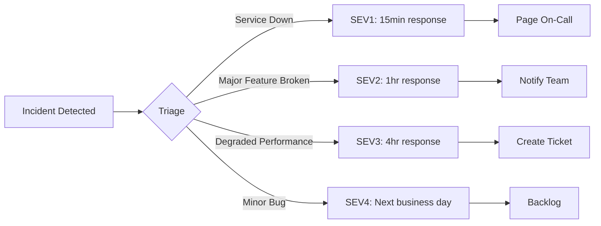
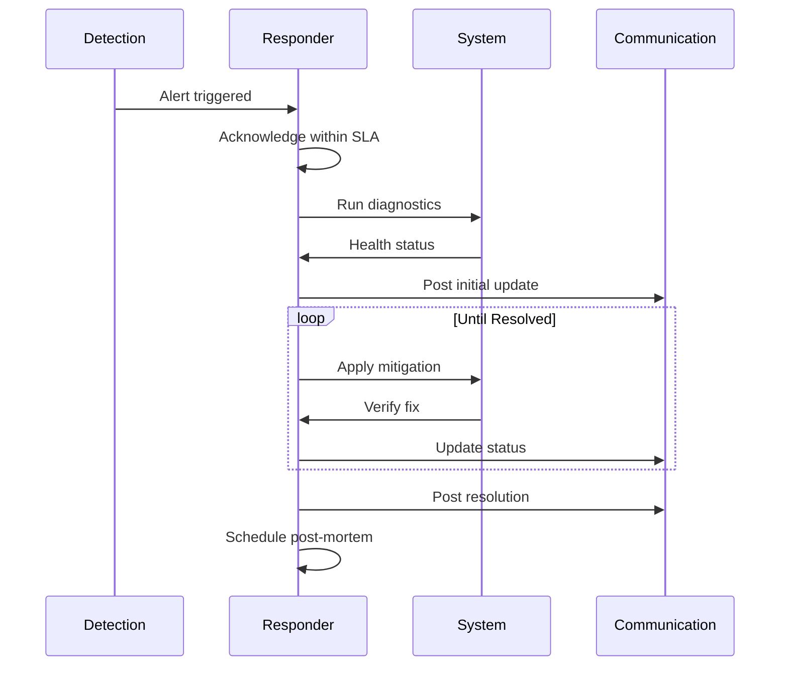

# MirrorBuddy Incident Response Runbook

> Reference: [ISE Incident Management](https://microsoft.github.io/code-with-engineering-playbook/observability/incident-response/) | [Google SRE - Managing Incidents](https://sre.google/sre-book/managing-incidents/)

## Incident Classification



| SEV | Impact | Response | Examples |
|-----|--------|----------|----------|
| **1** | Complete outage | 15 min | Service down, data loss, safety bypass |
| **2** | Major degradation | 1 hour | Voice broken, high error rate |
| **3** | Partial impact | 4 hours | Slow responses, single feature broken |
| **4** | Minimal | Next day | Cosmetic bugs, minor UX issues |

## Quick Diagnosis

```bash
# 1. Health check (always start here)
curl -s https://[domain]/api/health | jq

# 2. Container status
docker ps -a | grep mirrorbuddy
docker logs mirrorbuddy-app --tail 100 --since 5m

# 3. Database connectivity
docker exec mirrorbuddy-db pg_isready -U mirrorbuddy

# 4. Error patterns (last 5 minutes)
docker logs mirrorbuddy-app 2>&1 | grep -i error | tail -20
```

## Incident Response Flow



## Common Incidents

### INC-001: Application Unresponsive

**Symptoms**: Health check timeout, 502/503 errors

**Diagnostic Tree**:
1. Container running? → `docker ps | grep app`
2. Port listening? → `netstat -tlnp | grep 3000`
3. Database connected? → Check health endpoint
4. Memory exhausted? → `docker stats --no-stream`

**Resolution**: Restart container, check env vars, scale if needed

### INC-002: Voice Sessions Failing

**Symptoms**: WebSocket connection drops, no audio

**Diagnostic Tree**:
1. Azure endpoint configured? → Check `AZURE_OPENAI_REALTIME_*`
2. Rate limited? → Check for 429 in logs
3. WebRTC issues? → Client-side debugging needed

**Resolution**: Verify credentials, check Azure status, fallback to text

### INC-003: High Latency

**Symptoms**: P99 > SLO threshold, slow responses

**Root Causes**:
- Database slow queries
- AI provider latency
- Memory pressure
- Network issues

**Resolution**: Check slow query log, add indexes, scale resources

### INC-004: Safety System Alert

**CRITICAL**: Safety-related incidents are always SEV1

**Response Protocol**:
1. **IMMEDIATE**: Block affected session
2. Document the attempt
3. Review detection patterns
4. If bypass detected → full incident review

## Communication Template

```markdown
🔴 INCIDENT ACTIVE

**Title**: [Brief description]
**Severity**: SEV[1-4]
**Impact**: [Users affected]
**Status**: Investigating | Mitigating | Resolved
**Started**: [Time UTC]
**Next Update**: [Time UTC]

**Timeline**:
- HH:MM - [Event]
```

## Escalation Path

| Level | Contact | When |
|-------|---------|------|
| L1 | On-call engineer | All incidents |
| L2 | Tech lead | SEV1-2 after 30min |
| L3 | Engineering manager | SEV1 after 1hr |

## Related Documents

- [RUNBOOK-PROCEDURES.md](./RUNBOOK-PROCEDURES.md) - Maintenance & recovery
- [SLI-SLO.md](./SLI-SLO.md) - Service level definitions
- [ADR 0037](../adr/0037-deferred-production-items.md) - Known limitations

---
*Version 2.0 | January 2025 | Technical Fellow Review*
