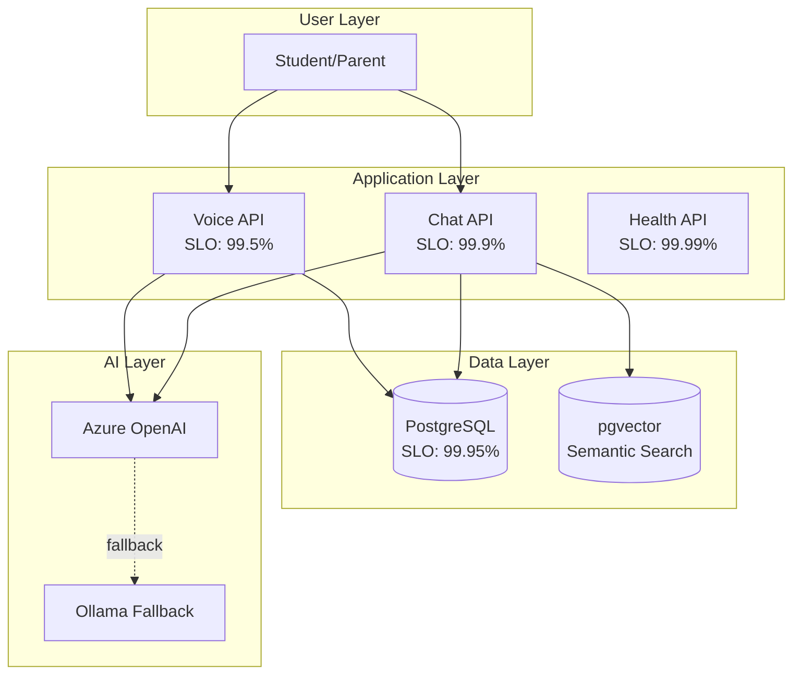
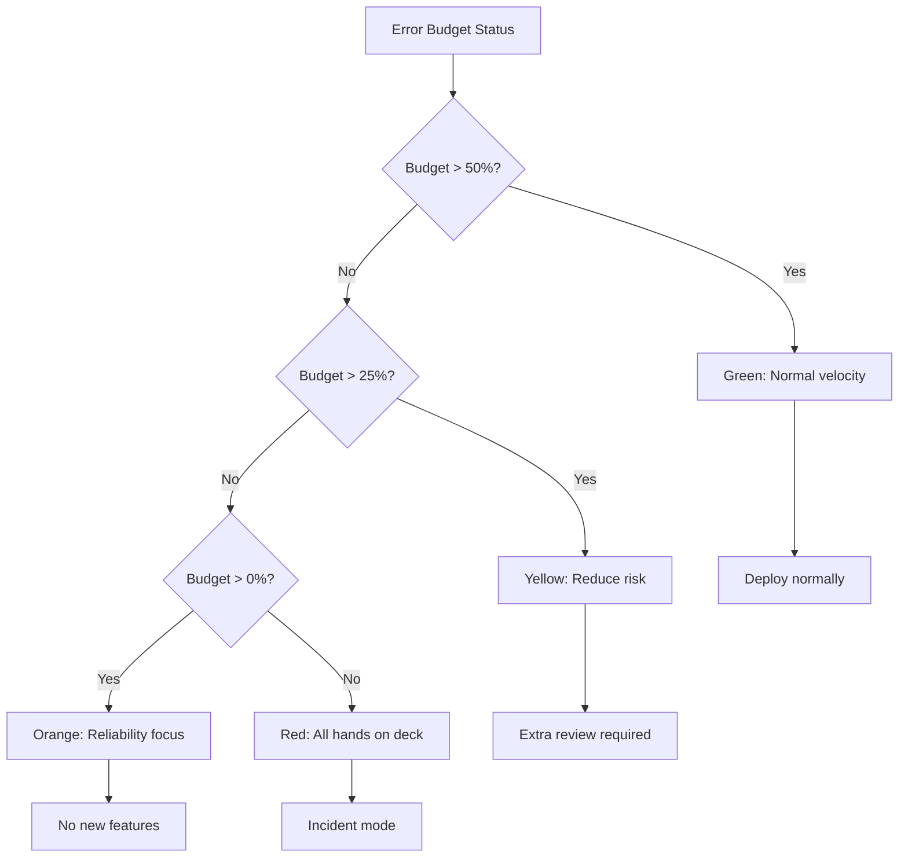

# MirrorBuddy Service Level Objectives

> Reference: [Google SRE Book - SLOs](https://sre.google/sre-book/service-level-objectives/) | [ISE Observability](https://microsoft.github.io/code-with-engineering-playbook/observability/slo/)

## Architecture Context



## SLI/SLO Definitions

### Voice API (Real-time WebSocket)

| SLI | Formula | Target (SLO) | Rationale |
|-----|---------|--------------|-----------|
| Availability | `successful_starts / total_attempts` | **99.5%** | WebRTC inherently less reliable than HTTP |
| Latency P50 | `percentile(ttfv, 50)` | **< 500ms** | Conversational UX threshold |
| Latency P99 | `percentile(ttfv, 99)` | **< 2000ms** | Maximum tolerable delay |
| Error Rate | `errors / total_sessions` | **< 1%** | Includes mid-session failures |

**TTFV** = Time To First Voice (WebSocket connect → first audio playback)

### Chat API (HTTP Streaming)

| SLI | Formula | Target (SLO) | Rationale |
|-----|---------|--------------|-----------|
| Availability | `2xx_responses / total_requests` | **99.9%** | Three 9s for HTTP services |
| TTFB P50 | `percentile(ttfb, 50)` | **< 300ms** | User perception of responsiveness |
| TTFB P99 | `percentile(ttfb, 99)` | **< 1500ms** | Tail latency budget |

**TTFB** = Time To First Byte (request received → first SSE chunk sent)

### Database (PostgreSQL + pgvector)

| SLI | Formula | Target (SLO) | Rationale |
|-----|---------|--------------|-----------|
| Availability | `successful_queries / total_queries` | **99.95%** | Critical dependency |
| Query P50 | `percentile(query_ms, 50)` | **< 50ms** | Standard OLTP expectation |
| Query P99 | `percentile(query_ms, 99)` | **< 200ms** | With connection pooling |
| Vector P99 | `percentile(vector_ms, 99)` | **< 500ms** | Semantic search overhead |

## Error Budget Model

```
Monthly Error Budget = (1 - SLO) × 30 × 24 × 60 minutes

Voice API (99.5%):  0.005 × 43200 = 216 min = 3.6 hours
Chat API (99.9%):   0.001 × 43200 = 43.2 min
Database (99.95%):  0.0005 × 43200 = 21.6 min
```

### Burn Rate Alerts

| Severity | Condition | Time Window | Action |
|----------|-----------|-------------|--------|
| **SEV1** | 14.4× burn rate | 1 hour | Page immediately |
| **SEV2** | 6× burn rate | 6 hours | Page during business |
| **SEV3** | 3× burn rate | 24 hours | Ticket for review |

*14.4× = consumes monthly budget in 2 days*

## Decision Matrix



## Measurement Points

```typescript
// Voice API measurement
const voiceSLI = {
  availability: successfulStarts / totalAttempts,
  latencyP50: percentile(ttfvSamples, 0.5),
  latencyP99: percentile(ttfvSamples, 0.99),
};

// Chat API measurement
const chatSLI = {
  availability: responses2xx / totalRequests,
  ttfbP50: percentile(ttfbSamples, 0.5),
  ttfbP99: percentile(ttfbSamples, 0.99),
};
```

## Review Schedule

| Cadence | Activity | Owner |
|---------|----------|-------|
| Daily | Error budget check | On-call |
| Weekly | SLO compliance review | Tech lead |
| Monthly | Target adjustment | Engineering manager |
| Quarterly | Capacity planning | Technical director |

## Dashboard & Live Monitoring

### Health Status Endpoint

**Real-time health dashboard for load balancers and status pages:**

```bash
# Basic health check (liveness)
curl -s http://localhost:3000/api/health | jq .

# Detailed metrics (for dashboards)
curl -s http://localhost:3000/api/health/detailed | jq .
```

**Response includes**:
- Service uptime / downtime
- Database connection pool status
- AI provider availability (Azure OpenAI, Ollama)
- Vector store health (pgvector)
- Response times for all dependencies

**Use for**:
- Load balancer health probes (every 10s)
- Status page automation
- Incident alerting (consume with `jq .status`)

### Prometheus Metrics Endpoint

**Production observability via Prometheus-compatible metrics:**

```bash
# Scrape metrics in Prometheus format
curl -s http://localhost:3000/api/metrics
```

**Exposed metrics** (OpenTelemetry instrumentation):
- `http_requests_total` - All HTTP requests with status code labels
- `http_request_duration_seconds` - Request latency (P50, P95, P99)
- `voice_session_duration_seconds` - WebSocket session lengths
- `chat_messages_total` - Messages sent/received
- `db_query_duration_seconds` - PostgreSQL query latencies
- `vector_search_duration_seconds` - pgvector semantic search times
- `ai_provider_requests_total` - Azure OpenAI vs Ollama fallback counts

**Prometheus scrape config** (`prometheus.yml`):
```yaml
scrape_configs:
  - job_name: 'mirrorbuddy'
    static_configs:
      - targets: ['localhost:3000']
    metrics_path: '/api/metrics'
    scrape_interval: 30s
    scrape_timeout: 10s
```

### Grafana Dashboard Setup

**Deploy dashboard for SLI visualization:**

1. **Add Prometheus data source**
   - URL: `http://prometheus:9090`
   - Auth: None (internal cluster)
   - Test & Save

2. **Import SLO dashboard**
   ```bash
   # Copy dashboard JSON from docs/dashboards/slo-dashboard.json
   # In Grafana UI: Dashboards → Import → Paste JSON
   ```

3. **Key dashboard panels**
   - Voice API Availability (%) - Last 30 days
   - Chat API TTFB P50/P99 - Rolling 1-hour
   - Database Query Latency - P99 percentile
   - Error Budget Burn Rate - Alert if > 6× during 6-hour window
   - Service Status Grid - Green/Yellow/Red status per component

4. **Alert rules** (in Grafana)
   - **SEV1**: Voice availability < 95% (14.4× burn rate)
   - **SEV2**: Chat latency P99 > 3000ms (6× burn rate)
   - **SEV3**: DB queries > 500ms P99 (3× burn rate)

### Manual SLI Checks

**For on-call without dashboard access:**

```bash
# Voice API - check last hour of sessions
psql mirrorbuddy -c "
  SELECT
    COUNT(*) as total_sessions,
    COUNTIF(duration_ms > 2000) as p99_breaches,
    ROUND(100 - (COUNTIF(duration_ms > 2000) * 100 / COUNT(*)), 2) as availability_pct
  FROM voice_sessions
  WHERE created_at > NOW() - INTERVAL '1 hour';"

# Chat API - TTFB latencies
psql mirrorbuddy -c "
  SELECT
    PERCENTILE_CONT(0.50) WITHIN GROUP (ORDER BY ttfb_ms) as p50_ms,
    PERCENTILE_CONT(0.99) WITHIN GROUP (ORDER BY ttfb_ms) as p99_ms
  FROM chat_requests
  WHERE created_at > NOW() - INTERVAL '1 hour';"

# Database - Query latency
psql mirrorbuddy -c "
  SELECT
    PERCENTILE_CONT(0.99) WITHIN GROUP (ORDER BY duration_ms) as p99_ms
  FROM pg_stat_statements
  WHERE query NOT LIKE '%pg_stat%';"
```

## References

- [ADR 0037: Deferred Production Items](../adr/0037-deferred-production-items.md)
- [RUNBOOK.md](./RUNBOOK.md) - Incident response procedures
- [Health Endpoint](../../src/app/api/health/detailed/route.ts) - Implementation

---
*Version 2.0 | January 2025 | Technical Fellow Review*
