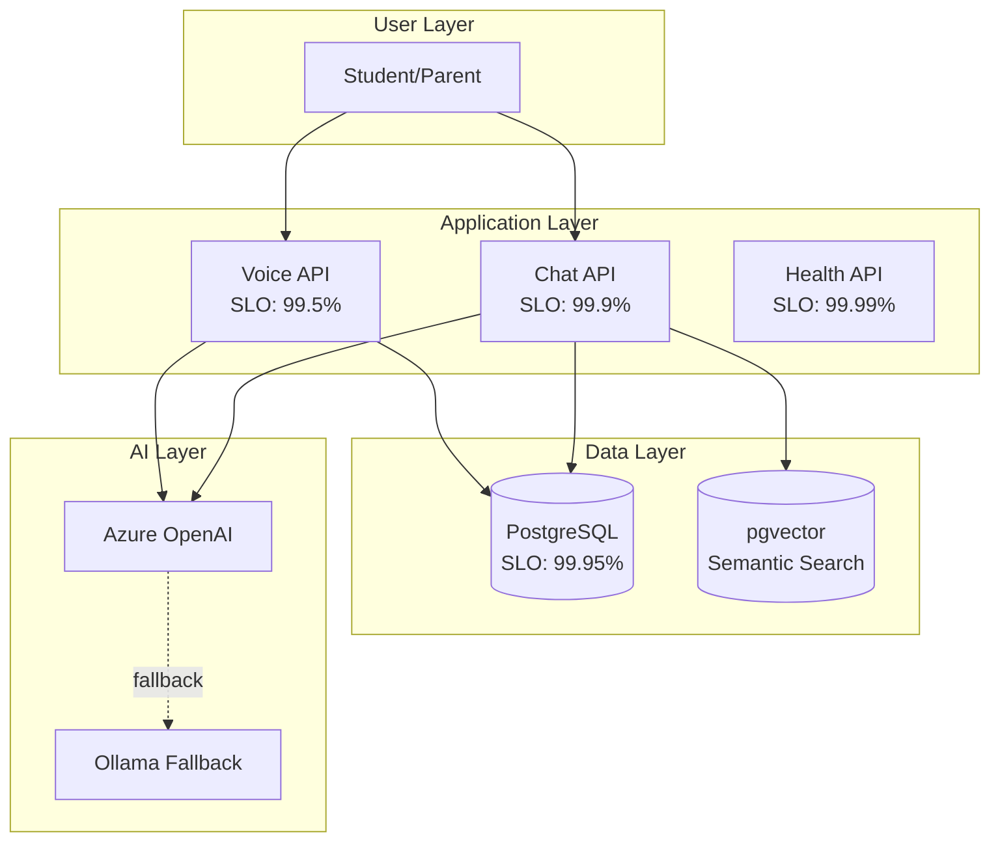
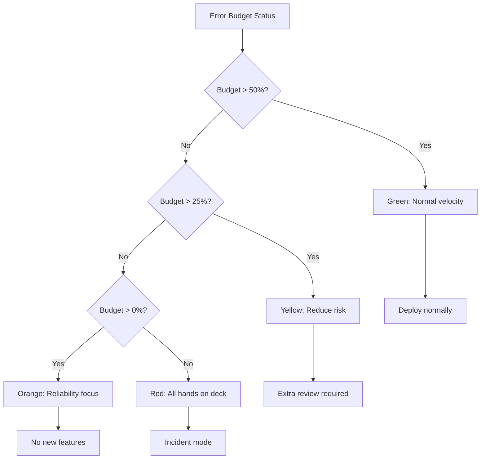

# MirrorBuddy Service Level Objectives

> Reference: [Google SRE Book - SLOs](https://sre.google/sre-book/service-level-objectives/) | [ISE Observability](https://microsoft.github.io/code-with-engineering-playbook/observability/slo/)

## Architecture Context



## SLI/SLO Definitions

### Voice API (Real-time WebSocket)

| SLI | Formula | Target (SLO) | Rationale |
|-----|---------|--------------|-----------|
| Availability | `successful_starts / total_attempts` | **99.5%** | WebRTC inherently less reliable than HTTP |
| Latency P50 | `percentile(ttfv, 50)` | **< 500ms** | Conversational UX threshold |
| Latency P99 | `percentile(ttfv, 99)` | **< 2000ms** | Maximum tolerable delay |
| Error Rate | `errors / total_sessions` | **< 1%** | Includes mid-session failures |

**TTFV** = Time To First Voice (WebSocket connect → first audio playback)

### Chat API (HTTP Streaming)

| SLI | Formula | Target (SLO) | Rationale |
|-----|---------|--------------|-----------|
| Availability | `2xx_responses / total_requests` | **99.9%** | Three 9s for HTTP services |
| TTFB P50 | `percentile(ttfb, 50)` | **< 300ms** | User perception of responsiveness |
| TTFB P99 | `percentile(ttfb, 99)` | **< 1500ms** | Tail latency budget |

**TTFB** = Time To First Byte (request received → first SSE chunk sent)

### Database (PostgreSQL + pgvector)

| SLI | Formula | Target (SLO) | Rationale |
|-----|---------|--------------|-----------|
| Availability | `successful_queries / total_queries` | **99.95%** | Critical dependency |
| Query P50 | `percentile(query_ms, 50)` | **< 50ms** | Standard OLTP expectation |
| Query P99 | `percentile(query_ms, 99)` | **< 200ms** | With connection pooling |
| Vector P99 | `percentile(vector_ms, 99)` | **< 500ms** | Semantic search overhead |

## Error Budget Model

```
Monthly Error Budget = (1 - SLO) × 30 × 24 × 60 minutes

Voice API (99.5%):  0.005 × 43200 = 216 min = 3.6 hours
Chat API (99.9%):   0.001 × 43200 = 43.2 min
Database (99.95%):  0.0005 × 43200 = 21.6 min
```

### Burn Rate Alerts

| Severity | Condition | Time Window | Action |
|----------|-----------|-------------|--------|
| **SEV1** | 14.4× burn rate | 1 hour | Page immediately |
| **SEV2** | 6× burn rate | 6 hours | Page during business |
| **SEV3** | 3× burn rate | 24 hours | Ticket for review |

*14.4× = consumes monthly budget in 2 days*

## Decision Matrix



## Measurement Points

```typescript
// Voice API measurement
const voiceSLI = {
  availability: successfulStarts / totalAttempts,
  latencyP50: percentile(ttfvSamples, 0.5),
  latencyP99: percentile(ttfvSamples, 0.99),
};

// Chat API measurement
const chatSLI = {
  availability: responses2xx / totalRequests,
  ttfbP50: percentile(ttfbSamples, 0.5),
  ttfbP99: percentile(ttfbSamples, 0.99),
};
```

## Review Schedule

| Cadence | Activity | Owner |
|---------|----------|-------|
| Daily | Error budget check | On-call |
| Weekly | SLO compliance review | Tech lead |
| Monthly | Target adjustment | Engineering manager |
| Quarterly | Capacity planning | Technical director |

## References

- [ADR 0037: Deferred Production Items](../adr/0037-deferred-production-items.md)
- [RUNBOOK.md](./RUNBOOK.md) - Incident response procedures
- [Health Endpoint](../../src/app/api/health/detailed/route.ts) - Implementation

---
*Version 2.0 | January 2025 | Technical Fellow Review*
