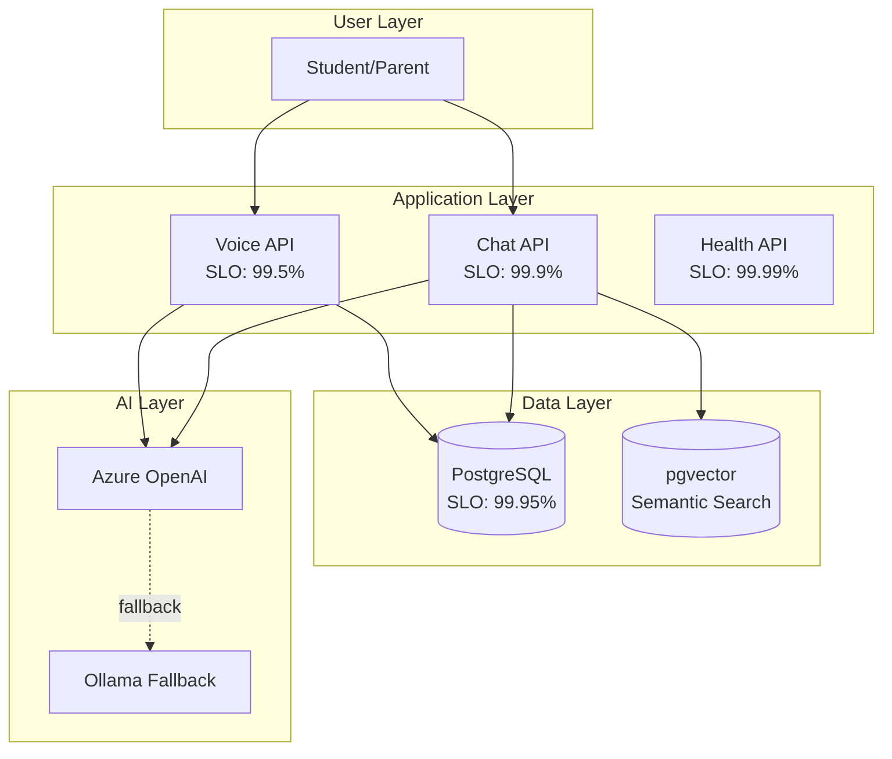
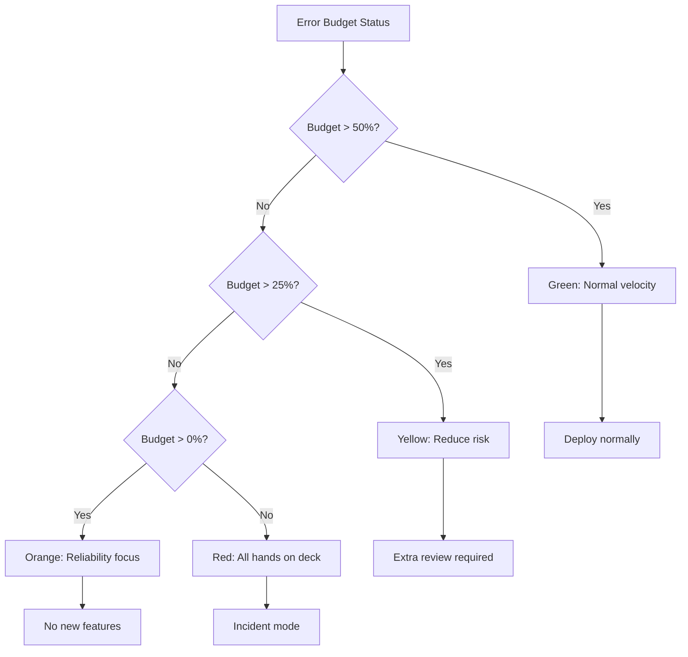

# MirrorBuddy Service Level Objectives

> Reference: [Google SRE Book - SLOs](https://sre.google/sre-book/service-level-objectives/) | [ISE Observability](https://microsoft.github.io/code-with-engineering-playbook/observability/slo/)

> **Measurement status (#1076, 2026-09-21):** The objectives below are targets,
> not measured compliance. Local proxy timings and statuses do not observe API
> handlers, streamed responses or user-visible availability. Application HTTP
> latency/availability/error-budget alerting has a monitoring gap until handler
> or OpenTelemetry instrumentation is implemented and validated.

## Architecture Context


```mermaid
graph TB
    subgraph "User Layer"
        U[Student/Parent]
    end

    subgraph "Application Layer"
        V[Voice API<br/>SLO: 99.5%]
        C[Chat API<br/>SLO: 99.9%]
        H[Health API<br/>SLO: 99.99%]
    end

    subgraph "Data Layer"
        DB[(PostgreSQL<br/>SLO: 99.95%)]
        VEC[(pgvector<br/>Semantic Search)]
    end

    subgraph "AI Layer"
        AZ[Azure OpenAI]
        OL[Ollama Fallback]
    end

    U --> V & C
    V --> AZ
    C --> AZ
    AZ -.->|fallback| OL
    V & C --> DB
    C --> VEC
```

## SLI/SLO Definitions

### Voice API (Real-time WebSocket)

| SLI          | Formula                              | Target (SLO) | Rationale                                 |
| ------------ | ------------------------------------ | ------------ | ----------------------------------------- |
| Availability | `successful_starts / total_attempts` | **99.5%**    | WebRTC inherently less reliable than HTTP |
| Latency P50  | `percentile(ttfv, 50)`               | **< 500ms**  | Conversational UX threshold               |
| Latency P99  | `percentile(ttfv, 99)`               | **< 2000ms** | Maximum tolerable delay                   |
| Error Rate   | `errors / total_sessions`            | **< 1%**     | Includes mid-session failures             |

**TTFV** = Time To First Voice (WebSocket connect → first audio playback)

### Chat API (HTTP Streaming)

| SLI          | Formula                          | Target (SLO) | Rationale                         |
| ------------ | -------------------------------- | ------------ | --------------------------------- |
| Availability | `2xx_responses / total_requests` | **99.9%**    | Three 9s for HTTP services        |
| TTFB P50     | `percentile(ttfb, 50)`           | **< 300ms**  | User perception of responsiveness |
| TTFB P99     | `percentile(ttfb, 99)`           | **< 1500ms** | Tail latency budget               |

**TTFB** = Time To First Byte (request received → first SSE chunk sent)

### Database (PostgreSQL + pgvector)

| SLI          | Formula                              | Target (SLO) | Rationale                 |
| ------------ | ------------------------------------ | ------------ | ------------------------- |
| Availability | `successful_queries / total_queries` | **99.95%**   | Critical dependency       |
| Query P50    | `percentile(query_ms, 50)`           | **< 50ms**   | Standard OLTP expectation |
| Query P99    | `percentile(query_ms, 99)`           | **< 200ms**  | With connection pooling   |
| Vector P99   | `percentile(vector_ms, 99)`          | **< 500ms**  | Semantic search overhead  |

## Error Budget Model

```
Monthly Error Budget = (1 - SLO) × 30 × 24 × 60 minutes

Voice API (99.5%):  0.005 × 43200 = 216 min = 3.6 hours
Chat API (99.9%):   0.001 × 43200 = 43.2 min
Database (99.95%):  0.0005 × 43200 = 21.6 min
```

### Burn Rate Alerts

| Severity | Condition       | Time Window | Action               |
| -------- | --------------- | ----------- | -------------------- |
| **SEV1** | 14.4× burn rate | 1 hour      | Page immediately     |
| **SEV2** | 6× burn rate    | 6 hours     | Page during business |
| **SEV3** | 3× burn rate    | 24 hours    | Ticket for review    |

_14.4× = consumes monthly budget in 2 days_

## Decision Matrix


```mermaid
graph TD
    A[Error Budget Status] --> B{Budget > 50%?}
    B -->|Yes| C[Green: Normal velocity]
    B -->|No| D{Budget > 25%?}
    D -->|Yes| E[Yellow: Reduce risk]
    D -->|No| F{Budget > 0%?}
    F -->|Yes| G[Orange: Reliability focus]
    F -->|No| H[Red: All hands on deck]

    C --> I[Deploy normally]
    E --> J[Extra review required]
    G --> K[No new features]
    H --> L[Incident mode]
```

## Measurement Points

```typescript
// Voice API measurement
const voiceSLI = {
  availability: successfulStarts / totalAttempts,
  latencyP50: percentile(ttfvSamples, 0.5),
  latencyP99: percentile(ttfvSamples, 0.99),
};

// Chat API measurement
const chatSLI = {
  availability: responses2xx / totalRequests,
  ttfbP50: percentile(ttfbSamples, 0.5),
  ttfbP99: percentile(ttfbSamples, 0.99),
};
```

## Review Schedule

| Cadence   | Activity              | Owner               |
| --------- | --------------------- | ------------------- |
| Daily     | Error budget check    | On-call             |
| Weekly    | SLO compliance review | Tech lead           |
| Monthly   | Target adjustment     | Engineering manager |
| Quarterly | Capacity planning     | Technical director  |

## Dashboard & Live Monitoring

### Health Status Endpoint

**Real-time health dashboard for load balancers and status pages:**

```bash
# Basic health check (liveness)
curl -s http://localhost:3000/api/health | jq .

# Detailed metrics (for dashboards)
curl -s http://localhost:3000/api/health/detailed | jq .
```

**Response includes**:

- Service uptime / downtime
- Database connection pool status
- AI provider availability (Azure OpenAI, Ollama)
- Vector store health (pgvector)
- Response times for all dependencies

**Use for**:

- Load balancer health probes (every 10s)
- Status page automation
- Incident alerting (consume with `jq .status`)

### Prometheus Metrics Endpoint

**Best-effort local proxy diagnostics, not application SLI measurements:**

```bash
# Scrape metrics in Prometheus format
curl -s http://localhost:3000/api/metrics
```

**Retained 10 names:** all are **gauges** over a local sliding **5-minute** window,
including names ending in `_total` (retained only for migration readability).
Scrape output and the timer use these same names; there is no aggregate
`http_request_duration_seconds{quantile=...}` series.

| Gauge                                     | Meaning within one worker's window                   |
| ----------------------------------------- | ---------------------------------------------------- |
| `proxy_http_requests_total`               | Proxy observations by route                          |
| `proxy_http_request_duration_seconds_p50` | Local proxy execution P50                            |
| `proxy_http_request_duration_seconds_p95` | Local proxy execution P95                            |
| `proxy_http_request_duration_seconds_p99` | Local proxy execution P99                            |
| `proxy_http_request_errors_total`         | Proxy error observations by route                    |
| `proxy_http_request_error_rate`           | Proxy errors / **all** proxy requests for that route |
| `proxy_http_request_errors_by_status`     | Proxy error observations by route and `status_code`  |
| `proxy_http_requests_total_all`           | All local proxy request observations                 |
| `proxy_http_errors_total_all`             | All local proxy error observations                   |
| `proxy_http_error_rate_all`               | All local proxy errors / all local proxy requests    |

The `worker` label is a random process UUID: it prevents separate instances from
overwriting each other's series, not missing observations or fleet aggregation.
Route-level samples carry `instance`, `env`, `worker` and `route`; only
`proxy_http_request_errors_by_status` adds `status_code`. Overall `_all` samples
omit `route`. No proxy metric has a method dimension.
Empty workers emit **no traffic observations**, not zero-traffic/healthy samples.
The timer retains only `proxy-http`; `metric_collector_up` and `metric_collector_enabled`
are **2 collector-health metadata names**, excluded from the 10 diagnostic names and 22 removed names.

Restarts, deployments and process recycling reset the in-memory window. Clock
adjustments can distort its boundaries; unpushed data is lost. Serverless timers
may freeze, skip ticks or never flush before termination. Persisted remote
samples can remain visible after a worker stops; a last value is not fresh health.
Neither the timer nor a scrape of one instance is a durable fleet aggregate.
No durable shared store or handler instrumentation is implemented by this change.

### Grafana migration and monitoring gaps

`grafana/mirrorbuddy-dashboard.json` plots direct per-worker proxy P95 and error
fraction gauges with route/worker legends. Do not use `rate()`/`increase()`
on these gauges, sum overlapping snapshots, or average percentiles into a global
percentile. Do not derive application availability, TTFB or SLO compliance from
proxy execution. `scripts/test-grafana-push.ts` uses `env=test`,
`worker=synthetic-test` and `synthetic=true` for synthetic proxy examples.

**Removed 22 unproduced legacy names** (not replaced by zero):

- Trial (4): `trial_started_total`, `trial_engaged_total`, `trial_limit_hit_total`, `trial_beta_requested_total`.
- Invite (5): `invite_requested_total`, `invite_approved_total`, `invite_rejected_total`, `invite_first_login_total`, `invite_active_total`.
- Budget (4): `budget_used_eur`, `budget_limit_eur`, `budget_projected_monthly_eur`, `budget_usage_percent`.
- Abuse (3): `abuse_flagged_total`, `abuse_blocked_total`, `abuse_score_total`.
- Conversion (6): `conversion_trial_to_engaged`, `conversion_engaged_to_limit`, `conversion_limit_to_request`, `conversion_request_to_approved`, `conversion_approved_to_login`, `conversion_login_to_active`.

Their panels in `grafana/dashboards/mirrorbuddy-beta.json` are retired with an
explicit unavailable-telemetry notice. Legacy in-memory funnel modules are removed;
**DB-backed cron funnel/conversion and other collectors are unchanged**.
The cron does not read worker-local HTTP/SLI snapshots.

**Additional unsupported dashboard-only queries:** beta panels 13 (Voice Usage),
14 (Tool Calls), 15 (Resource Usage by Type) and 17 (Voice/Tool Usage Over Time)
are removed because `trial_voice_seconds_total`, `trial_tool_calls_total` and
`trial_chats_total` have no producers. These three query names are additional
monitoring gaps, **not an increase to the 22 source names removed**.

**Release note / operator action:** `grafana/alerts/mirrorbuddy-alerts.json`
removes `budget-80-percent`, `budget-95-percent`, `abuse-spike`, `conversion-drop`
and `invite-backlog`; notification destinations remain. None has a validated
equivalent replacement. Budget/abuse telemetry is unavailable, not healthy.
DB-backed conversion metrics are not automatically equivalent to these old
window/denominator definitions. Existing unrelated business/safety metrics remain.

These repository artifacts do **not** modify live Grafana. On an authorized
rollout, explicitly remove those five deployed alert UIDs (importing an empty
rule list need not delete existing rules), and disable any application HTTP SLO
alerts still using old HTTP names or proxy diagnostics. Do not simply rename
those alerts. No HTTP SLO alert is defined in this Grafana JSON rule file.

Replacement work belongs at handlers under `apps/web/src/app/api/` or their OpenTelemetry
instrumentation: record final outcomes and latency/first byte, export durable counters/histograms,
validate cross-instance collection, then define SLO alerts. Until then, the objectives
and burn-rate policies above are design targets, not an active coverage claim.

## References

- [ADR 0039: Deferred Production Items](../adr/archive/0039-deferred-production-items.md)
- [RUNBOOK.md](./RUNBOOK.md) - Incident response procedures
- [Health Endpoint](../../apps/web/src/app/api/health/detailed/route.ts) - Implementation

---

_Version 3.0 | September 2026 | Proxy-only diagnostic contract (#1076)_
