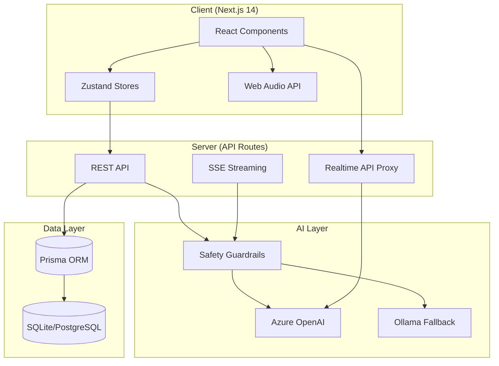

# MirrorBuddy Architecture

> AI-powered educational platform for students with learning differences.
> Last updated: 2026-01-01

---

## Table of Contents

1. [Overview](#overview)
2. [Core Concepts](#core-concepts)
3. [Character System](#character-system)
4. [Educational Tools](#educational-tools)
5. [Gamification](#gamification)
6. [Accessibility](#accessibility)
7. [Audio System](#audio-system)
8. [State Management](#state-management)
9. [Database Schema](#database-schema)
10. [API Routes](#api-routes)
11. [Safety & Guardrails](#safety--guardrails)
12. [Key ADRs](#key-adrs)

---

## System Overview



## Overview

MirrorBuddy is a Next.js 14 application providing AI tutoring for K-12 students with learning differences (dyslexia, ADHD, autism, etc.).

### Tech Stack

| Layer | Technology |
|-------|------------|
| Frontend | Next.js 14, React 18, TypeScript |
| Styling | Tailwind CSS, Radix UI |
| State | Zustand (no persist, API-synced) |
| Database | Prisma + SQLite (dev) / PostgreSQL (prod) |
| AI | Azure OpenAI (primary), Ollama (fallback) |
| Voice | Azure Realtime API (WebRTC) |
| Audio | Web Audio API (procedural generation) |

### Directory Structure

```
src/
├── app/                    # Next.js App Router
│   ├── api/               # REST API routes
│   └── (pages)/           # Page components
├── components/            # React components
├── data/                  # Static data (maestri, coaches, buddies)
├── lib/
│   ├── ai/               # AI providers, intent detection, routing
│   ├── audio/            # Ambient audio generators
│   ├── education/        # FSRS, quiz logic
│   ├── safety/           # Safety guardrails
│   ├── stores/           # Zustand stores
│   └── tools/            # Tool handlers
└── types/                # TypeScript definitions
```

---

## Core Concepts

### Triangle of Support (ADR-0003)

Three character types serve different educational needs:

```mermaid
flowchart TD
    Student((Student))

    subgraph Triangle["Triangle of Support"]
        Maestro["🎓 MAESTRO (17)<br/>Subject Expert<br/>Vertical • Content"]
        Coach["📚 COACH (5)<br/>Learning Method<br/>Vertical • Autonomy"]
        Buddy["🤝 BUDDY (5)<br/>Peer Support<br/>Horizontal • Emotional"]
    end

    Student --> |academic| Maestro
    Student --> |methodology| Coach
    Student --> |emotional| Buddy

    Maestro -.-> |handoff| Coach
    Coach -.-> |handoff| Buddy
    Buddy -.-> |handoff| Maestro
```



### Intent-Based Routing


---

## Character System

### 17 Maestri (Subject Experts)

| Maestro | Subject | Voice |
|---------|---------|-------|
| Euclide | Mathematics | coral |
| Marie Curie | Chemistry | shimmer |
| Richard Feynman | Physics | echo |
| Galileo Galilei | Astronomy | verse |
| Charles Darwin | Biology/Sciences | ballad |
| Alessandro Manzoni | Italian Literature | sage |
| William Shakespeare | English | ash |
| Erodoto | History | ballad |
| Alexander von Humboldt | Geography | echo |
| Leonardo da Vinci | Art | coral |
| Wolfgang Amadeus Mozart | Music | verse |
| Ada Lovelace | Computer Science | shimmer |
| Adam Smith | Economics | echo |
| Socrate | Philosophy | sage |
| Marco Tullio Cicerone | Civic Education | ash |
| Ippocrate | Physical Education/Health | coral |
| Chris | Storytelling | alloy |

**Location**: `src/data/maestri/`

### 5 Learning Coaches

| Coach | Personality | Voice | Best For |
|-------|-------------|-------|----------|
| Melissa | Enthusiastic, young (27) | shimmer | Default, energetic students |
| Roberto | Calm, reassuring (28) | echo | Anxious students |
| Chiara | Organized, academic (24) | coral | Structure-seekers |
| Andrea | Sporty, energetic (26) | sage | ADHD, movement needs |
| Favij | Gaming, digital (29) | ballad | Tech-savvy students |

**Location**: `src/data/support-teachers.ts`

### 5 Peer Buddies (MirrorBuddy v2.0)

| Buddy | Personality | Voice |
|-------|-------------|-------|
| Mario | Friendly, ironic | echo |
| Noemi | Empathetic, warm | shimmer |
| Enea | Playful, cheerful | alloy |
| Bruno | Thoughtful, introspective | sage |
| Sofia | Creative, artistic | coral |

**MirrorBuddy Feature**: Buddies dynamically mirror the student's learning differences (dyslexia, ADHD, autism, etc.) so students feel understood.

**Location**: `src/data/buddy-profiles.ts`

---

## Educational Tools

### Tool Types

| Tool | Handler | Description |
|------|---------|-------------|
| Flashcard | `flashcard-handler.ts` | FSRS-5 spaced repetition |
| Quiz | `quiz-handler.ts` | Multiple choice with feedback |
| MindMap | `mindmap-handler.ts` | MarkMap visualization |
| Summary | `summary-handler.ts` | AI-generated summaries |
| Demo | `demo-handler.ts` | Interactive simulations |
| Diagram | `diagram-handler.ts` | Mermaid diagrams |
| Timeline | `timeline-handler.ts` | Historical timelines |

**Location**: `src/lib/tools/handlers/`

### FSRS Algorithm (ADR-0001)

Free Spaced Repetition Scheduler v5 implementation:

```typescript
// Core parameters
FSRS_INITIAL_STABILITY = 1.0    // days
FSRS_INITIAL_DIFFICULTY = 0.3
FSRS_DESIRED_RETENTION = 0.9    // 90% target
FSRS_K_FACTOR = 19.0            // stability growth

// Quality ratings
1 = Forgot (0.3x stability)
2 = Hard (0.6x stability)
3 = Good (0.85x stability)
4 = Easy (1.3x stability)
```

**Location**: `src/lib/education/fsrs.ts`

### Tool Execution (ADR-0009)


---

## Gamification

### XP & Leveling System

```typescript
// XP Sources
Lesson completed:     10-50 XP
Flashcard reviewed:   5 XP per card
Quiz completed:       10-30 XP (based on score)
Pomodoro completed:   15 XP

// 10 Levels
1. Principiante      0 XP
2. Apprendista       100 XP
3. Studente          300 XP
4. Studioso          600 XP
5. Esperto           1000 XP
6. Professore        1500 XP
7. Gran Professore   2200 XP
8. Saggio            3000 XP
9. Illuminato        4000 XP
10. Leggenda         5000 XP
```

### Streaks & Achievements

- **Daily Streak**: Study every day, milestone at 7/30/100/365 days
- **Achievements**: Categories include study, mastery, streak, social, exploration, xp
- **Subject Mastery**: 5 tiers from Beginner to Master

**Location**: `src/lib/stores/app-store.ts` (useProgressStore)

### Pomodoro Timer

- 25 min focus + 5 min break (configurable)
- Every 4 pomodoros: 15 min long break
- 15 XP per completed pomodoro
- Integrates with ambient audio (ADR-0018)

**Location**: `src/lib/stores/pomodoro-store.ts`

---

## Accessibility

### 7 Accessibility Profiles

| Profile | Key Adaptations |
|---------|-----------------|
| Dyslexia | OpenDyslexic font, letter/line spacing |
| ADHD | Distraction-free, Pomodoro, break reminders |
| Visual | High contrast, large text, TTS |
| Motor | Keyboard navigation, reduced motion |
| Autism | Reduced motion, sensory-friendly |
| Auditory | Visual cues, large text emphasis |
| Cerebral Palsy | Keyboard nav, TTS, large text |

### Accessibility Features

- **Font**: OpenDyslexic toggle
- **Text Size**: 0.8x - 1.5x multiplier
- **Line Spacing**: 1.0 - 2.0
- **Letter Spacing**: Adjustable
- **Contrast**: High contrast mode
- **Motion**: Reduced animations
- **TTS**: Auto-read with speed control (0.5x - 2.0x)
- **Colors**: Custom background/text

**Location**: `src/lib/accessibility/`

---

## Audio System

### Voice API (Azure Realtime)

Real-time voice chat with all characters:

```typescript
// Voice configuration
voices: ['alloy', 'ash', 'ballad', 'coral', 'echo', 'sage', 'shimmer', 'verse']
VAD sensitivity: 0.3 - 0.7
Silence duration: 300 - 800ms
Barge-in: Interrupt while speaking
```

**Features**:
- Real-time transcription
- Tool execution during voice
- Audio level monitoring
- HTTPS required

**Location**: `src/app/api/realtime/`

### Ambient Audio (ADR-0018)

Procedural audio generation via Web Audio API:

```typescript
// 9 Audio Modes
white_noise, pink_noise, brown_noise,
binaural_alpha (8-14 Hz), binaural_beta (14-30 Hz), binaural_theta (4-8 Hz),
rain, thunderstorm, fireplace, cafe, library, forest, ocean, night

// 7 Presets
deep_work:   binaural_beta + brown_noise
library:     library + white_noise
starbucks:   café ambience
rainy_day:   rain + fireplace + thunder
nature:      forest + ocean
focus:       binaural_alpha
creative:    binaural_theta + forest
```

**Pomodoro Integration**:
- Auto-start with Pomodoro
- Pause during breaks
- Auto-duck during voice/TTS

**Location**: `src/lib/audio/`, `src/lib/stores/ambient-audio-store.ts`

---

## State Management

### Zustand Stores (ADR-0015)

**No localStorage** - All state synced via REST APIs:


| Store | Purpose | Sync Endpoint |
|-------|---------|---------------|
| useSettingsStore | Theme, AI provider, profile | `/api/user/settings`, `/api/user/profile` |
| useProgressStore | XP, levels, streaks | `/api/progress` |
| useVoiceSessionStore | Voice connection state | In-memory only |
| useConversationStore | Chat history | `/api/conversations` |
| usePomodoroStore | Timer state | `/api/progress` (on complete) |
| useAmbientAudioStore | Audio playback | In-memory only |
| useNotificationStore | Notifications | `/api/notifications` |

**Sync Pattern**:
```typescript
// Optimistic updates with batched sync
store.update(state) → UI updates immediately
store.syncToServer() → Batched API call (fire-and-forget)
store.loadFromServer() → Hydrate on app start
```

---

## Database Schema

### Core Models (Prisma)


### Key Indexes

- `FlashcardProgress`: `nextReview`, `userId` (due cards lookup)
- `Conversation`: `userId`, `maestroId`, `updatedAt` (list views)
- `Message`, `QuizResult`, `TelemetryEvent`: `userId`, `createdAt` (sorting)

**Location**: `prisma/schema.prisma`

---

## API Routes

### Categories

| Category | Routes | Description |
|----------|--------|-------------|
| User | `/api/user/*` | Settings, profile, data export |
| Progress | `/api/progress/*` | XP, sessions, autonomy |
| Flashcards | `/api/flashcards/*` | FSRS state sync |
| Conversations | `/api/conversations/*` | Chat history, messages |
| Tools | `/api/tools/*` | Tool creation, SSE streaming |
| Voice | `/api/realtime/*` | Token, status |
| Notifications | `/api/notifications/*`, `/api/push/*` | In-app, PWA push |
| Parent | `/api/parent-professor/*` | Dashboard, GDPR consent |
| Telemetry | `/api/telemetry/*` | Usage analytics |

### Auth Pattern

Cookie-based session via `convergio-user-id`:

```typescript
const userId = cookieStore.get('convergio-user-id')?.value;
if (!userId) return NextResponse.json({ error: 'Unauthorized' }, { status: 401 });
```

---

## Conversational Memory (ADR-0021)

### Memory Injection System

Maestros remember previous conversations through memory injection:


### Memory Components

| Component | File | Purpose |
|-----------|------|---------|
| Memory Loader | `src/lib/conversation/memory-loader.ts` | Load last 3 conversations |
| Prompt Enhancer | `src/lib/conversation/prompt-enhancer.ts` | Inject memory into system prompt |

### Memory Context Structure

```typescript
interface ConversationMemory {
  recentSummary: string | null;   // Last session recap
  keyFacts: string[];              // Student preferences, decisions
  topics: string[];                // Discussed subjects
  lastSessionDate: Date | null;    // For relative dating
}
```

### Token Budget

| Component | Max Tokens |
|-----------|------------|
| Base System Prompt | ~800 |
| Recent Summary | ~200 |
| Key Facts (max 5) | ~100 |
| Topics (max 10) | ~50 |
| **Total Enhanced** | **~1150** |

---

## Knowledge Hub (ADR-0022)

### Architecture

File-manager style interface for all educational materials:

```mermaid
flowchart TB
    subgraph Views["View Modes"]
        Explorer["📁 Explorer"]
        Gallery["🖼️ Gallery"]
        Timeline["📅 Timeline"]
        Calendar["📆 Calendar"]
    end

    subgraph Components["Components"]
        Search["🔍 SearchBar"]
        Sidebar["📂 SidebarNav"]
        Cards["📇 MaterialCards"]
        Bulk["⚡ BulkToolbar"]
    end

    subgraph Renderers["12 Renderers"]
        MR["MindmapRenderer"]
        QR["QuizRenderer"]
        FR["FlashcardRenderer"]
        SR["SummaryRenderer"]
        DR["DemoRenderer"]
        More["...8 more"]
    end

    Views --> Components
    Components --> Renderers
```



### Directory Structure

```
src/components/education/knowledge-hub/
├── knowledge-hub.tsx           # Main orchestrator
├── hooks/
│   ├── use-materials-search.ts # Fuse.js fuzzy search
│   ├── use-collections.ts      # Folders CRUD
│   ├── use-tags.ts             # Tags CRUD
│   ├── use-smart-collections.ts # Dynamic collections
│   └── use-bulk-actions.ts     # Multi-select operations
├── views/
│   ├── explorer-view.tsx       # Sidebar + grid
│   ├── gallery-view.tsx        # Large cards
│   ├── timeline-view.tsx       # Chronological
│   └── calendar-view.tsx       # Calendar view
├── components/
│   ├── search-bar.tsx          # Search with type filter
│   ├── sidebar-navigation.tsx  # Collections & tags
│   ├── material-card.tsx       # Card with drag & drop
│   ├── bulk-toolbar.tsx        # Bulk actions
│   └── stats-panel.tsx         # Statistics
└── renderers/
    ├── index.tsx               # Registry with lazy loading
    └── *-renderer.tsx          # 12 type-specific renderers
```

### Full-Text Search

```typescript
// Pre-computed on save
searchableText = generateSearchableText(toolType, content);

// Client-side fuzzy search with Fuse.js
const fuse = new Fuse(materials, {
  keys: ['title', 'subject', 'searchableText'],
  threshold: 0.3,
  includeMatches: true,
});
```

### Smart Collections

| Collection | Filter |
|------------|--------|
| Da ripassare | Flashcards with nextReview <= now |
| Recenti | Created in last 7 days |
| Preferiti | isBookmarked = true |
| Per Maestro | Group by maestroId |
| Oggi | Created today |
| Questa settimana | Created this week |

---

## Tool Focus Selection (ADR-0020)

### Dialog Flow

When creating educational tools, users first select maestro and mode:


### Components

| Component | Purpose |
|-----------|---------|
| `ToolMaestroSelectionDialog` | Modal for selecting maestro and mode |
| `focus-tool-layout.tsx` | Layout with voice integration |

### Mode Types

- **Text**: Traditional chat-based tool creation
- **Voice**: Real-time voice conversation with maestro

---

## Safety & Guardrails

### 5-Layer Defense System (ADR-0004)

```mermaid
flowchart TB
    Input[/"Student Input"/]

    subgraph Safety["5-Layer Defense"]
        L1["🛡️ Layer 1: System Prompt<br/>Safety rules injected"]
        L2["🚫 Layer 2: Input Filter<br/>Block inappropriate"]
        L3["🔍 Layer 3: Jailbreak Detector<br/>Catch manipulation"]
        L4["🤖 Layer 4: AI Processing<br/>Generate response"]
        L5["✨ Layer 5: Output Sanitizer<br/>Clean response"]
    end

    Crisis{Crisis<br/>Detected?}
    Output[/"Safe Response"/]
    Escalate["⚠️ Escalate to<br/>Trusted Adult"]

    Input --> L1
    L1 --> L2
    L2 --> L3
    L3 --> L4
    L4 --> L5
    L5 --> Crisis

    Crisis -->|No| Output
    Crisis -->|Yes| Escalate
```



### Safety Modules

| Module | Purpose |
|--------|---------|
| `safety-prompts.ts` | Core injection, crisis keywords |
| `content-filter.ts` | Input filtering, blocked patterns |
| `output-sanitizer.ts` | Output cleaning, streaming sanitizer |
| `jailbreak-detector.ts` | Manipulation attempt detection |
| `age-gating.ts` | Age-appropriate content (6-10, 11-13, 14-18, 18+) |
| `monitoring.ts` | Safety event logging, session termination |

**Location**: `src/lib/safety/`

### Crisis Response

- Crisis keywords trigger escalation to trusted adult
- Session can be auto-terminated for safety
- All safety events logged for review

---

## Key ADRs

| ADR | Title | Decision |
|-----|-------|----------|
| 0001 | Materials Storage | Provider-agnostic (local/Azure Blob) |
| 0002 | Mind Maps | MarkMap instead of Mermaid |
| 0003 | Triangle of Support | 3 character types (Maestro/Coach/Buddy) |
| 0004 | Safety Guardrails | 5-layer defense for child protection |
| 0005 | Real-time Tools | SSE for streaming tool creation |
| 0006 | Telemetry | Prometheus-compatible metrics |
| 0007 | Notifications | Server-side persistence |
| 0008 | Parent Dashboard | Dual GDPR consent model |
| 0009 | Tool Execution | OpenAI function calling |
| 0010 | Conversations | Separate history per character |
| 0011 | Voice Mindmaps | Real-time voice editing |
| 0012 | Unified Voice | Side-by-side chat/voice layout |
| 0013 | Platform Support | Coach handles tech support |
| 0014 | PWA Push | Browser notifications via VAPID |
| 0015 | Database-First | No localStorage, API-synced |
| 0016 | Modularization | Barrel exports, max 300 lines |
| 0017 | Voice Summaries | Voice-driven summary creation |
| 0018 | Audio Coordination | Pause ambient during voice |
| 0019 | Session Summaries | Auto-generate summaries at session end |
| 0020 | Mindmap Data Fix | Unified title field, hierarchy rendering |
| 0021 | Conversational Memory | Memory injection into system prompts |
| 0022 | Knowledge Hub | File-manager interface for materials |

**Location**: `docs/adr/`

---

## Quick Reference

### Commands

```bash
npm run dev          # Dev server :3000
npm run build        # Production build
npm run lint         # ESLint
npm run typecheck    # TypeScript
npm run test         # Playwright E2E
npx prisma generate  # After schema changes
npx prisma db push   # Sync schema
```

### Key Paths

| Purpose | Path |
|---------|------|
| Types | `src/types/index.ts` |
| AI Providers | `src/lib/ai/providers.ts` |
| Safety | `src/lib/safety/` |
| FSRS | `src/lib/education/fsrs.ts` |
| Maestri | `src/data/maestri/` |
| Coaches | `src/data/support-teachers.ts` |
| Buddies | `src/data/buddy-profiles.ts` |
| Stores | `src/lib/stores/` |
| API | `src/app/api/` |

---

## Statistics

- **Components**: 150+ React components
- **API Routes**: 60+ REST endpoints
- **Zustand Stores**: 8 stores
- **Prisma Models**: 25+ models
- **Maestri**: 17 subject experts
- **Coaches**: 5 learning coaches
- **Buddies**: 5 peer buddies
- **Accessibility Profiles**: 7 profiles
- **Audio Modes**: 14 modes
- **Audio Presets**: 7 presets
- **Safety Layers**: 5 layers
- **ADRs**: 23 architecture decisions
- **Knowledge Hub Renderers**: 12 type-specific renderers
- **Knowledge Hub Hooks**: 5 custom hooks
- **Unit Tests**: 1400+ tests
